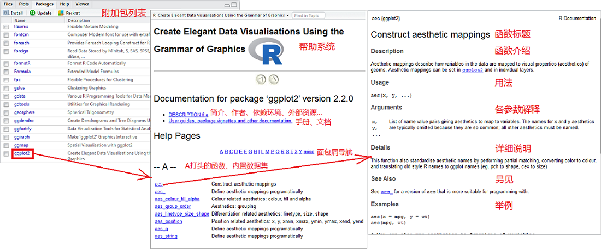
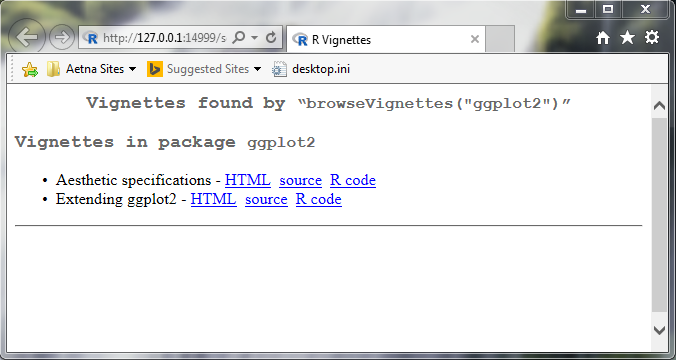
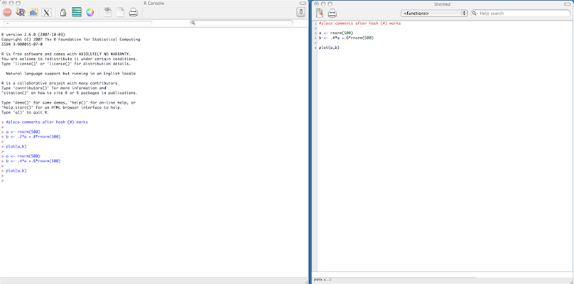
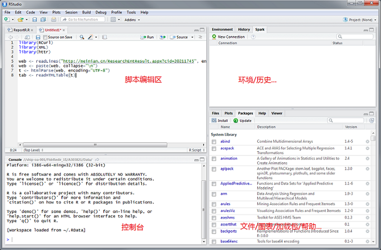
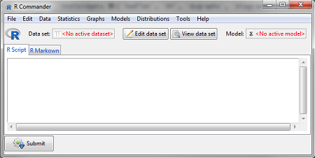
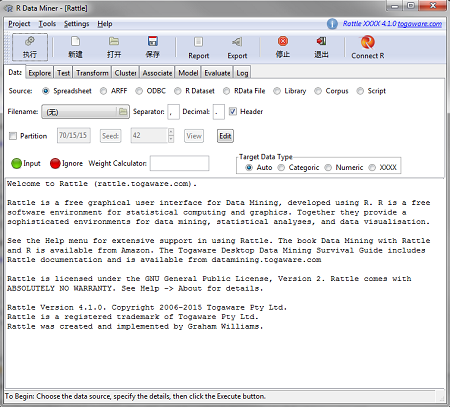

```{r setup, include=FALSE}
## User-defined options come here
knitr::opts_chunk$set(warning = FALSE, message = FALSE, 
                      fig.path = "A01_01_intro_files/figure-html")
```

## 目录

- [为什么学R？](#3)
- [怎么学R？](#10)
- [R单机作业环境的搭建](#15)
- [典型应用套路](#22)


# 为什么学R？ 


## R是什么？

一种<ora>开源</ora>的<ora>解释型统计分析</ora>程序语言/[软件工具包](http://www.r-project.org)

<div class="columns-2">

### 历史

- 前身是S (John Chambers, et al. Bell Lab, 1976) --> S-Plus
- 由**R**oss Ihaka & **R**obert Gentleman开发(U Aucland, 1990s)
- R Core Team成立，维护R核心代码(1997)

<p class="forceBreak"></p>

### 现状

- 生态系统：核心组、开发者、用户
- 统计学家事实上的标准工具语言
- 渐受产业界重视
   + 金融、零售、生物制药、气象地质、信息科技, ...
   + 整合大数据技术(`Spark`, ...)
   + 商业化分支：[Revolution R Analytics](https://www.microsoft.com/en-us/download/details.aspx?id=51204), [Oracle R Enterprise](http://www.oracle.com/technetwork/cn/database/database-technologies/r/r-enterprise/overview/index.html), ...

</div>

## R有何用？ {.smaller}

<div class='columns-2'>

### 数据科学
- 数据抽取
    + 文本/网页
    + 第三方数据文件
    + 关系型/非关系型数据库
- 数据清理
    + 缺失/奇异值
    + 变形/标签
- 数据分析
    + 描述分析
    + 统计推断
    + 挖掘预测
    
<p class="forceBreak"></p>

- 可视化
    + 制图
    + 数据产品(*本deck即knit而成*)
    
### 工程开发
- R附加包
- Shell/bat调用
- 与SQL/Java/Python联用
- 与Spark/Hive/Pig联用

</div>


## R的优缺点

<div class="notes">

> The best thing about R is that it was developed by **statisticians**. The worst thing about R is that it was developed by **statisticians**. 
> <br>
>                                      -- Bo Cowgill, *Google*

</div>

<div class='columns-2'>

### <gre>优点</gre>

- 开源
    + 免费、自由、透明
    + 活跃的支持社区
- 为统计而生
    + 强大而前沿的统计分析功能
    + 强大的作图能力
- 为懒人而生
    + 背靠附加包，代码产出率高
    + 胶水语言，便于混搭其他工具

<p class="forceBreak"></p>

### <crb>缺点</crb>

- 学习曲线陡峭
    + 语法略奇葩
    + 支持文档不详尽
- 速度/效率/内存管理弱
    + 数据全部读入内存
    + 解释执行，速度较慢
- 缺少权限/安全控制
    + 限制其工程开发用途

</div>

## R适合谁学？

<div class="columns-2">
### 这些人适合学R

- 日常业务需求
    + 常用小型数据集运行分析、挖掘
    + 常执行重复分析、报告过程 
    + 用不起昂贵的分析工具，但也想跑点分析
- 个人禀赋
    + 有志成为数据科学家
    + 对数据/算法/结构有兴趣
    + 有一点黑客精神

<p class="forceBreak"></p>
### 你可能关心的问题

- <gbl>Q: 需要编程经验吗？</gbl>
- <red>A: 不需要有编程背景。最好懂SQL，懂Python更好。</red>
- <gbl>Q: 学起来真的难吗？</gbl>
- <red>A: 入门容易精通难。</red>
- <gbl>Q: 一般多久能上手？</gbl>
- <red>A: 一般50-100小时实操可大致上手。</red>
- <gbl>Q: 学会了能涨工资吗？</gbl>
- <red>A: 不能。</red>

</div>

------- 

<div class="centered">

](A01_01_intro_files/figure-html/rexersurvey2015.png)

</div>
------

<div class="centered">

](A01_01_intro_files/figure-html/lavastorm2013.png)

</div>

# 怎么学R？

## 30%的时间 - 书本和课堂 {.smaller}

<div class="columns-2">

### 书本(供参考) 

- 入门
    + R语言初学者指南 (*Alain F.Zuur*)
    + R语言实战 (*Robert I.Kabacoff*)
- 高手
    + ggplot2:数据分析与图形艺术 (*H. Wickham*)
    + 数据科学中的R语言 (*李舰, 肖凯*)
- 老司机
    + R语言编程艺术 (*Norman Matloff*)
    + 高级R语言编程指南 (*H. Wickham*)
    + Software for data analysis programming with R (*J. Chambers*)
    
### 在线课堂

- **M**assive **O**pen **O**nline **C**ourses
    - Coursera: [Data Science](https://www.coursera.org/specializations/jhu-data-science), [Statistics with R](https://www.coursera.org/specializations/statistics)
    - edX: [Introduction to R for Data Science](https://www.edx.org/course/introduction-r-data-science-microsoft-dat204x-2), [Explore Statistics with R](https://www.edx.org/course/explore-statistics-r-kix-kiexplorx-0)
- 支持网站
    - [Try-R](http://www.codeschool.com/courses/try-r), [Data Camp](www.datacamp.com/swirl-r-tutorial), [Rstudio](https://www.rstudio.com/online-learning)
    - [统计之都](http://cos.name)、[炼数成金](http://edu.dataguru.cn)

</div>

## 70%的时间 - 社区和实战

<div class="columns-2">

### 社区

- 帮助
    + [StackOverflow](https://stackoverflow.com/), [RSeek](http://rseek.org/)
    + [统计之都](http://cos.name)、[炼数成金](http://www.dataguru.cn)
- 资源
    + [R Official](http://www.r-project.org/), [GitHub](http://github.com), [Bioconductor](http://bioconductor.org)
    + [R-bloggers](http://www.r-bloggers.com), [R Doc](http://www.rdocumentation.org)
- 竞赛
    + [Kaggle](http://www.kaggle.com), [Euler Project](https://projecteuler.net)

<p class="forceBreak"></p>

### 实战

- R帮助系统: `help()`, `?`
- 坚持在实际工作中使用
    + 分解一个实际问题，将其中的**分析、展示**部分用R实现
    + 封装可**复用**代码，提升效率
- 参加项目协作，提升实践能力
    + 团队协作流程和**框架**
    + 团队R**代码规范**、管理指南
    + **协作**开发，解决中大型分析问题
    + **多工具**生态环境

</div>

## 帮助系统

`?ggplot2::aes`或手动导航



## 随机手册(Vignette)

- Vignette [vi:n'jet]: 画像。附加包的随机手册。
- `browseVignettes("ggplot2")`



# R单机作业环境的搭建

## 下载并安装R

- 访问R官网，下载[R for windows](https://cloud.r-project.org)并解压到C盘，建议安装64-bit版本（前提是安装了64位操作系统 ）
- **更推荐用Linux**



## 集成开发环境(IDE)

- IDE不是必需的, 你可以用R自带的GUI界面写交互命令行
- 但R本质上是一种**脚本语言**，存为脚本后运行才是王道
- IDE的选择:
    + **强烈推荐使用[RStudio Desktop](https://download1.rstudio.org/RStudio-1.0.44.zip)** (后续课程都将在RStudio上演示)
        - 接下来Rstudio将是你的一个R的宝库
        - 在Linux上，更建议安装Rstudio Server
    + 可以用你所惯用的代码编辑器，如Vim, Emacs, Notepad++
        - 但不要用Win Notepad、WordPad、MS Word等带BOM的编辑器
    + 还可以通过插件方式整合在其他IDE中使用，如Eclipse + StatET, Jupyter Notebook + IRkernel, R Tools for Visual Studio
        - 如果要对R进行工程开发，建议采用这种方式

---



## 一些初始配置 (RStudio) {.smaller}

<div class="columns-2">

### 全局设置
(Tools -> Global Options) 

+ Code Tab
    - Editing -> General -> Insert spaces for tab | Tab width: 4
    - Display -> Show margin | Margin column: 80
+ 其他Tab
    - 修改Work Directory
    - 修改CRAN Mirror
    - 修改外观主题
        
<p class="forceBreak"></p>

### 环境配置
(Control Panel\All Control Panel Items\System -> Change settings -> Advanced -> Environment variables)

- 验证R安装目录是否在PATH中 (`Sys.getenv('PATH')`)
- Edit PATH， 将R安装路径添加进去

### 基础组件

- [RTools](https://cran.r-project.org/bin/windows/Rtools) (对于Windows): 包含`gcc`, `mingw`等编译工具
- [MikTex on Windows](https://miktex.org/) / [Texmaker on Linux](http://www.xm1math.net/texmaker/): 用于生成pdf文档

</div>

## 安装附加包 (add-on package) 

### 附加包: R最重要的优势

##### 用法
- Packages面板 -> Install -> 输入包名
- `install.packages(c("<包名1>", "<包名2>", ...))`

##### 使用原则
- 优先使用官方包、流行包
- 避免使用偏门包、来历不明的包
- 使用前阅读手册，了解其原理和局限

## {.smaller}

### 推荐一些常用包 

<div class="columns-2">

- 数据抽取
    + 数据库: `RODBC`, `RMySQL`, `RPostgresSQL`
    + 表格数据: `readr`, `XLConnect`, `readxl`
    + 网页: `XML`, `httr`, `jsonlite`, `RCurl`
- 数据整理
    + 拆合排转: `dplyr`, `tidyr`, `reshape2`
    + 文本/时间: `stringr`, `lubridate`, `timeDate`
- 数据分析
    + 建模: `car`, `lme4`, `glmnet`, `survival`
    + 金融/时序: `quantmod`, `xts`, `zoo`
    + 地理: `sp`, `maps`, `maptools`, `ggmap`

<p class="forceBreak"></p>

- 数据挖掘
    + 机器学习: `caret`, `e1071`, `kernlab`
    + 自然语言: `NLP`, `tm`, `RTextTools`
- 可视化
    + 图表: `ggplot2`, `rCharts`, `ggvis`, `htmlwidgets`族(`leaflet`, `DT`, `dygraphs`, `DiagrammR`, `d3heatmap`, ...), `plotly`, `rgl`, `rbokeh`, `highcharter`
    + 报告: `rmarkdown`, `knitr`, `shiny`, `ReporteRs`
- 工具
    + 运行效率: `data.table`, `Rcpp`, `parallel`
    + 开发: `devtools`, `roxygen2`, `testthat`
    
</div>

# 典型应用套路

## GUI操作

通过Rcmdr或rattle包调用`tcltk`库，驱动图形界面，进行整理、分析、挖掘

<div class="columns-2">

#### R Commander (经典分析利器)

```{r, eval=FALSE, echo=TRUE}
library(Rcmdr)  ## 加载Rcmdr包
Commander()  ## Rcmdr主函数
```


<p class="forceBreak"> </p>

#### rattle (整合数据挖掘功能)

```{r, eval=FALSE, echo=TRUE}
library(rattle)  ## 加载rattle包
rattle()  ## rattle主函数
```


</div>

## 交互命令行 {.smaller}

<div class="columns-2">

#### 用法

- 最传统的使用形式
- 在控制台敲入命令后回车，即时返回结果
- 通过History面板或向上键调出历史命令

|   | 优点     |  缺点 |
|---|----------|-------|
| 1 | 直观 | 结果杂乱 |
| 2 | 便捷 | 无法复用 |

<p class="forceBreak"></p>

#### 例子
```{r scatter_cars, fig.cap='scatter cars', fig.width=4.5, fig.height=2.5, warning=FALSE, message=FALSE}
1:4 + 1:4
library(plotly)
plot_ly(cars, x=~speed, y=~dist) %>% add_markers()
```

</div>

## 脚本 {.smaller}

<div class="columns-2">

#### 用法

- 创建.R脚本文件，编辑函数、执行代码
- `source`该.R脚本读入，编辑或块选执行
- 用Shell/bat等外部工具直接通过`R CMD`或`Rscript`命令调用脚本
- 选块Ctrl+Enter，显示为R Notebook

|   | 优点    |  缺点   |
|---|---------|---------|
| 1 | 可复用  | 需脚本管理 |
| 2 | 代码逻辑 | 结果欠结构 |

<p class="forceBreak"></p>
#### 例子  

保存一个[intro.R](A01_01_intro_files/file/intro.R)脚本

```{r, eval=FALSE, echo=TRUE}
# Open pdf device and name it
pdf('intro.pdf')
# Lazy plot a scatterplot
plot(cars, main='Scatterplot of cars')
# Close all the devices
dev.off()
```

执行[intro.bat](A01_01_intro_files/file/intro.bat)，内容为

```bat
@echo off
: If Rscript is not in PATH, define the location manually 
Rscript.exe intro.R
@pause
```

最后在脚本同目录下生成一个intro.pdf。全过程不出现RGui。

</div>

## 可重复报告

<div class="columns-2">

#### 用法

- 创建.rmd文档
- 用YAML头部定义文档参数
- 可自由生成html, docx, rtf, pdf
- 混编可执行代码(R/Python/SQL)和自然语言行文 (markdown/ html/ LaTeX)

|   | 优点     |  缺点  |
|---|----------|--------|
| 1 | 可反复运行 | 有一定学习成本 |
| 2 | 文学化编程 | 需要一定的构思 |

<p class="forceBreak"></p>

#### 例子

- 创建的.Rmd文档本身自带示例代码，可尝试Knit
- [本文档](A01_01_intro.rmd)是一个较复杂的例子
- 可以将配置项目写在_output.yml文件中，`rmarkdown::render()`生成文档
- 可以尝试套用模板创建一个封装好格式的R Markdown文档
    - 默认的html
    - R Presentation
    - (安装`rticles`包)基于template的文档
- 直接创建R Notebook文档

</div>

## 入门仪式: Hello, world! {.smaller}

<div class="columns-2">

#### Java

```java
public class HelloWorld
{ 
  public static void main(String[] args)  
  { 
    System.out.println("Hello, world!");  
  }  
}
```

#### PHP

```php
<!DOCTYPE html>  
<body>  
<?php 
    echo "Hello, world!";
?>  
</body>  
</html>
```

<p class="forceBreak"></p>

#### JavaScript

```javascript
var sys = require("sys");
sys.puts("Hello, world!"); 
```
#### Python 3

```python
print("Hello, world!")
```

#### Scala

```scala
println("Hello, world!")
```

#### R

```r
print("Hello, world!")
```

</div>

## {.grayblue}

<p style="font-size:100px;font-family:'Arial Black'"><br/>Thank you! </p>
