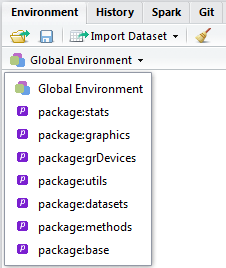

```{r setup, include=FALSE}
## User-defined options come here
knitr::opts_chunk$set(warning = FALSE, message = FALSE, 
                      fig.path = "A01_03_calc_files/figure-html/")
```

## 目录

- [算符计算](#3)
- [向量运算](#8)
- [矩阵运算](#11)
- [函数](#13)


# 算符计算 (`?Ops`)

<div class="notes">

> R的所有运算符本质上都是函数
> 
> x <算符> y ==> "<算符>"(x, y)

</div>

## 代数运算符 {.smaller}

名称 | 符号 | 等价函数 | 举例 | 等价于 | 结果
-----|------|----------|------|--------|-------
加 | + | "+"() | 1 + 2 | "+"(1, 2) | 3
减 | - | "-"() | 1 - 2 | "-"(1, 2) | -1
乘 | * | "*"() | 1 * 2 | "*"(1, 2) | 2
处以 | / | "/"() | 1 / 2 | "/"(1, 2) | 0.5
求余 | %% | "%%"() | 5 %% 2 | "%%"(5, 2) | 1
整除 | %/% | "%/%"() | 5 %/% 2 | "%/%"(5, 2) | 2
乘方 | ^ | "^"() | 5 ^ 2 | "^"(5, 2) | 25
乘方 | ** | "**"() | 5 ** 2 | "**"(5,2) | 25 

## 比较运算符 

名称 | 符号 | 等价函数 | 举例 | 结果
-----|------|----------|------|-----
大于 | > | ">"() | 1 > 2 | FALSE
小于 | < | "<"() | 1 < 2 | TRUE
大于等于 | >= | ">="() | 1 >= 2 | FALSE
小于等于 | <= | "<="() | 1 <= 2 | TRUE
等于 | == | "=="() | 1 == 2 | FALSE
不等于 | !=  | "!="() | 1 != 2 | TRUE
包含于 | %in% | "%in%"() | 1 %in% c(1,3) | TRUE

## 逻辑运算符 

名称 | 符号 | 等价函数 | 举例 | 结果
-----|------|----------|------|-----
且(向量) | & | "&"() | c(TRUE, TRUE) & c(FALSE, TRUE) | c(FALSE, TRUE)
且(标量) | && | "&&"() | c(TRUE, TRUE) && c(FALSE, TRUE) | FALSE
或(向量) | \| | "\|"() | c(TRUE, TRUE) \| c(FALSE, TRUE) | c(TRUE, TRUE)
或(标量) | \|\| | "\|\|"() | c(TRUE, TRUE) \|\| c(FALSE, TRUE) | TRUE
非 | ! | "!"() | ! TRUE | FALSE
 
## 其它常用算符

名称 | 符号 | 等价函数 | 举例 | 结果 | 备注
-----|------|----------|------|------|-----------
序列 | : | `seq()` | 1:3 | c(1, 2, 3) | 
波浪 | ~ | `"~"()` | y ~ x | 模型y~x |
附加包显式对象 | :: | `"::"()` | base::abs(-2) | 2 | 被export到附加包Namespace的函数/数据集
附加包隐式对象 | ::: | `":::"()` | MASS:::vcov.polr| 略 |未被export到附加包Namespace的函数/数据集

# 向量运算

## 一切皆向量

- R里面没有标量，本质上都是向量运算
- 向量进行简单运算时，会尽量自动循环补齐
- 向量化运算能显著提高效率(如`apply()`家族)
- 建立向量化计算的思维习惯
    - 避免一切显式循环
    - 数据切片/拆分-统合/...

## 举例 {.smaller}

<div class="columns-2">

```r
> 1:4 + 1:4
[1] 2 4 6 8
```

$$
\begin{pmatrix}
1\\ 
2\\ 
3\\ 
4
\end{pmatrix} +
\begin{pmatrix}
1\\ 
2\\ 
3\\ 
4
\end{pmatrix} =
\begin{pmatrix}
2\\ 
4\\ 
6\\ 
8
\end{pmatrix}
$$

```r
> 1:4 + 1:2
[1] 2 4 4 6
```

$$
\begin{pmatrix}
1\\ 
2\\ 
3\\ 
4
\end{pmatrix} +
\begin{pmatrix}
1\\ 
2\\ 
1\\ 
2
\end{pmatrix} =
\begin{pmatrix}
2\\ 
4\\ 
4\\ 
6
\end{pmatrix}
$$
```r
c(T, T, F, F) & c(T, F, T, F)
[1]  TRUE FALSE FALSE FALSE
```
$$
\begin{pmatrix}
TRUE\\ 
TRUE\\ 
FALSE\\ 
FALSE
\end{pmatrix} \&
\begin{pmatrix}
TRUE\\ 
FALSE\\ 
TRUE\\ 
FALSE
\end{pmatrix} =
\begin{pmatrix}
TRUE\\ 
FALSE\\ 
FALSE\\ 
FALSE
\end{pmatrix}
$$

```r
c(T, T, F, F) && c(T, F, T, F)
[1]  TRUE
```

$$
\begin{pmatrix}
\textbf{TRUE}\\ 
TRUE\\ 
FALSE\\ 
FALSE
\end{pmatrix} \&\&
\begin{pmatrix}
\textbf{TRUE}\\ 
FALSE\\ 
TRUE\\ 
FALSE
\end{pmatrix} =
TRUE
$$
</div>

# 矩阵运算

## 内积和外积 {.smaller}

结论：反正R是很擅长矩阵运算的。

<div class="columns-2">
### 内积(点积/标积)

```r
> 1:4 %*% 1:4  ## inner production
[1] 30
```

$$
\begin{pmatrix}
1\\ 
2\\ 
3\\ 
4
\end{pmatrix} \cdot 
\begin{pmatrix}
1\\ 
2\\ 
3\\
4
\end{pmatrix} =
1 + 4 + 9 + 16
$$
<p class="forceBreak"></p>

### 外积(叉积/矢积)

```r
> 1:4 %o% 1:4  # outer production
     [,1] [,2] [,3] [,4]
[1,]    1    2    3    4
[2,]    2    4    6    8
[3,]    3    6    9   12
[4,]    4    8   12   16
```
$$
\begin{pmatrix}
1\\ 
2\\ 
3\\ 
4
\end{pmatrix} \otimes  
\begin{pmatrix}
1 & 2 & 3 & 4
\end{pmatrix} =
\begin{pmatrix}
1 & 2 & 3 & 4\\ 
2 & 4 & 6 & 8\\ 
3 & 6 & 9 & 12\\ 
4 & 8 & 12 & 16
\end{pmatrix}
$$
</div>

# 函数

## 函数的基本结构

```r
function( arglist ) {
    # comments
    expr
    return(value)
}
```
- 函数头
    - arglist 形式参数列表: 留空，或若干名称，或`name=默认取值`；
- 函数体
    - comments 注释: 非必需，但可帮助理解函数的用法
    - expr 表达式: 若干行函数体表达式
    - value	返回值: 返回值

## 例子

以内置泛型函数`print`的默认方法`print.default`为例，看函数结构

```r
> print.default
function (x, digits = NULL, quote = TRUE, na.print = NULL, print.gap = NULL, 
    right = FALSE, max = NULL, useSource = TRUE, ...) 
{
    noOpt <- missing(digits) && missing(quote) && missing(na.print) && 
        missing(print.gap) && missing(right) && missing(max) && 
        missing(useSource) && missing(...)
    .Internal(print.default(x, digits, quote, na.print, print.gap, 
        right, max, useSource, noOpt))
}
<bytecode: 0x07b8c9a8>
<environment: namespace:base>
```

## 调用函数

- 载入附加包
    - 加载命令为函数`library(<包名>)`
    - 系统包不需要专门载入
- 调用格式
    ```r
    fun(arglist)
    ```
    - fun: 函数名
    - arglist: 实际参数列表（取值）

## 其它常用计算函数 {.smaller}

| 类型 | 名称 | 函数 | 举例 | 结果 |
|------|------|------|------|------|
| 代数 | 自然对数 | `log` | log(10) | 2.302585 |
|      | 科学对数 | `log10` | log10(10) | 1 |
|      | 幂  | `exp` | exp(2) | 7.389056 |
|      | 三角函数 | `sin, cos, tan`  | sin(pi/6) | 0.5 |
|      | 绝对值  | `abs`  | abs(-1) | 1 |
| 逻辑 | 所有 | `all` | all(c(T, F, T)) | FALSE |
|      | 任一 | `any` | any(c(T, F, T)) | TRUE  |
| 比较 | 异或 | `xor` | xor(TRUE, FALSE) | TRUE |
|      | 全等 | `identical` | identical(1, 1L) | FALSE |

## 自定义函数

> 需求: 定义一个函数addN，将一个向量x的每个元素加n。如果不指定n，就加1。

```r
> addN <- function(x, n=1){
+     # add n to vector x
+     # params:
+     #   x: vector
+     #   n: default 1
+     x <- x + n
+     return(x)
+ }

> x <- c(1, 4, 2, 6)
> addN(x=x)
[1] 2 5 3 7
```

## 闭包(closure)与环境~~: 盗梦空间~~ 

- 在R中，函数的实际type是闭包(closure)
- 闭包计算运行在一个隔离的下层临时环境中，不会影响调用环境
- 闭包运行完毕，函数临时环境即被销毁
- 超级赋值号`<<-`可穿透当前环境，将某对象抛入上一级环境

<div class="columns-2">
```r
> x <- 2
> z
Error: object 'z' not found
> environment()
<environment: R_GlobalEnv>
> f <- function(x) {
+   print(environment())  # this env
+   z <<- x  # super assignment
+   return(x + 1)
+ }
```

```r
> y <- f(x=5)
> y
<environment: 0x1342c330>
[1] 6
> environment()
[1] <environment: R_GlobalEnv>
> x
[1] 2
> z
[1] 5
```
</div>

## 环境

- 默认载入的环境: RStudio中，Environment面板 --> Global Environment 下拉菜单


- `search()`
```r
 [1] ".GlobalEnv"        "tools:rstudio"     "package:stats"     "package:graphics"
 [5] "package:grDevices" "package:utils"     "package:datasets"  "package:methods"
 [9] "Autoloads"         "package:base"   
```


## 自定义算符

设计一个名称格式为`"%<算符名>%"(lhs, rhs)`的函数(必须包含两个参数)，可获得一个名为`%<算符名>%`的算符，等价于`lhs %<算符名>% rhs`。

```r
> "%+n%" <- function(x, n){
+     x <- x + n
+     return(x)
+ }

> x <- c(1, 4, 2, 6)
> x %+n% 2
[1] 3 6 4 8

> x %+n% 1.5
[1] 2.5 5.5 3.5 7.5
```

## {.grayblue}

<p style="font-size:100px;font-family:'Arial Black'"><br/>Thank you! </p>


