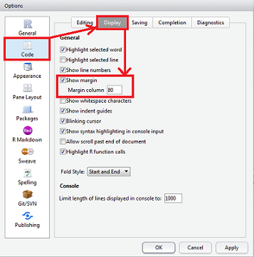
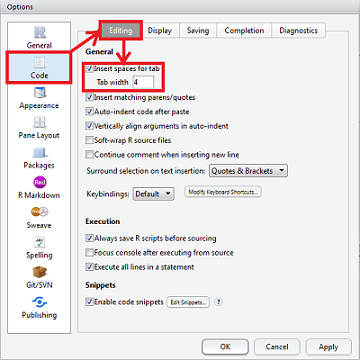

```{r setup, include=FALSE}
## User-defined options come here
knitr::opts_chunk$set(warning = FALSE, message = FALSE, 
                      fig.path = "A01_05_style_files/figure-html/")
```

## 目录

- [代码风格](#3)
- [编码风格约定](#9)
- [语言规则](#21)

<p class="footer">Copyright © 2016 Aetna Inc. <span class="cranberry">内部使用，请勿外传。</span></p>

# 代码风格

## 是啥？

**代码风格**（英语：Programming style）即程序开发人员所编写源代码的书写风格。 良好代码风格的特点是使代码易读。 总结程序设计实践中的经验，代码风格的要素包括（但不限于）以下几点：

- 名字的使用（参见：[驼峰式大小写](https://zh.wikipedia.org/wiki/%E9%A7%9D%E5%B3%B0%E5%BC%8F%E5%A4%A7%E5%B0%8F%E5%AF%AB)、[标识符命名约定](https://zh.wikipedia.org/w/index.php?title=%E6%A0%87%E8%AF%86%E7%AC%A6%E5%91%BD%E5%90%8D%E7%BA%A6%E5%AE%9A&action=edit&redlink=1)、[匈牙利命名法](https://zh.wikipedia.org/wiki/%E5%8C%88%E7%89%99%E5%88%A9%E5%91%BD%E5%90%8D%E6%B3%95)）
- [表达式](https://zh.wikipedia.org/wiki/%E8%A1%A8%E8%BE%BE%E5%BC%8F)与语句
- 常量的使用
- 注释的使用
- [缩进](https://zh.wikipedia.org/w/index.php?title=%E7%BC%A9%E8%BF%9B&action=edit&redlink=1)（参见：[缩进风格](https://zh.wikipedia.org/w/index.php?title=%E7%BC%A9%E8%BF%9B%E9%A3%8E%E6%A0%BC&action=edit&redlink=1)）
- 代码的布局

<p class='footer'>来源: [Wikipedia.org](https://zh.wikipedia.org/zh-hans/%E4%BB%A3%E7%A0%81%E9%A3%8E%E6%A0%BC)</p>

## 遵守风格约定的意义

> 我只是想用R跑跑分析，又不要做码农，为什么还要遵守开发者代码风格？

- 良好的代码风格代表了代码组织的**最优实践**
    - 降低了**手残/笔误**的几率
    - 便于理解，提高了代码的**可读性**(结构、注释)
- 统一的代码风格能**避免混乱**，便利**团队协作**

<p class="footer">参见[HMS的R代码风格指南](file://ship-oa-001/china_health_advisory/Analytics/GUIDE%20And%20TOOLS/Guideline/HMS%20R%E8%AF%AD%E8%A8%80%E7%BC%96%E7%A0%81%E9%A3%8E%E6%A0%BC%E6%8C%87%E5%8D%97.html#4-r-编码风格约定-style-rules)和[Google R Style Guide](https://google.github.io/styleguide/Rguide.xml)</p>

# 编码风格约定 (Style Rules)

## 表示和命名 Notation And Naming | 文件命名 Filenames

- 脚本文件名应以 .R (大写) 结尾, 文件名本身要有意义。
    - <gre>正例</gre>: predict_ad_revenue.R
    - <red>反例</red>: foo.R, function.R
- 不要把所有的功能函数放在一个脚本中。

##  {.smaller}

### 标识符命名 Identifiers

- 不要使用连字符( - )，也尽量不使用下划线 ( _ )。
- 变量名：名词或**名词性短语**，用(.)分隔小写单词，或从第二个单词开始首字母大写（小驼峰法）; 
    - 不使用保留字或函数名，如`c, list, TRUE, FALSE`；
    - <gre>正例</gre>: avgClicks, avg.clicks
    - <red>反例</red>: avg_Clicks, AvgClicks
- 函数名：动词或**动词性短语**，用(_)分隔小写单词；或小驼峰法（不用大驼峰法）; 
    - 不输出(export)到命名空间(NAMESPACE)的函数名前加”.”前缀；
    - <gre>正例</gre>: calculateAvgClicks, calculate_avg_clicks
    - <red>反例</red>: calculate.avg.clicks, CalculateAvgClicks
- S3类(S3 Class)名采用大驼峰法，S4类(S4 Class)名采用大驼峰法并加”S4”前缀
- 方法名(method)也采用函数名相同规则
- 常数命名规则同函数, 但需使用一个k 开头；或全大写：如kConstantName，CONSTANTNAME
- 例外: 当创建一个含类 (class) 属性的对象时, 函数名 (也是constructor) 和类名 (class) 应当匹配 (例如, lm).

## 语法 Syntax {.smaller}

<div class='columns-2'>

### 单行长度 Length of Lines

- 最大单行长度为 80 个字符。 

Rstudio中Tools -> Global Options -> Code -> Display-> General -> Show margin -> Margin column = 80。



### 缩进 Indentation

- 使用4个空格来缩进代码. 不要使用制表符(tab)或混合使用二者。 

Rstudio中Tools -> Global Options -> Code -> Editing -> General -> Insert spaces for tab -> Tab width=4。


</div>

## {.smaller}

### 空白 Spacing

- 在所有二元操作符 (=, +, -, <-, 等等)的**两侧**加上空格。
    - 例外: 在函数调用中传递参数时 =两边的空格可不加。不可在逗号前加空格, 逗号后总须加空格。
    - <gre>正例</gre>: 
    ```r
    tabPrior <- table(df[df$daysFromOpt < 0, "campaignid"])
    total <- sum(x[, 1])
    total <- sum(x[1, ])
    ```
    - <red>反例</red>: 
    ```r
    tabPrior <- table(df[df$daysFromOpt<0, "campaignid"])   # 在 '<' 两侧需要增加空格
    tabPrior <- table(df[df$daysFromOpt < 0,"campaignid"])  # 逗号后需要一个空格
    tabPrior<- table(df[df$daysFromOpt < 0, "campaignid"])  # 在 <- 前需要一个空格
    tabPrior<-table(df[df$daysFromOpt < 0, "campaignid"])   # 在 <- 两侧需要增加空格
    total <- sum(x[,1])   # 逗号后需要一个空格
    total <- sum(x[ ,1])  # 逗号后需要一个空格, 而非逗号之前
    -2<-1                 # 想想看会发生什么?
    ```

## {.smaller}

- 在前括号前加一个空格, 函数调用时除外。
    - <gre>正例</gre>: `if (debug)`
    - <red>反例</red>: `if(debug)`
- 多加空格 (即，在行内使用多于一个空格) 也是可以的，如果这样做能够改善等号或箭头 (<-) 的对齐效果。
    ```r
    plot(x    = xCoord,
         y    = dataMat[, makeColName(metric, ptiles[1], "roiOpt")],
         ylim = ylim,
         xlab = "dates",
         ylab = metric,
         main = (paste(metric, " for 3 samples ", sep="")))
    ```
- 不要向圆括号或方括号中的代码两侧加入空格。但逗号后总要加空格。
    - <gre>正例</gre>: 
    ```r
    if (debug)
    x[1, ]
    ```
    - <red>反例</red>: `if(debug)`
    ```r
    if ( debug )  # debug 的两边不要加空格
    x[1,]         # 需要在逗号后加一个空格 
    ```

## {.smaller}

### 花括号 Curly Braces

- 前括号永远不应该独占一行；
- 后括号应当总是独占一行。 
- 但在处理这类单个语句时， 必须前后一致地要么全部使用花括号，或者全部不用花括号。
    ```r
    if (is.null(ylim)) {
        ylim <- c(0, 0.06)
    }
    ```
    或 (不可混用)
    ```r
    if (is.null(ylim))
        ylim <- c(0, 0.06)
    ```
- 总在新起的一行开始书写代码块的主体.
    - <red>反例</red>:
    ```r
    if (is.null(ylim))              ylim <- c(0, 0.06)
    if (is.null(ylim))              {ylim <- c(0, 0.06)}
    ```
    
------

### 赋值 Assignment

- 尽量使用"<-"进行赋值, 不用"="赋值，以保证对早期R版本的兼容性；
- 但对于仅用于较新版本环境的代码，可统一用"="赋值。

### 分号 Semicolons

不要以分号结束一行，也不要利用分号在同一行放多于一个命令。

## 代码组织 Organization {.smaller}

### 总体布局和顺序 General Layout And Ordering

如果所有人都以相同顺序安排代码内容, 就可以更加轻松快速地阅读并理解他人的脚本了。

- 版权声明注释
- 作者信息注释
- 文件描述注释, 包括程序的用途, 输入和输出
- `source()` 和 `library()` 语句
- 函数定义
- 要执行的语句，如果有的话 (例如，`print`，`plot`)
- 所有的类定义都写入一个名为allClass.R的独立文件中
- 基本过程/函数定义写入一个名为generic.R的独立文件中
- 单元测试应在另一个名为原始的文件名_unittest.R的独立文件中进行。

编写R加载包的话，请全盘参考[William Hadley的指南](http://r-pkgs.had.co.nz)。

------

### 注释准则 Commenting Guidelines

- **注释您的代码**。整行注释应以 # 后接一个空格开始。
- 行内短注释应在代码后接两个空格，#，再接一个空格. 。

```r
# Create histogram of frequency of campaigns by pct budget spent.

hist(df$pctSpent,
     breaks = "scott",  # method for choosing number of buckets
     main   = "Histogram: fraction budget spent by campaignid",
     xlab   = "Fraction of budget spent",
     ylab   = "Frequency (count of campaignids)")
```

-----

### 函数的定义和调用 Function Definition And Calls

- 函数定义应首先列出无默认值的参数，然后再列出有默认值的参数。
- 函数定义和函数调用中，允许每行写多个参数；折行只允许在赋值语句外进行。
    - <gre>正例</gre>:
    ```r
    predictCTR <- function(query, property, numDays,
                           showPlot = TRUE)
    ```
    - <red>反例</red>:
    ```r
    predictCTR <- function(query, property, numDays, showPlot =
                           TRUE)
    ```
- 理想情况下，单元测试应该充当函数调用的样例 (对于包中的程序来说)。

## {.smaller}

### 函数文档 Function Documentation

为便于使用[roxygen2](https://github.com/klutometis/roxygen)包将R脚本编译成加载包，**强烈建议**在函数定义行上方插入一个注释区. 这些注释应当符合roxygen2的语法，每一行都以#’ 开头:

- 此函数的标题，用`@title`表示（或注释区第一行）;
- 此函数的简要描述和详细描述，用`@description`（或注释区第三行，第二行留空）和`@details`表示;
- 此函数的参数列表, 用`@param`表示, 对每个参数的描述 (包括数据类型);
- 以及对于返回值的描述, 以`@return`表示;
- 其他可选注释，如`@aliases`，`@author`，`@examples`，`@export`，`@importFrom`

这些注释应当描述得足够充分, 这样调用者无须阅读函数中的任何代码即可使用此函数. 而编译后，roxygen2能自动将这些注释生成函数文档(.Rd)。

鼓励用RStudio中书写代码。可使用 `Ctrl+Alt+Shift+R` 快捷键在函数体上方插入Roxygen2文档骨架。

## {.smaller}

#### 示例函数 Showcase

```r
#' Computes the sample covariance between two vectors.
#' 
#' \code{CalculateSampleCovariance} computes the sample covariance between two 
#'       vectors.
#' 
#' @details \code{CalculateSampleCovariance} computes the sample covariance 
#'       between two vectors.
#'
#' @param x One of two vectors whose sample covariance is to be calculated.
#' @param y The other vector. x and y must have the same length, greater than one,
#'      with no missing values.
#' @param verbose If TRUE, prints sample covariance; if not, not. Default is TRUE.
#'
#' @return The sample covariance between x and y.
#' @export
#' @import base
#'
#' @examples
#' calculateSampleCovariance(x, y)
#'
#' @author Given Middle Surname, \email{name@@domain.com}
#' @references \url{http://xxxxxxxxxxx}
#' @seealso \code{\link{var}}
#' @keywords covariance
#'
```

-----

```r
calculateSampleCovariance <- function(x, y, verbose = TRUE) {
  n <- length(x)
  # Error handling
  if (n <= 1 || n != length(y)) {
    stop("Arguments x and y have invalid lengths: ",
         length(x), " and ", length(y), ".")
  }
  if (TRUE %in% is.na(x) || TRUE %in% is.na(y)) {
    stop(" Arguments x and y must not have missing values.")
  }
  covariance <- var(x, y)
  if (verbose)
    cat("Covariance = ", round(covariance, 4), ".\n", sep = "")
  return(covariance)
}
```

对于不输出到命名空间的隐函数，可将上述注释修改为非roxygen2格式的，即以“#”开头，而非“#’”。

---------

### TODO/FIXME 书写风格 Style

编码时通篇使用一种一致的风格来书写 TODO：

- `TODO(您的用户名)`: 所要采取行动的明确描述 或
- `FIXME(您的用户名)`: 所要采取行动的明确描述

# 语言规则 (Language)

## 

### 不要用`Attach()`

使用 attach() 造成错误的可能数不胜数。避免使用它。

### 完整书写Comprehensive TRUE和FALSE

始终完整书写TRUE和FALSE，而不要用T或F简略。

- <gre>正例</gre>:
    ```r
    a <- TRUE
    ```
- <red>反例</red>:
    ```r
    a <- F
    ```
## 

### 错误捕捉 Error Capturing

错误 (error) 应当使用 `stop()`或`stopifnot()` 抛出。

### 对象和方法 Objects And Methods

- S 语言中有两套面向对象系统，S3 和 S4，在 R 中这两套均可使用。S3 方法的可交互性更强，更加灵活；反之，S4 方法更加正式和严格。
- 这里推荐使用 S3 对象和方法，除非您有很强烈的理由去使用 S4 对象和方法。使用 S4 对象的一个主要理由是在 C++ 代码中直接使用对象。使用一个 S4 泛型/方法的主要理由是对双参数的分发.
- 避免混用 S3 和 S4: S4 方法会忽略 S3 中的继承，反之亦然。


## {.teal}

<p style="font-size:100px;font-family:'Arial Black'"><br/>Thank you! </p>


