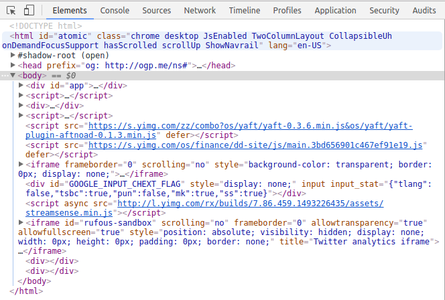
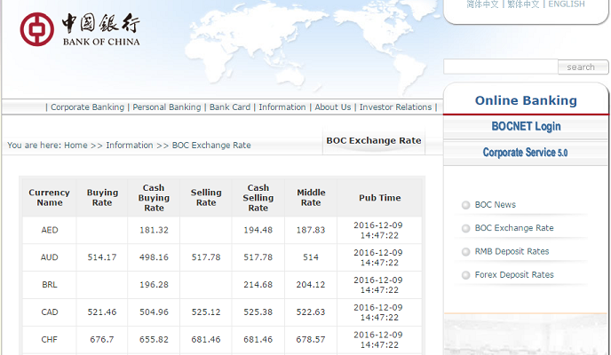

```{r setup, include=FALSE}
## User-defined options come here
knitr::opts_chunk$set(warning = FALSE, message = FALSE, 
                      fig.path = "A02_02_io_files/figure-html")
```

## 目录

- [读入内部数据](#3)
- [读入外部数据](#6)
- [把数据写入文件](#25)


# 读入内部数据

## 内部数据的存在形式

- 常数: 如`pi`
- 随默认包示例数据: 不需加载即可使用
    - `datasets`包: `cars, mtcars, airquality, faithful`
- 随附加包示例数据: 先library加载后使用
    - `MASS`包: `UScrime, Boston, Animal`
    - `ggplot2`包: `diamonds, economics`

## 内部数据读入: `data`

- 载入内存: `data(<数据集>)`
    - 出现在Environment面板
    - 点下拉箭头展开，显示结构
    - 点右侧表格图标，显示表格明细
- 查看结构: `str(<数据集>)`
- 查看明细: `View(<数据集>)`

```r
> data(cars)
> str(cars)
'data.frame':	50 obs. of  2 variables:
 $ speed: num  4 4 7 7 8 9 10 10 10 11 ...
 $ dist : num  2 10 4 22 16 10 18 26 34 17 ...
```

# 读入外部数据

## 外部数据存在形式

- 结构化数据
    - 表格: CSV, Excel, SAS, SPSS, Stata
    - 关系型数据库: Oracle, SQL Server, MySQL, PostgreSQL, Access
    - 结构化文件: RDS, RDA
- 非结构化数据
    - 文本: Txt, Log
    - 网页: HTML, CSS, XML
    - 非关系型数据库: MongoDB, HBase
    - 图片: .bmp, .png, .jpg
    - 音频/视频: .wav, .avi

## 读剪贴板 {.smaller}

> 我从Outlook打开一个Excel附件，突然想拿出其中的一部分数据跑个时间序列分析。
> 但这个文件和分析都用于初步探索，不需要保存。我也比较懒，不高兴费劲另存、读取、选片再分析。

- 工具: `base`包
- 函数: `read.table`
- 语法:

```r
read.table(file, header = FALSE, sep = "", quote = "\"'",
           dec = ".", numerals = c("allow.loss", "warn.loss", "no.loss"),
           row.names, col.names, as.is = !stringsAsFactors,
           na.strings = "NA", colClasses = NA, nrows = -1,
           skip = 0, check.names = TRUE, fill = !blank.lines.skip,
           strip.white = FALSE, blank.lines.skip = TRUE,
           comment.char = "#",
           allowEscapes = FALSE, flush = FALSE,
           stringsAsFactors = default.stringsAsFactors(),
           fileEncoding = "", encoding = "unknown", text, skipNul = FALSE)
```

---------

- 方法: **两步**:

    - 直接复制数据区域
    - 调用函数读取剪贴板的数据
        1. `read.table(file="clipboard")`，或
        1. `read.table(text=readClipboard())`

- 注意
    - 这是快捷但临时的方法
    - 不适合读取特别大的数据
    - `readClipboard`是`utils`包的函数，读取后返回的是一个制表符('\\t')分隔的字符串
    
## 直接加载R镜像(.Rdata)

> 退出时，R会询问是否保存工作空间(workspace)的镜像(image)。什么是镜像？

- R可以将若干个对象压缩保存为一个.Rdata文件
- 保存当前环境的所有对象为.Rdata，即生成一个瞬时工作镜像，包括但不限于
    - 数据集(Data)
    - 变量值(Value)
    - 函数(Function)
- RStudio启动后默认加载当前工作空间的镜像
- 如保存过Rdata文件，用`load()`函数加载，即可读入该镜像文件内封存的所有对象。(**当前的同名对象会被覆盖**)。
- 保存为.rds的数据集存档，可使用`readRDS`函数读入

## 读表格-1: csv {.smaller}

- 工具: `readr`包
- 函数: `read_csv()`
- 语法: 

```r
read_csv(file, col_names = TRUE, col_types = NULL,
  locale = default_locale(), na = c("", "NA"), quoted_na = TRUE,
  comment = "", trim_ws = TRUE, skip = 0, n_max = Inf,
  guess_max = min(1000, n_max), progress = interactive())
```

- 案例

```r
> library(readr)                                                     # 载入包
> csv.file <- system.file("extdata/challenge.csv", package="readr")  # 指定文件路径
> data <- read_csv(csv.file, col_types="nD")                         # 读入数据
> str(data)                                                          # 看结构
Classes 'tbl_df' 'tbl' and 'data.frame': 2000 obs. of  2 variables:
 $ x: num  404 4172 3004 787 37 ...
 $ y: Date, format: NA NA NA NA ...
```

## {.smaller}

也可以用自带函数`base::read.csv`

```r
> data <- read.csv(csv.file, colClasses=c("numeric", "Date"))
> str(data)
'data.frame': 2000 obs. of  2 variables:
 $ x: num  404 4172 3004 787 37 ...
 $ y: Date, format: NA NA NA NA ...
```
     
但`read_csv`更好:

- 执行速度更快(20+倍)
- 能直接读.gz, .bz2, .xz, .zip等压缩包
- 对于远程表格(http://, https://, ftp://, ftps://)会自动下载后读入
- 定义各列数据格式更方便 (建议自己定义，不要让函数自动猜): 'nD' vs c('numeric', 'Date')
- 默认参数更人性化: stringsAsFactors默认为FALSE

**推荐始终用csv给R传递数据**

- **不推荐任何形式的Excel文档 (xls, xlsx, ...)!**
- **不推荐任何形式的Excel文档 (xls, xlsx, ...)!**
- **不推荐任何形式的Excel文档 (xls, xlsx, ...)!**


## 读表格-2: Excel {.smaller}

- 工具: `readxl`包
- 函数: `read_excel()`
- 语法: 

```r
read_excel(path, sheet = 1, col_names = TRUE, col_types = NULL, na = "",
  skip = 0)
```

- 案例

```r
> datasets <- system.file("extdata/datasets.xlsx", package = "readxl")
> data <- read_excel(datasets)
> str(data)
Classes 'tbl_df' 'tbl' and 'data.frame':	150 obs. of  5 variables:
 $ Sepal.Length: num  5.1 4.9 4.7 4.6 5 5.4 4.6 5 4.4 4.9 ...
 $ Sepal.Width : num  3.5 3 3.2 3.1 3.6 3.9 3.4 3.4 2.9 3.1 ...
 $ Petal.Length: num  1.4 1.4 1.3 1.5 1.4 1.7 1.4 1.5 1.4 1.5 ...
 $ Petal.Width : num  0.2 0.2 0.2 0.2 0.2 0.4 0.3 0.2 0.2 0.1 ...
 $ Species     : chr  "setosa" "setosa" "setosa" "setosa" ...
```

-------

其它可选包

- `openxlsx`, `xlsx`: 读xlsx文件
- `XLConnect`: 读xls文件
- `RODBC`: (除了读ODBC驱动的数据库外) 读xls文件
      
但它们都不如`readxl`好用

- 开发者是RStudio Inc.的*Hadley Wickham* (按"p"看notes)
- 使用了高效的C++库`libxls`和`RapidXML`，执行速度更快
- 语法更简洁统一
- 跨平台，且不需要安装外部依赖库(甚至不需要装Excel)

<div class="notes">
[2015年上半年CRAN上最受欢迎的20个包](http://www.kdnuggets.com/2015/06/top-20-r-packages.html)

```{r hadley packages, echo=FALSE, fig.width=7, fig.path="A02_02_io_files/figure-html"}
dt <- data.frame(Pkg=c(
    "Rcpp", "ggplot2", "stringr", "plyr", "digest", "reshape2", "colorspace", 
    "RColorBrewer", "manipulate", "scales", "labeling", "proto", "munsell", 
    "gtable", "dichromat", "mime", "RCurl", "bitops", "zoo", "knitr"),
    nDown=c(693288, 598484, 543434, 523220, 521344, 483065, 476304, 453858, 395232,
           394389, 373374, 369096, 368949, 364015, 362562, 352780, 340530, 322743,
           302052, 295528),
    Author=c("Dirk", rep("Hadley", 3), "Dirk", "Hadley", rep("Others", 3), "Hadley",
             "Others", "Hadley", "Others", "Hadley", rep("Others", 6)),
    Rstudio_related=c(rep("Y", 4), "N", "Y", "N", "N", "Y", "Y", "N", "Y", "N", "Y", "N", 
                        "Y", rep("N", 3), "Y"),
    stringsAsFactors=FALSE)
dt$Pkg <- factor(dt$Pkg, levels=dt$Pkg[20:1])
library(ggplot2)
ggplot(dt, aes(x=Pkg, y=nDown, fill=Author, alpha=Rstudio_related)) + 
    geom_bar(stat="identity") + coord_flip() + scale_alpha_manual(values=c(0.25, 1)) +
    labs(y="Number of Downloads", x="Top 20 Packages") +
    ggtitle("Hadley Wickham & RStudio's Great Impact on R") +
    theme_minimal()
```

</div>

## 读表格-3: 其它统计软件的数据文件

传统三大统计软件SAS, SPSS, Stata都可以和R无缝切换

<div class="columns-2">

- 数据格式转换工具: **`haven`**包
    - SAS
        - `read_sas`
    - SPSS
        - `read_sav` / `read_por`
        - `read_spss`
    - Stata
        - `read_dta`
        - `read_stata`

<p class="forceBreak"></p>

- 更小众的软件: `foreign`包
    - EpiData/EpiInfo: `read.epiinfo`
    - DBF: `read.dbf`
    - Minitab: `read.mtp`
    - Octave: `read.octave`
    - Systat: `read.systat`
    - S: `read.S`
    - Weka: `read.arff` 
    - ...

</div>

## 读数据库-1: ODBC和JDBC

- 微软系: `RODBC`包 (仅限Windows) - by *Brian Ripley*
- 其它: `DBI`家族 - by *Hadley Wickham*
    - `RJDBC`: 提供JDBC引擎接口
    - `ROracle`: Oracle
    - `RMySQL`: MySQL
    - `RSQLServer`: MS SQL Server
    - `RPostgreSQL`: PostgreSQL
    - `RSQLite`: SQLite

## 读数据库-2: MS Access为例 {.smaller}

`RODBC`包读取Access数据库

```r
> library(RODBC)                                        # 1. 加载RODBC
> db <- "ProvCity.accdb"                                # 2. 数据库位置(dsn)
> con <- odbcConnectAccess2007(db)                      # 3. 建立数据库连接
> tbl <- sqlTables(con, tableType = "Table")            # 4. 数据库所有非系统表
> tbl$TABLE_NAME                                        # 5. 打印表名
[1] "CaptCity"    "City"    "Province"
> prov <- sqlFetch(con, 'Province')                     # 6. 读取Province表
> head(Prov, 2)                                         # 7. Prov前2行
  ProvID ProvCode Province ProvAlias ProvNick CountryID ProvinceEN IsCapital
1      1       11   北京市      北京       京        48    Beijing         1
2      2       12   天津市      天津       津        48    Tianjin         0
> qry <- paste("select Province.ProvAlias as Prov, count(City.CityID) as N",
+              "from Province inner join City on Province.ProvID = City.ProvID",
+              "group by Province.ProvAlias;")          # 8. 统计各省城市数的查询
> city.n <- sqlQuery(con, qry)                          # 9. 运行查询
> head(city.n, 2)                                       # 10. 查看前2行结果
   Prov        N
1  安徽       17
2  北京        2
> odbcClose(con)                                        # 11. 关闭数据库连接
```

## 读文本-1: 按行读入`readr::read_lines`

- 语法: 

```r
read_lines(file, skip = 0, n_max = -1L, locale = default_locale(),
  na = character(), progress = interactive())
```

- 案例

```r
> txt.file <- system.file("extdata/epa78.txt", package="readr")
> data <- read_lines(txt.file)
> str(data)
chr [1:20] "ALFA ROMEO                         ALFA ROMEO           78010003"...
```

## 读文本-2: 定宽文本`readr::read_fwf` {.smaller}

- 语法: 

```r
read_fwf(file, col_positions, col_types = NULL, locale = default_locale(),
  na = c("", "NA"), comment = "", skip = 0, n_max = Inf,
  guess_max = min(n_max, 1000), progress = interactive())
```

- 案例

```r
> txt.file <- system.file("extdata/epa78.txt", package="readr")
> data <- read_fwf(txt.file, fwf_positions(
+       c(1, 38, 41, 45, 51, 54, 58, 62, 67, 70, 80, 101), 
+       c(37, 40, 44, 50, 53, 57, 61, 66, 69, 79, 100, 108)))
> head(data, 2)
          X1    X2    X3    X4    X5    X6    X7    X8    X9   X10        X11      X12
       <chr> <chr> <int> <int> <int> <int> <int> <int> <int> <int>      <chr>    <int>
1 ALFA ROMEO  <NA>    NA    NA    NA    NA    NA    NA    NA    NA ALFA ROMEO 78010003
2    ALFETTA    03    81     8    74     7    89     9    NA    NA    ALFETTA 78010053
```

## 读日志: `readr::read_log` {.smaller}

- 语法: 

```r
read_log(file, col_names = FALSE, col_types = NULL, skip = 0,
  n_max = -1, progress = interactive())
```

- 案例

```r
> log.file <- system.file("extdata/compound.log", package="readr")
> str(read_log(log.file))
Classes 'tbl_df' 'tbl' and 'data.frame':	2 obs. of  9 variables:
 $ X1: chr  "74.133.75.225" "162.13.87.136"
 $ X2: chr  NA NA
 $ X3: chr  NA NA
 $ X4: chr  "01/Jan/2015:15:15:20 -0500" "01/Jan/2015:15:15:16 -0500"
 $ X5: chr  "GET blah/ HTTP/1.0" "GET / HTTP/1.0"
 $ X6: int  200 200
 $ X7: int  202 6934
 $ X8: chr  NA NA
 $ X9: chr  "R (3.1.2 x86_64-apple-darwin13.4.0 x86_64 darwin13.4.0)..."
```

## 读网页-1: `readr::read_lines` {.smaller}


 ==> 


读作页面代码文本

```r
> data <- read_lines("https://finance.yahoo.com")
> str(data)
chr [1:104] "<!DOCTYPE html><html id=\"atomic\" class=\"NoJs desktop\" lang=\"en-US\"><head prefix=\"og: http://ogp.me/ns#\"><script>window."| __truncated__ ...
```

## 读网页-2: `XML`包



## {.smaller}

- 把页面文件下载到本地演示
- 读取汇率表，形成一个data.frame
- 另推荐爬虫包`rvest`、`curl`和`RCurl`

```r
> library(XML)                               # 加载XML包
> data <- readHTMLTable("A02_02_io_files/file/BOC EXCHANGE RATE(new).html",
                        header = TRUE)       # 读取保存到本地的页面文件
> str(data[[8]])                             # 共获得23个列表，我们要的是其中第8个
'data.frame':	27 obs. of  7 variables:
 $ Currency Name    : Factor w/ 27 levels "AED","AUD","BRL",..: 1 2 3 4 5 6 7 8 9 10 ...
 $ Buying Rate      : Factor w/ 22 levels "","0.5887","10.87",..: 1 11 1 12 14 22 16 20 21 1 ...
 $ Cash Buying Rate : Factor w/ 27 levels "","0.05","0.568",..: 8 15 10 17 18 27 20 24 25 2 ...
 $ Selling Rate     : Factor w/ 22 levels "","0.5935","10.95",..: 1 11 1 12 14 22 16 20 21 1 ...
 $ Cash Selling Rate: Factor w/ 27 levels "","0.0536","0.615",..: 8 15 11 16 19 27 21 24 25 2 ...
 $ Middle Rate      : Factor w/ 27 levels "0.0517","0.5929",..: 8 16 11 17 19 27 21 25 26 1 ...
 $ Pub Time         : Factor w/ 1 level "2016-12-09 \n\t\t10:07:37": 1 1 1 1 1 1 1 1 1 1 ...
```

## 其它

- XML: `XML` / `xml2`包
- json: `jsonlite`包
- jpg图片: `jpeg`包
- png图片: `png`包
- shp、KML等地图数据: `maptools` / `sp`包

# 数据写入文件

## 存镜像 `save`

- 语法

```r
save(..., list = character(),
     file = stop("'file' must be specified"),
     ascii = FALSE, version = NULL, envir = parent.frame(),
     compress = isTRUE(!ascii), compression_level,
     eval.promises = TRUE, precheck = TRUE)
```

- 案例

```r
save(c(<obj1>, <obj2>), file="~/image.RData")
```

- `save.image`是其快捷形式，将当前环境下所有对象都存入目标文件.RData。

## 写入csv `readxl::write_csv`

- 语法

```r
write.csv(x, file = "", append = FALSE, quote = TRUE, sep = " ",
            eol = "\n", na = "NA", dec = ".", row.names = TRUE,
            col.names = TRUE, qmethod = c("escape", "double"),
            fileEncoding = "")
```

- 案例

```r
write.csv(<data.frame>, file="~/target.csv")
```

- 导出为csv是最推荐的数据中转形式

## 写入Excel `openxlsx::write.xlsx` {.smaller}  

- 语法

```r
write.xlsx(x, file, asTable = FALSE, ...)
```

- 部分可选参数 (...内的部分)
    - sheetName: Name of the worksheet
    - : A logical. If FALSE, the worksheet grid lines will be hidden.
    - colNames: or col.names If TRUE, column names of x are written.
    - rowNames: or row.names If TRUE, row names of x are written.
    - 格式参数gridLines, headerStyle, borders, borderColour, borderStyle

- 案例

```r
write.xlsx(<data.frame>, file="~/target.xlsx")
```

## 写入数据库

- 基本步骤同读取数据库: 加载包、建立连接、运行查询、断开连接
- 查询语句可能包括:
    - 创建新表  `create table ...`
    - 修改表结构 `alter table ...`
    - 删除表 `drop table ...`
    - 插入记录 `insert into table (...) ...`
    - 删除记录 `delete ... from table ...`
    - 覆盖记录 `update table set ...`

## {.grayblue}

<p style="font-size:100px;font-family:'Arial Black'"><br/>Thank you! </p>
<br><br>
[返回目录](http://madlogos.github.io/R_Tutorial)
