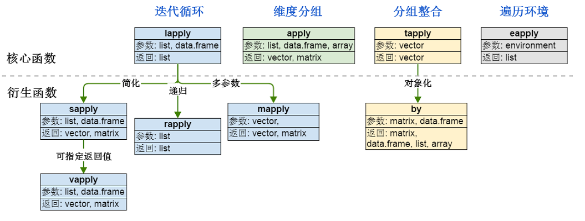

```{r setup, include=FALSE}
## User-defined options come here
knitr::opts_chunk$set(warning = FALSE, message = FALSE, 
                      fig.path = "A02_04_apply__family_files/figure-html")
```

## 目录

- [化整为零策略](#3)
- [迭代循环](#6)
- [维度分组](#13)
- [分组整合](#16)
- [遍历环境](#23)

<p class="footer">Copyright © 2016 Aetna Inc. <span class="cranberry">内部使用，请勿外传。</span></p>


# 化整为零策略

## Split-Apply-Combine 化整为零计算策略

- R的精髓是**向量化计算**和**函数式编程**
- [SAC策略](https://www.jstatsoft.org/article/view/v040i01/v40i01.pdf)的精神 (单机map-reduce)：
    - 把一个问题拆成若干个可并行处理的**同结构小片**
    - 把并行处理子过程写成**可复用函数**
    - **并行化处理**这些小片

    ```r
    > system.time(1:999999 + 1)                         # 向量化计算
       user  system elapsed 
       0.00    0.02    0.01 
    > system.time(sapply(1:999999, function(i) i + 1))  # 隐式循环
       user  system elapsed 
       0.87    0.01    0.89 
    > system.time({v <- vector(length=999999)
    +             for (i in 1:999999) v[i] <- i + 1})   # 显式循环
       user  system elapsed 
       1.08    0.00    1.08 
    ```

## `apply`家族成员

apply函数族是R菜鸟和入门的分野



# 循环迭代: lapply, sapply, mapply, vapply和rapply

## `lapply`

- 语法 (**l**ist-**apply**)
```r
lapply(X, FUN, ...)  # 返回一个list
```

    - X: 向量或列表，或表达式
    - FUN: 子过程函数
- 示例

    ```r
    > lst <- split(mtcars$mpg, mtcars$gear)  # 分拆成gear 3|4|5 三个list
    > lapply(lst, mean)  # 对这三个list，并行使用函数mean
    $`3`
    [1] 16.10667
    $`4`
    [1] 24.53333
    $`5`
    [1] 21.38
    ```

## `sapply`: `lapply`的扩展版

- 语法 (**s**implified-**apply**)
```r
sapply(X, FUN, ..., simplify = TRUE, USE.NAMES = TRUE)  # 返回列表或向量
```

    - simplify: 逻辑值，是否简化结果
    - USE.NAMES: 逻辑值，结果是否用X名称命名
- `sapply`是`lapply`的扩展版。simplify和USE.NAMES都为FALSE时，sapply与lapply等价。
- 示例

    ```r
    > lst <- split(mtcars$mpg, mtcars$gear)
    > sapply(lst, mean)
           3        4        5 
    16.10667 24.53333 21.38000 
    ```

## `mapply`: `lapply`的多参数版

- 语法 (**m**ultiple-**apply**)
```r
mapply(FUN, ..., MoreArgs = NULL, SIMPLIFY = TRUE, USE.NAMES = TRUE)
```

    - MoreArgs: 其他参数，以列表形式提供
- 示例

    ```r
    > mapply(rep, times = 1:3, MoreArgs = list(x = 42))
    [[1]]
    [1] 42
    [[2]]
    [1] 42 42
    [[3]]
    [1] 42 42 42
    
    > mapply(round, digits=0:5, list(x=pi))
    [1] 3.00000 3.10000 3.14000 3.14200 3.14160 3.14159
    ```

## `vapply`: `sapply`的可定制返回值版 {.smaller}

- 语法 (**v**alue-**apply**)
```r
vapply(X, FUN, FUN.VALUE, ..., USE.NAMES = TRUE)
```

    - FUN.VALUE: 扩展向量，FUN返回值的模板。
- 示例

    ```r
    > vapply(lst, fivenum, c(
    +   Min.=0, "1st Qu."=0, Median=0, "3rd Qu."=0, Max.=0))
               3     4    5
    Min.    10.4 17.80 15.0
    1st Qu. 14.5 21.00 15.8
    Median  15.5 22.80 19.7
    3rd Qu. 18.4 28.85 26.0
    Max.    21.5 33.90 30.4
    ```

- 也可以sapply后再`row.names()`赋值

## `rapply`: `lapply`的递归版 {.smaller}

- 语法 (**r**ecursive-**apply**)
```r
rapply(object, f, classes = "ANY", deflt = NULL,
       how = c("unlist", "replace", "list"), ...)
```

    - object: 列表
    - f: 函数或某个参数
- 示例

    ```r
    > X <- list(list(a = pi, b = list(c = 1:1)), d = "a test")
    > rapply(X, sqrt, classes = "numeric", how = "replace")
    [[1]]
    [[1]]$a
    [1] 1.772454
    
    [[1]]$b
    [[1]]$b$c
    [1] 1
    
    $d
    [1] "a test"
    ```


## Farewell, 显式循环

- 所有显示循环(`for`, `while`, ...)都可以用隐式循环`lapply`或`sapply`替代
- 为效率计，很多R设计准则中都明令禁止使用显式循环
    - 向量化计算是最快的
    - 隐式循环次之
    - 虽然隐式循环不那么直观，但代码效率更高，长度也更短
- 例外
    - 几乎不会复用的探索性临时代码，可以用显示循环
    - **人比机器重要得多**：对于临时性的工作，宁可3分钟写出代码，跑30分钟，也不要花30分钟优化代码，跑3分钟。


# 维度分组: apply

## 二维对象 (数据框) {.smaller}

- 语法
```r
apply(X, MARGIN, FUN, ...)
```

    - MARGIN: 函数FUN将被用在哪些维度。对于数据框，1代表行，2代表列。
- 示例

    ```r
    > apply(mtcars, 2, mean)
           mpg        cyl       disp         hp       drat         wt       qsec
     20.090625   6.187500 230.721875 146.687500   3.596563   3.217250  17.848750
            vs         am       gear       carb 
      0.437500   0.406250   3.687500   2.812500 
      
    > apply(mtcars, 1, mean)
              Mazda RX4       Mazda RX4 Wag          Datsun 710      Hornet 4 Drive 
               29.90727            29.98136            23.59818            38.73955 
      Hornet Sportabout             Valiant          Duster 360           Merc 240D 
               53.66455            35.04909            59.72000            24.63455 
    ...
    ```

## 高维对象

```r
> apply(Titanic, 3, sum)  # 第三维是Age
Child Adult 
  109  2092 

> apply(Titanic, 4, sum)  # 第四维是Survived
  No  Yes 
1490  711

> apply(Titanic, c(1, 3), sum)
      Age
Class  Child Adult
  1st      6   319
  2nd     24   261
  3rd     79   627
  Crew     0   885
```

# 分组整合: tapply, by和aggregate

##  `tapply`函数 {.smaller}

- 语法 (**t**able-**apply**)
```r
tapply(X, INDEX, FUN = NULL, ..., simplify = TRUE)
```

    - X: 原子对象，通常是向量
    - INDEX: 列表，一或多个因子，长度均与X相同
- 示例

    ```r
    > str(warpbreaks)
    'data.frame':	54 obs. of  3 variables:
     $ breaks : num  26 30 54 25 70 52 51 26 67 18 ...
     $ wool   : Factor w/ 2 levels "A","B": 1 1 1 1 1 1 1 1 1 1 ...
     $ tension: Factor w/ 3 levels "L","M","H": 1 1 1 1 1 1 1 1 1 2 ...
    > tapply(warpbreaks$breaks, warpbreaks[,-1], sum)
        tension
    wool   L   M   H
       A 401 216 221
       B 254 259 169
    ```

## `by`函数 

- 语法
```r
by(data, INDICES, FUN, ..., simplify = TRUE)
```

    - data: R对象，数据框或矩阵
    - INDICES: 一个因子或一列表的因子，每个引资长度都与data的行数相等
- 示例    

    ```r
    > by(warpbreaks[, c(1,2)], warpbreaks[,"wool"], summary)
    ## 获得两个水平的小结列表
    ```
    
------

```r
warpbreaks[, "wool"]: A
     breaks      wool  
 Min.   :10.00   A:27  
 1st Qu.:19.50   B: 0  
 Median :26.00         
 Mean   :31.04         
 3rd Qu.:36.00         
 Max.   :70.00         
---------------------------------------------------------------------------------------------------------- 
warpbreaks[, "wool"]: B
     breaks      wool  
 Min.   :13.00   A: 0  
 1st Qu.:18.00   B:27  
 Median :24.00         
 Mean   :25.26         
 3rd Qu.:29.00         
 Max.   :44.00
```

## `aggregate`: 一步完成分组、运算、整合

- `stats::aggregate`
- 基本语法
    - `aggregate(x, ...)`
    - 数据框 (data.frame)
    
    ```r
    aggregate(x, by, FUN, ..., simplify = TRUE, drop = TRUE)
    ```
    
    - 公式 (formula)
    
    ```r
    aggregate(formula, data, FUN, ..., subset, na.action = na.omit)
    ```
    
    - 时间序列 (ts)
    
    ```r
    aggregate(x, nfrequency = 1, FUN = sum, ndeltat = 1,
          ts.eps = getOption("ts.eps"), ...)
    ```
    
## `aggregate.data.frame`方法 {.smaller}

- `by` 必须是列表
- `FUN`函数的补充参数可直接列在`aggregate`表达式里(...传入)

```r
> aggregate(state.x77, list(Region = state.region), mean)
         Region Population   Income Illiteracy Life Exp    Murder  HS Grad    Frost      Area
1     Northeast   5495.111 4570.222   1.000000 71.26444  4.722222 53.96667 132.7778  18141.00
2         South   4208.125 4011.938   1.737500 69.70625 10.581250 44.34375  64.6250  54605.12
3 North Central   4803.000 4611.083   0.700000 71.76667  5.275000 54.51667 138.8333  62652.00
4          West   2915.308 4702.615   1.023077 71.23462  7.215385 62.00000 102.1538 134463.00

> aggregate(airquality[, 1:4], list(Month=airquality$Month), mean, na.rm=TRUE)
  Month    Ozone  Solar.R      Wind     Temp
1     5 23.61538 181.2963 11.622581 65.54839
2     6 29.44444 190.1667 10.266667 79.10000
3     7 59.11538 216.4839  8.941935 83.90323
4     8 59.96154 171.8571  8.793548 83.96774
5     9 31.44828 167.4333 10.180000 76.90000
```

## `aggregate.formula`方法 {.smaller}

- `formula`: `~`连接的表达式，可以是一/多对一/多
- `subset`: 子集向量

```r
> aggregate(.~Month, data=airquality[, -6], mean, na.rm=TRUE)
  Month    Ozone  Solar.R      Wind     Temp
1     5 24.12500 182.0417 11.504167 66.45833
2     6 29.44444 184.2222 12.177778 78.22222
3     7 59.11538 216.4231  8.523077 83.88462
4     8 60.00000 173.0870  8.860870 83.69565
5     9 31.44828 168.2069 10.075862 76.89655

> aggregate(cbind(Ozone, Temp) ~ Month, data = airquality, mean)
  Month    Ozone     Temp
1     5 23.61538 66.73077
2     6 29.44444 78.22222
3     7 59.11538 83.88462
4     8 59.96154 83.96154
5     9 31.44828 76.89655
```

# 遍历环境: eapply

## `eapply`函数 {.smaller}

- 语法 (**e**nvironment-**apply**)
```r
eapply(env, FUN, ..., all.names = FALSE, USE.NAMES = TRUE)
```

    - env: 环境
    - all.names: 是否将FUN应用到所有值
    - USE.NAMES: 返回结果列表是否有名称
- 示例    

    ```r
    > env <- new.env(hash = FALSE)
    > env$a <- 1:10
    > env$beta <- exp(-3:3)
    > utils::ls.str(env)
    a :  int [1:10] 1 2 3 4 5 6 7 8 9 10
    beta :  num [1:7] 0.0498 0.1353 0.3679 1 2.7183 ...
    > unlist(eapply(env, mean))
        beta        a 
    4.535125 5.500000
    ```

## {.teal}

<p style="font-size:100px;font-family:'Arial Black'"><br/>Thank you! </p>
