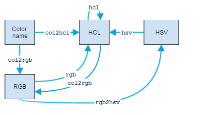
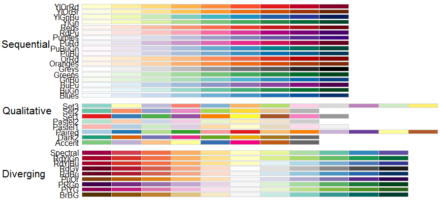

```{r setup, include=FALSE}
## User-defined options come here
knitr::opts_chunk$set(warning = FALSE, message = FALSE, 
                      fig.path = "A03_02_visualDesign_files/figure-html/")
```

## 目录

- [可视化流程](#3)
- [设计原则](#15)
- [调色](#25)


# 可视化流程

## 什么? 为什么?

数据可视化(Data Visualization): 将抽象的科学或者商业**数据**用**图像**表示出来，帮助理解**数据的意义**的过程。可视化并不独立于分析过程，两者往往相伴、迭代推进。

为什么要做可视化? 图形传达信息的效率更高

- 理解数据**特性**
- 找出数据中蕴含的**模式** (pattern)
- 建议**建模**策略
- 诊断分析中的**问题**

## 一般流程


## 作图前考虑

- 选择绘图设备 (本教程只考虑屏幕设备)
    - 是不是只要看看效果？只要显示到屏幕？
    - 要输出为文件？是否要高清晰度？用于浏览器/展示/打印？
- 选择绘图系统
    - 探索性画一下图？要做面板图？要出更灵活、更美观的图？
    - 一般各种绘图系统彼此独立，不能混用。
- 选择统计图种类
    - 可参考[Dr. Andrew Abela的小结](http://www.infographicsblog.com/wp-content/uploads/2011/11/chart-suggestion-infographic.jpg)
- 图表设计
    - 是否要分面？如何排版？边距？视觉通道（长短、大小、饱和度、色调、透明度）？

-----


## 变量映射

变量映射(数据==>可视化结果)的过程就是**视觉编码**(visual encoding)。

作图前的数据准备: 各个变量分别映射到哪个视觉通道(visual channel)上？通常，

- `x` 变量映射到x轴或角度
- `y` 变量映射到y轴或半径
- 若干`group`变量映射到分组
    - 可以映射为气泡大小、线条粗细
    - 可以映射为色调 (hue)
    - 可以映射为饱和度 (saturation)
    - 可以映射为透明度 (transparency/alpha)
    - ...

## 何谓视觉通道?

- 信息被编码在**数据-符号的映射**关系（视觉编码）中
- 人类视觉系统通过**解码视觉编码**获得信息


-----

<div class="columns-2">

```{r vis channel 1, echo=FALSE, fig.width=5, fig.height=4}
library(ggplot2)
ggplot(iris, aes(Sepal.Width, Sepal.Length)) + 
    geom_point(aes(color=Species, size=Petal.Length)) + theme_minimal() +
    ggtitle("Anderson's Iris Dataset")
```

- 通道1: 位置
- 通道2: 颜色
- 通道3: 气泡大小

<p class="forceBreak"></p>

```{r vis channel 2, echo=FALSE, fig.width=5, fig.height=4}
library(ggplot2)
titanic <- reshape2::dcast(as.data.frame(Titanic), Class+Sex+Survived~., sum, value.var="Freq")
ggplot(titanic, aes(Sex, .)) + theme_minimal() + facet_grid(.~Class) +
    geom_col(aes(fill=Sex, alpha=Survived), position="stack") + 
    scale_alpha_manual(values=c("Yes"=1, "No"=0.2)) + 
    ggtitle("Titanic Survival by Class & Gender")
```

- 通道1: 长度
- 通道2: 颜色
- 通道3: 透明度

</div>

## 人类视觉对不同视觉通道的敏感性

| 通道  | 分类数据 Categorical | 有序数据 Ordinal | 定量数据 Quantitative |
|:------|:----------:|:----------:|:----------:|
| 位置 position | <gre>好</gre> | <gre>好</gre> | <gre>好</gre> |
| 长度 length | <gre>好</gre> | <gre>好</gre> | <gre>好</gre> |
| 亮暗 luminance | <gre>好</gre> | <gre>好</gre> | <gld>中</gld> |
| 纹理 texture | <gre>好</gre> | <gld>中</gld> | <crb><b>差</b></crb> |
| 颜色 color | <gre>好</gre> | <gld>中</gld> | <crb><b>差</b></crb> |
| 角度 angle | <gre>好</gre> | <crb><b>差</b></crb> | <crb><b>差</b></crb> |
| 形状 shape | <gre>好</gre> | <crb><b>差</b></crb> | <crb><b>差</b></crb> |

(Jacques Bertin, 1967)

## 视觉编码的选择优先级

| 序号 | 分类数据 | 有序数据 | 定量数据 |
|----:|:--------:|:--------:|:--------:|
| 1  | <crb>位置</crb>     position | <crb>位置</crb>     position | <crb>位置</crb>     position |
| 2  | <red>色调</red>          hue | <gld>密度</gld>      density | <dgr>长度</dgr>       length |
| 3  | <dpk>纹理</dpk>      texture | <lim>饱和度</lim> saturation | <tea>角度</tea>        angle |
| 4  | <pnk>连接</pnk>   connection | <red>色调</red>          hue | <blu>斜率</blu>        slope |
| 5  | <ora>包含</ora>  containment | <dpk>纹理</dpk>      texture | <prw>面积</prw>         area |
| 6  | <gld>密度</gld>      density | <pnk>连接</pnk>   connection | <vio>体积</vio>       volume |
| 7  | <lim>饱和度</lim> saturation | <ora>包含</ora>  containment | <gld>密度</gld>      density |

## 视觉编码的选择优先级 (续) 

| 序号 | 分类数据 | 有序数据 | 定量数据  |
|-----:|:--------:|:--------:|:---------:|
| 8  | <gre>形状</gre>        shape | <dgr>长度</dgr>       length | <lim>饱和度</lim> saturation |
| 9  | <dgr>长度</dgr>       length | <tea>角度</tea>        angle | <red>色调</red>          hue |
| 10 | <tea>角度</tea>        angle | <blu>斜率</blu>        slope | <dpk>纹理</dpk>      texture |
| 11 | <blu>斜率</blu>        slope | <prw>面积</prw>         area | <pnk>连接</pnk>   connection |
| 12 | <prw>面积</prw>         area | <vio>体积</vio>       volume | <ora>包含</ora>  containment |
| 13 | <vio>体积</vio>       volume | <gre>形状</gre>        shape | <gre>形状</gre>        shape |

by Mackinlay, **Automating the Design of Graphical Presentations of Relational Information**, 1986

## 其他考虑

- 视觉编码方案组合众多: k个视觉通道 * n个数据维度 -> (n+1)^k 种编码方案
- 除了视觉通道以外，还要考虑
    - 色彩搭配
    - 人机交互
    - 美学规律
    - 信息密度
    - 象征、隐喻
    - ...

# 设计原则

## 基本原则

- 一致性: 可视化结果与数据**真实蕴含**的信息一致 (诚实性)
    - 文字标示清晰、完整
    - 视觉度量和数字本身**成比例**
    - 体现数字的变异，而不是设计的变异
- 表达性: 可视化结果**充分且不多余**地表达数据要传达的信息
    - 用于表现数字变化的笔墨比重越高越好
    - **内容为王**，避免图标垃圾，增加信息/数字密度
    - 信息分层
    - **对比**、**证据综合**
- 有效性: 可视化之后**表达效果更好**
- 可理解性: 可视化结果**便于理解**

<p style="text-align:center">by Mackinlay, Tversky, & E. Tufte</p>


## 一致性

#### 文字标示清晰完整

<div class="columns-2">

```{r consitency 1 wrong, echo=FALSE, fig.width=5, fig.height=3.5}
p <- ggplot(cars, aes(speed, dist))
p + geom_point(color="firebrick")
```

- 变量名意义不明晰
- 没有标题和背景提示

<p class="forceBreak"></p>

```{r consitency 1 right, echo=FALSE, fig.width=5, fig.height=3.5}
p + geom_point(color="seagreen") + ggtitle(
    "Car Test: Speed & Distances Taken to Stop", sub="Recorded in 1920s") + 
    xlab("Speed (mph)") + ylab("Stopping Distance (feet)")
```

- 要提供标签、尺度、来源等信息

</div>


## 一致性

#### 视觉度量和数字成比例

<div class="columns-2">

```{r consitency 2 wrong, echo=FALSE, fig.width=5, fig.height=3.5}
p <- ggplot(data.frame(Year=as.character(2010:2016), Percent=81:87), aes(Year, Percent)) +
    ggtitle("Satisfaction Rate by Year")
p + geom_col(fill="firebrick") + 
    scale_y_continuous(limits=c(80,NA), oob=scales::rescale_none)
```

- 视觉上7倍 (实际1.07倍)
- **谎言系数**: 7/1.07=6.5，夸大5.5倍

<p class="forceBreak"></p>

```{r consitency 2 right, echo=FALSE, fig.width=5, fig.height=3.5}
p + geom_col(fill="seagreen")
```

</div>

## 一致性

#### 重点表达数字本身的变异

<div class="columns-2">

```{r consitency 3 wrong, echo=FALSE, fig.width=5, fig.height=3.5}
p <- ggplot(data.frame(Year=as.character(2010:2016), Percent=c(81:83, 70, 85:87),
                       type=c(rep("Up", 3), "Down", rep("Up", 3))), 
            aes(Year, Percent)) + ggtitle("Satisfaction Rate by Year")
cols <- terrain.colors(7); names(cols) <- as.character(2010:2016)
p + geom_col(aes(fill=Year, color=Year), size=2) + scale_color_manual(values=cols)
```

- 彩虹色一般都要慎用
- 要善用灰色、灰度

<p class="forceBreak"></p>

```{r consitency 3 right, echo=FALSE, fig.width=5, fig.height=3.5}
p + geom_col(aes(fill=type)) + scale_fill_manual(values=c("Up"="seagreen", "Down"="firebrick"))
```

</div>


## 表达性

#### 提高数字笔墨比 (data-ink ratio)

<div class="columns-2">

```{r expressive 1 wrong, echo=FALSE, fig.width=5, fig.height=3.5}
dt <- matrix(c(81:87, 91:97), byrow=TRUE, nrow=2)
colnames(dt) <- 2010:2016
row.names(dt) <- c("Male", "Female")
par(mar=c(3.5, 1.5, 2, 0.5))
epade::bar3d.ade(dt, main="Gender-specific Satisfaction Rate by Year", wall=4,
                 xlab="Year", ylab="Percent")
```

- 3D图侧面/阴影元素费墨，且误导比例
- 花哨的"镀金"元素，应一律去除

<p class="forceBreak"></p>

```{r expressive 1 right, echo=FALSE, fig.width=5, fig.height=3.5}
p <- ggplot(data.frame(Year=as.character(rep(2010:2016, 2)), Gender=c(rep("Male", 7), rep("Female", 7)),
                       Percent=c(81:87, 91:97)/100), aes(Year, Percent, group=Gender))
p + geom_col(aes(fill=Gender, color=Gender), position="dodge", alpha=0.9) + theme_bw() +
    ggtitle("Gender-specific Satisfaction Rate by Year") +
    scale_y_continuous(labels=scales::percent) +
    geom_text(aes(y=Percent+0.05, label=paste0(100*Percent, "%")),
              position=position_dodge(0.9), size=3, color="gray10") +
    theme(panel.grid=element_line(linetype=0), 
          panel.border=element_rect(linetype=0))
```

- 淡化边框、网格、轴线、背景
- 去掉所有无关元素

</div>

## 表达性

#### 信息分层

<div class="columns-2">

```{r expressive 2 wrong, echo=FALSE, fig.width=5, fig.height=3.5}
titanic <- reshape2::dcast(as.data.frame(Titanic), Class+Sex+Survived~., sum, value.var="Freq")
titanic$Group <- with(titanic, paste(Class, Sex, sep=" Class -"))
ggplot(titanic, aes(Survived, .)) + theme_minimal() + 
    geom_col(aes(fill=Group, color=Group), position="dodge") + 
    ggtitle("Titanic Survival by Class & Gender") + ylab("Num of Survivals")
```

- 分组和颜色太多，降低效果
- 信息密度不要太低也不要太高

<p class="forceBreak"></p>

```{r expressive 2 right, echo=FALSE, fig.width=5, fig.height=3.5}
ggplot() + theme_minimal() + facet_grid(.~Sex) +
    geom_bar(data=titanic, aes(Class, ., fill=Survived), position="stack", stat="identity") +
    ggtitle("Titanic Survival by Class & Gender") + ylab("Num of Survivals") +
    theme(panel.grid=element_line(linetype=0), 
          plot.background=element_rect(fill="gray95", color="transparent"),
          panel.background=element_rect(fill="white"), 
          panel.border=element_rect(fill=NA, color="white"))
```

</div>

## 表达性

#### 比较、证据综合

<div class="columns-2">

```{r expressive 3 wrong, echo=FALSE, fig.width=5, fig.height=3.5}
p <- ggplot(data.frame(Year=as.character(rep(2016,2)), Percent=c(0.87, 0.85), 
                       Gender=c("Male", "Female")), aes(Year, Percent))
p + geom_col(position="dodge", alpha=0.9, fill="firebrick", width=0.25) + theme_minimal() +
    ggtitle("Satisfaction Rate in 2016") + 
    scale_y_continuous(labels=scales::percent)
```

- 孤点，信息密度太低
- 没有参比标杆，没有自身对比

<p class="forceBreak"></p>

```{r expressive 3 right, echo=FALSE, fig.width=5, fig.height=3.5}
p <- ggplot(data.frame(
    Year=as.character(rep(2010:2016, 2)), Gender=c(rep("Male", 7), rep("Female", 7)),
    Percent=c(81:87, 71:77)/100, Benchmark=rep(81:87,2)/100+0.08), 
    aes(Year, Percent, group=Gender))
p + geom_col(aes(fill=Gender, color=Gender), position="dodge", alpha=0.9) + theme_minimal() +
    ggtitle("Gender-specific Satisfaction Rate by Year") +
    scale_y_continuous(labels=scales::percent) + 
    geom_line(aes(Year, Benchmark), size=1, color="gold3") + 
    annotate("text", x=6, y=0.98, label="Industrial Average", size=4, color="gold4") +
    annotate("text", x=6, y=0.91, label="Gap in 2016: 8 - 18%", color="red", size=4)
```

- 展示多种变量，展示对比和变化
- 努力表现因果、机制、解释、系统结构等

</div>

## 有效性

#### 选择达意效果最优的图

<div class="columns-2">

```{r effective 1 wrong, echo=FALSE, fig.width=5, fig.height=3.5}
titanic <- reshape2::dcast(as.data.frame(Titanic), Class+Sex+Survived~., sum, value.var="Freq")
titanic$Prop <- titanic$`.`
titanic$Prop[seq(1, 16, 2)] <- titanic$Prop[seq(2, 16, 2)] <-
    titanic$Prop[seq(1, 16, 2)] + titanic$Prop[seq(2, 16, 2)]
titanic$Prop <- titanic$`.`/titanic$Prop
ggplot(titanic, aes(factor(1), Prop)) + theme_minimal() + facet_grid(Sex~Class) +
    geom_bar(aes(fill=Survived), stat="identity", width=1) + coord_polar(theta="y") +
    ggtitle("Titanic Survival Proportion by Class & Gender") + xlab("") +
    scale_y_continuous(breaks=NULL, labels=NULL) +
    scale_x_discrete(breaks=NULL) 
```

- 人类视觉对面积不如长度敏感
- 饼图承载信息量太稀，建议尽量少用

<p class="forceBreak"></p>

```{r effective 1 right, echo=FALSE, fig.width=5, fig.height=3.5}
ggplot(titanic[titanic$Survived=="Yes",], aes(Class, Prop)) + theme_minimal() + 
    geom_col(aes(fill=Sex, alpha=Survived), position="dodge") + 
    scale_alpha_manual(values=c("Yes"=1, "No"=0), breaks=NULL) + 
    scale_y_continuous(labels=scales::percent) +
    ggtitle("Titanic Survival Rate by Class & Gender") +
    theme(panel.grid=element_line(linetype=0))
```

</div>


# 调色

## 颜色编码

 颜色系统|                    | 黑        | 灰              | 天蓝            | 番茄        
---------|--------------------|-----------|-----------------|-----------------|------------
 色名    | 文本, 颜色名字         | "black"   | "gray"          | "skyblue"       | "tomato"
 RGB空间 | 向量, `rgb(Red, Green, Blue, <Alpha>)` | rgb(0, 0, 0) | rgb(190, 190, 190, max=255) | rgb(135, 206, 235, max=255) | rgb(255, 99, 71, max=255)
 HCL空间 | Hex文本, `"#Hue Chroma Luminance <Transparency>"` | #000000FF | #BEBEBEFF       | #86CEEBFF       | #FF6347FF
 HSV空间 | 向量, `hsv(Hue, Saturation, Value, <Tranparency>)` | hsv(0, 0, 0) | hsv(0, 0, 0.74510) | hsv(0.548, 0.426, 0.922) | hsv(0.025, 0.722, 1)

```{r color encoding, fig.height=1, fig.width=10, echo=FALSE}
par(mfrow=c(1,4), mar=c(1,1,1,1))
for (i in list("black", "rgb(190, 190, 190, max=255)", "#86CEEBFF", "hsv(0.025, 0.722, 1)")){
    plot.new()
    rect(0, 1, 1, 0, col=ifelse(
        inherits(try(eval(parse(text=i)), silent=TRUE), c("try-error", "NULL")), 
        i, eval(parse(text=i))))
    text(0.5, 0.5, i, col="palegreen4", cex=1.25)
}
```

## 色彩空间相互转换


<div class="columns-2">

`colorspace`包，或



- 色名 --> HCL

```r
> col2hcl("pink")
[1] "#FFC0CBFF"
```

- 色名/HCL --> RGB: `col2rgb`

```r
> col2rgb("pink")
      [,1]
red    255
green  192
blue   203
```

- RGB --> HSV: `rgb2hsv`

```r
> rgb2hsv(255, 190, 77, max=255)
       [,1]
h 0.1058052
s 0.6980392
v 1.0000000
```

</div>

## 标准色

- 标准色内建于`grDevices`包中
    - R内建**657**种颜色名: `colors()`
    - `demo(colors)`展示内建颜色各种效果

    

## 自定义色

- 函数
    - `rgb`: R, G, B, A均可0-1或0-255
    - `hsv`: H, S, V, A均可0-1或0-255
- 或直接书写`hcl`颜色编码

<div class="columns-2">

```{r show_col, fig.height=3, fig.width=4.5}
library(scales)
show_col(c("#7AC143", "#7D3F98", "#F47721", 
    "#D20962", "#00A78E", "#00BCE4"))
show_col(c(rgb(1, 1, 1), rgb(0.5, 0, 0), 
    rgb(0, 0.5, 0), hsv(0, 0, 0.5), 
    hsv(1, 0.5, 1), hsv(0.5, 1, 0.5)))
```

</div>

## 调色板 Palette {.smaller}

- 调色板: 多个颜色构成的向量
- 离散色板: 显式定义固定长度调色板，及各组成元素
- 连续色板: 在一根定限的色阶上连续变化的一组颜色
    - `grDevices`包中的`gray()`
    
    ```r
    > gray(c(0.1, 0.5, 0.8))  # 取灰度0.1, 0.5, 0.8
    [1] "#1A1A1A" "#808080" "#CCCCCC"  # 返回hcl值
    ```
    
    - `colorRamp()`和`colorRampPalette()`: 生成色阶定义函数

    ```r
    > pal <- colorRamp(c("red", "green", "violet"))  # 定义色阶
    > pal(c(0.4, 0.75))   # 在该色阶上取0.4, 0.75分位
         [,1]  [,2] [,3]  # 三列分别代表红、绿、蓝
    [1,]   51 204.0    0  # 两行分别代表0.4和0.75分位
    [2,]  119 192.5  119
    
    > pal <- colorRampPalette(c("red", "green", "violet"))  # 定义同样的色阶
    > pal(5)  # 自动从色阶中等距取5种颜色，返回hcl值
    [1] "#FF0000" "#7F7F00" "#00FF00" "#77C077" "#EE82EE"
    ```

## 内置调色板 `RColorBrewer`包

- `display.brewer.all()`



- `brewer.pal.info`

## RColorBrewer

<div class="columns-2">

```{r brewer.pal 1, fig.width=4.5, fig.height=2}
library(RColorBrewer)
cols <- brewer.pal(n=3, name="RdYlGn")
cols
scales::show_col(cols)
```

<p class="forceBreak"></p>

```{r brewer.pal 2, fig.height=4, fig.width=4.5}
pal <- colorRampPalette(cols)
image(volcano, col = pal(20))
```

</div>

## {.grayblue}

<p style="font-size:100px;font-family:'Arial Black'"><br/>Thank you! </p>


