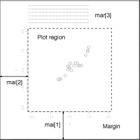
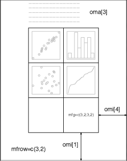
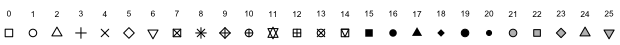

```{r setup, include=FALSE}
## User-defined options come here
knitr::opts_chunk$set(warning = FALSE, message = FALSE, 
                      fig.path = "A03_03_plotBase_files/figure-html/")
Sys.setlocale("LC_CTYPE", "Chs")
```

## 目录

- [作图流程](#3)
- [版面版式和全局配置](#5)
- [基础底图](#11)
- [进阶底图](#18)
- [添加图形元素](#29)
- [标注](#36)

<p class="footer">部分内容借鉴Johns Hopkins University Data Science Series Courses @ Coursera.</p>

# 作图流程

## 顺序

1. 配置函数`par`: 指定版式和全局参数
2. 底图函数: 初始化底图，将覆盖前一张底图
    - `plot`, `plot.new`
    - `smoothScatter`, `barplot`, `boxplot`, `bxp`, `dotchart`, `hist`, `pie`, `stars`
    - `pairs`, `spineplot`, `matplot`, `assocplot`, `coplot`, `cdplot`, `stripchart`, `sunflowerplot`, `mosaicplot`, `fourfoldplot`, `symbols`
3. 注释函数: 底图上覆盖其他元素
    - 图: `lines`, `abline`, `segments`, `points`, `pch`, `box`, `rect`, `curve`, `arrows`, `polygon`, `polypath`, `matlines`, `matpoints`
    - 文: `title`, `legend`, `text`, `mtext`
    - 其他: `axis`, `grid`, `rug`

# 版面版式和全局配置

## `par`

- `par()`打印所有制图版式参数的当前取值
- `par("<参数>")`打印某个特定参数的当前取值
- `par(<参数>=...)`修改特定参数的取值

```r
> par("mar")
[1] 5.1 4.1 4.1 2.1

> par(mar=c(5, 4, 4, 2))
> par("mar")
[1] 5 4 4 2
```

## 分面(facet)版式 {.smaller}

<div class="columns-2">

- `mfrow`: 向量`c(<行个数>, <列个数>)`，按行序出图

```{r mfrow, fig.width=5, fig.height=3.5}
par(mfrow=c(2, 2), mai=c(0.8, 0.8, 0, 0.2))
for (i in 0:1) for (j in 1:0) 
    with(subset(mtcars, am==i & vs==j), 
         plot(wt, mpg))
```

<p class="forceBreak"></p>

- `mfcol`: 向量`c(<行个数>, <列个数>)`，按列序出图

```{r mfcol, fig.width=5, fig.height=3.5}
par(mfcol=c(2, 2), mai=c(0.8, 0.8, 0, 0.2))
for (i in 0:1) for (j in 1:0) 
    with(subset(mtcars, am==i & vs==j), 
         plot(wt, mpg))
```

</div>

## 外边距

- `mar`: 向量`c(下, 左, 上, 右)`，单位是“行”
    - 默认值: c(5, 4, 4, 2) + 0.1
- `mai`: 向量`c(下, 左, 上, 右)`，单位是“英寸”
    - 默认值: c(1.02, 0.82, 0.82, 0.42)



## 内边距

- `oma`: 向量`c(下, 左, 上, 右)`，单位是“行”，默认值: c(0, 0, 0, 0)
- `omi`: 向量`c(下, 左, 上, 右)`，单位是“英寸”，默认值: c(0, 0, 0, 0)
- `omd`: c(x1, x2, y1, y2)，单位是相对于设备尺寸的"%"，默认值: c(0, 1, 0, 1)



## 美学参数

还有一些美学/视觉效果类参数。具体请查阅`?par`

- `bg`: 背景色
- `cex`: 注释图文的大小
- `family`: 字体
- `fg`: 前景色
- `font`: 字体效果
- `lty`: 线条的种类
- `lwd`: 线宽
- `pch`: 点的种类


# 基础底图

## 散点图 points

<div class="columns-2">

散点图: 两变量相关性。数据很多时，用`smoothScatter`

```{r scatter, fig.height=4, fig.width=4.5}
with(mtcars, plot(wt, mpg, type='p'))  
# 默认type='p'
```

<p class="forceBreak"></p>

文本型变量作散点图

```{r points, fig.height=4, fig.width=4.5}
stripchart(decrease ~ treatment,
    vertical=TRUE, data=OrchardSprays)
```

</div>

## 直方图 histogram

<div class="columns-2">

直方图: 单变量密度分布

```{r hist, fig.height=4, fig.width=4.5}
with(mtcars, hist(mpg))
```

<p class="forceBreak"></p>

或用线段图

```{r hist line, fig.height=4, fig.width=4.5}
with(mtcars, plot(mpg, type='h'))
```

</div>

## 箱式图 boxplot

<div class="columns-2">

连续性变量的分布

```{r boxplot, fig.height=4, fig.width=4.5}
boxplot(ToothGrowth$len)
```

<p class="forceBreak"></p>

多个箱式图

```{r multi boxplot, fig.height=4, fig.width=4.5}
boxplot(len ~ dose, data = ToothGrowth)
```

</div>

## 柱/条形图 barplot

<div class="columns-2">

分类变量的比较

```{r col, fig.height=4, fig.width=4.5}
hp <- mtcars$hp
names(hp) <- row.names(mtcars)
barplot(hp)
```

<p class="forceBreak"></p>

自变量较多时用横向条图

```{r bar, fig.height=4, fig.width=4.5}
hp <- mtcars$hp
names(hp) <- row.names(mtcars)
barplot(hp, horiz=TRUE)
```

</div>

## 折线图 lines

<div class="columns-2">

表示趋势

```{r line, fig.height=4, fig.width=4.5}
plot(AirPassengers) # 时间序列数据默认type='l'
```

<p class="forceBreak"></p>

阶梯折线

```{r stair, fig.height=4, fig.width=4.5}
plot(AirPassengers, type='s')  # 阶梯图
```

</div>

# 进阶底图

## 散点图矩阵 pairs

```{r pairs, fig.height=4.5}
pairs(iris[1:4], main = "Anderson's Iris Data -- 3 species",
      pch = 21, bg = c("red", "green3", "blue")[unclass(iris$Species)])
```

## 跨矩阵的列比较图 matplot

```{r matplot, fig.height=4}
iris.S=array(NA, dim=c(50, 4, 3),
             dimnames=list(NULL, colnames(iris)[-5], levels(iris$Species)))
for(i in 1:3) iris.S[,,i] <- data.matrix(iris[1:50+50*(i-1), -5])
matplot(iris.S[,"Petal.Length",], iris.S[,'Petal.Width',], pch="scv")
```

## 关联散点图 assocplot

```{r assocplot, fig.height=4.5}
x <- margin.table(Titanic, c(1,4))
assocplot(x)
```

## 条件散点图 coplot

```{r coplot, fig.height=4.5}
coplot(lat ~ long | depth, data = quakes)
```

## 一维散点图 stripchart

```{r stripchart, fig.height=4.5}
with(iris, stripchart(Sepal.Width ~ Species))
```

## 向日葵图 sunflowerplot

```{r sunflower, fig.height=4.5}
sunflowerplot(iris[, 3:4])
```

## 马赛克图 mosaicplot

```{r mosaicplot, fig.height=4.5}
mosaicplot(~ Sex + Age + Survived, data = Titanic, color = TRUE)
```

## 棘状图 spineplot

```{r spineplot, fig.height=4.5}
with(iris, spineplot(Species ~ Sepal.Width))
```

## 条件密度图 cdplot

```{r cdplot, fig.height=4.5}
with(iris, cdplot(Species ~ Sepal.Width))
```

## 四折图 fourfoldplot

```{r fourfoldplot, fig.height=4.5}
x <- aperm(UCBAdmissions, c(2, 1, 3))
fourfoldplot(x, mfcol=c(2, 3))
```

# 添加图形元素

## 添加点 points

```{r add point, fig.height=4}
par(mfrow=c(1,3))
plot(cars)
plot(cars);points(cars[cars$dist > 2.6 * cars$speed,], col='red')
plot(cars);points(cars[cars$dist > 2.6 * cars$speed,], pch=19)
```

## 点型`pch`


<div class="columns-2">

`pch`代表点的种类，可以是整数

- NA: 无符号
- 0:18: S兼容的矢量符号
- 19:25: R独特的矢量符号
- 32:127: ASCII字符，如33为感叹号
- 128:255: 本地符号
- -32: ... Unicode编码的点

你甚至可以用其他文本符号

<p class="forceBreak"></p>

```{r pch, fig.width=4.5, fig.height=4}
plot(cars, pch="\u8F66", cex=0.75)
```

</div>

## 添加线条 lines

```{r add line, fig.height=4}
par(mfrow=c(1,3))
plot(cars)
plot(cars);lines(stats::lowess(cars))
plot(cars);abline(h=40,v=15,col="red")
```

## 线型`lty`

<div class="columns-2">

`lty`是线条形状，可以是整数，或一个不超过8位的数值文本(连-断-连-断...的形式)

- 0 = 空白 blank
- 1 = 实线 solid(默认)
- 2 = 短划虚线 dashed，等价于"44"
- 3 = 点虚线 dotted，等价于"13"
- 4 = 点划虚线 dotdash，等价于"1343"
- 5 = 长划虚线 longdash，等价于"73"
- 6 = 双划虚线 twodash，等价于"2262"

<p class="forceBreak"></p>

```{r lty, fig.width=4.5, fig.height=4}
plot(cars, type='n')
for (i in 1:6) abline(h=20*i, lty=i)
```

</div>

## 添加线段segments / 箭头arrows {.smaller}

<div class="columns-2">

```{r segments, fig.width=4.5, fig.height=3.5}
x <- stats::runif(12); y <- stats::rnorm(12)
plot(x, y)
s <- seq(length(x)-1); s <- s[-length(s)]
segments(x[s], y[s], x[s+2], y[s+2], col= 'pink')
```

<p class="forceBreak"></p>

```{r arrow, fig.width=4.5, fig.height=3.5}
x <- stats::runif(12); y <- stats::rnorm(12)
plot(x, y)
s <- seq(length(x)-1)  # one shorter than data
arrows(x[s], y[s], x[s+1], y[s+1], col= 1:3)
```

</div>

## 添加方块rect / 多边形 polygon

<div class="columns-2">

```{r rect, fig.width=4.5, fig.height=3.5}
plot(cars)
rect(10, 20, 20, 80, border="red")
```

<p class="forceBreak"></p>

```{r polygon, fig.width=4.5, fig.height=3.5}
plot(cars)
polygon(c(10, 20, 20, 10), c(
    20, 30, 100, 60), border="gray")
```

</div>

# 标注

## 标题 title、坐标轴 axis、边框 box {.smaller}

```{r title, fig.width=9, fig.height=3.5}
par(mfrow=c(1, 4))
plot(cars)
plot(cars); title("Scatter Dist vs Speed", sub="1920s")
plot(cars, xlab="Speed (mph)", ylab="Stopping distance (ft)")
plot(cars); box(col="blue")
```

## 文字标注 text / 图例 legend {.smaller}

<div class="columns-2">

```{r text, fig.width=5, fig.height=3.5}
par(mar=c(4, 4, 1, 1))
with(mtcars, plot(wt, mpg, type="n"))  # 不出图
with(subset(mtcars, am==0), 
     text(wt, mpg, labels=row.names(mtcars),
     cex=0.6, col=1))
with(subset(mtcars, am==1), 
     text(wt, mpg, labels=row.names(mtcars),
     cex=0.6, col=2))
```

<p class="forceBreak"></p>

```{r legend, fig.width=5, fig.height=3.5}
par(mar=c(4, 4, 1, 1))
with(mtcars, plot(wt, mpg), type='n')  # 不出图
with(subset(mtcars, am==0), 
     points(wt, mpg, pch=20, col=1))
with(subset(mtcars, am==1), 
     points(wt, mpg, pch=20, col=2))
legend("topright", pch=20, col=c(1, 2), 
       legend=c("Auto", "Manual"))
```

</div>

## 自定义字体: `extrafont`包

<div class="columns-2">

- `family`参数可指定字体，但默认只支持"serif"、"sans"、"mono"等值
- 利用`extrafont`可将操作系统字体映射到R作图系统
- 使用方法
    - `install.packages("extrafont")`
    - `extrafont::font_import()`
    - `fonttable`查看映射字体名称
    - 使用`fonttable()$FullName`列表中的注册字体名称

<p class="forceBreak"></p>

```{r extrafont, fig.width=5, fig.height=3.5}
library(extrafont)
with(mtcars, plot(wt, mpg, main='汽车', 
        family="Microsoft YaHei"))
```

</div>

## 数学符号 (`?plotmath`) {.smaller}

<div class="columns-2">

- `expression()`

```{r plotmath 1, fig.width=4.5, fig.height=3.5}
plot(0, 0, main = expression(theta == 0),
     ylab = expression(hat(gamma) == 0),
     xlab = expression(sum(x[i] * y[i], i==1, n)))
```

<p class="forceBreak"></p>

- 几部分文本拼接: *符号

```{r plotmath 2, fig.width=4.5, fig.height=3.5}
x <- rnorm(100)
hist(x, xlab=expression(
  "The mean (" * bar(x) * ") is " * sum(x[i]/n,i==1,n)))
```

</div>

## `substitute`函数 {.smaller}

如果表达式中包含实时运算，要用`substitute`函数转义

```{r plotmath 3, fig.height=3.5}
par(mar=c(4, 4, 1, 1))
x <- rnorm(100)
y <- x + rnorm(100, sd = 0.5)
plot(x, y, xlab=substitute(bar(x) == k, list(k=mean(x))),
     ylab=substitute(bar(y) == k, list(k=mean(y))))
```

## {.grayblue}

<p style="font-size:100px;font-family:'Arial Black'"><br/>Thank you! </p>


