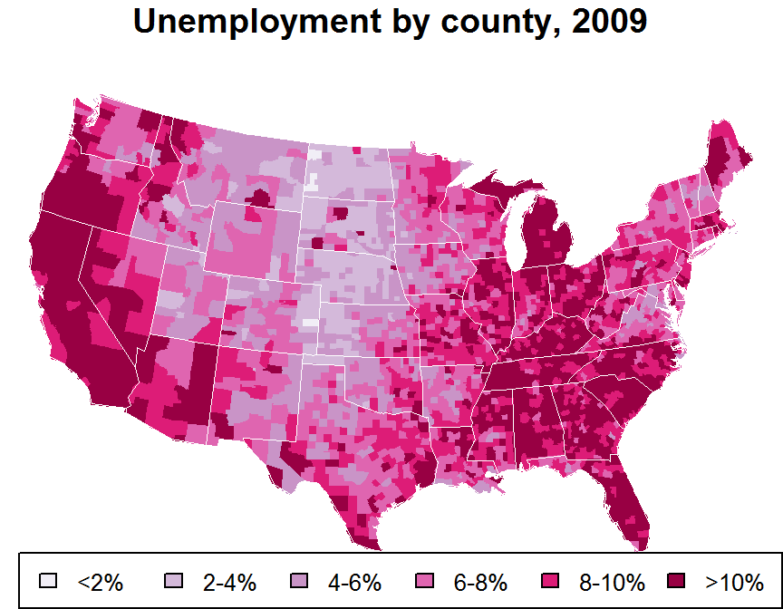
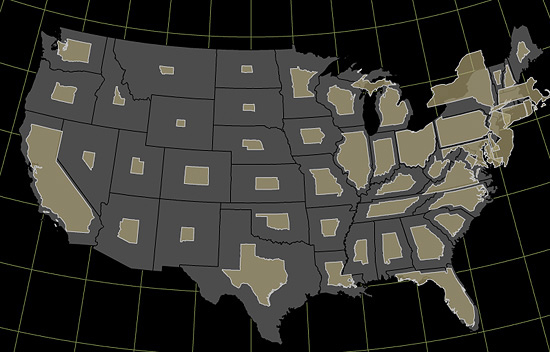
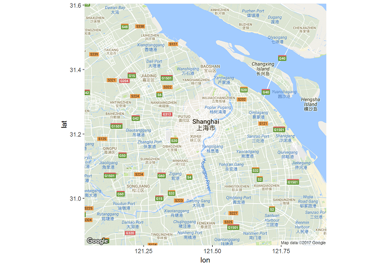
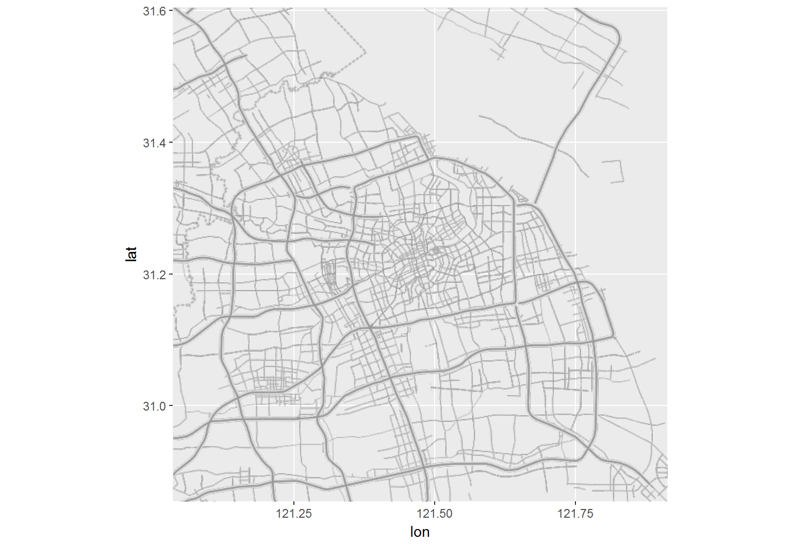
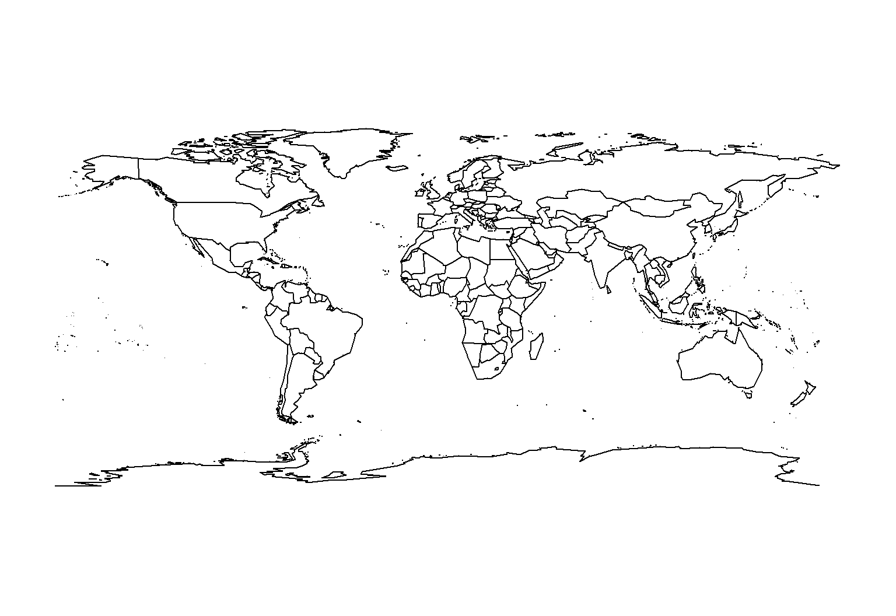
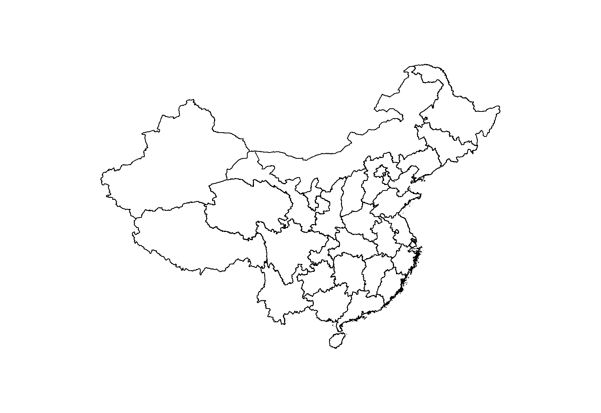
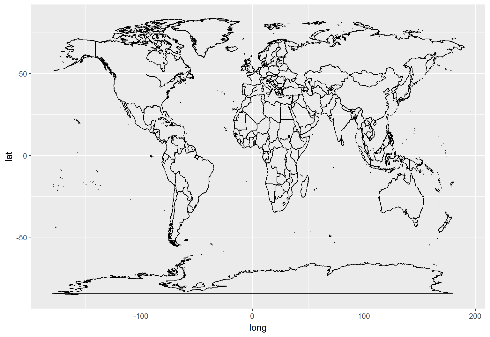
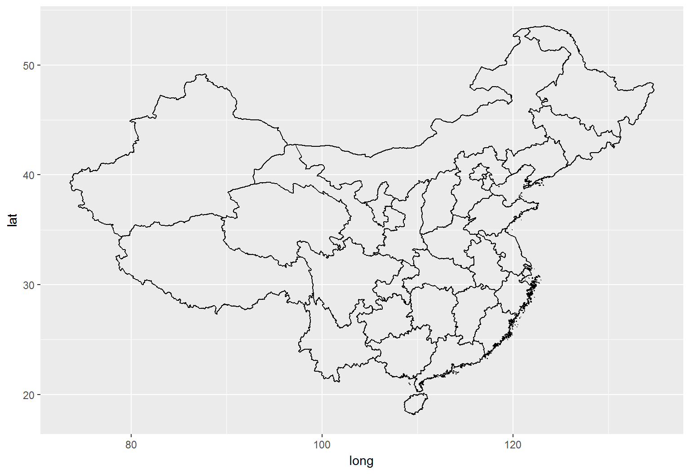

```{r setup, include=FALSE}
## User-defined options come here
knitr::opts_chunk$set(warning = FALSE, message = FALSE, 
                      fig.path = "A03_06_map_files/figure-html/")
```

## 目录

- [基础](#3)
- [GIS数据](#8)
- [底图](#11)
- [数据地图](#14)
- [用例](#20)

# 基础

## 可视化地图的构成

- 数据: 经纬度、测量值、属性，等
- 图层
    - 控制: 投影、网格、比例尺、大地控制，等
    - 视觉元素: 颜色、符号、文字标注，等
    - 辅助: 标题、插图、所略图、接合表、制图说明，等

<div class="columns-2">

```{r sample maps, echo=FALSE, eval=FALSE, fig.width=4.75, fig.height=3}
library(maps)
library(mapproj)
mar <- c(0, 0, 1.1, 0)
par(mar=mar)
map("state", fill=TRUE, col=terrain.colors(8)[-8], projection="rectangular", param=45, mar=mar)
map.grid(col="gray50", cex=0.6, nx=5, ny=6)
title("USA States (Rectangular Proj.)", cex=0.8)
map.scale(cex=0.75)
cat("\n\n")

map("state", fill=TRUE, col=terrain.colors(8)[-8], projection="polyconic", mar=mar)
map.grid(col="gray50", cex=0.6, nx=5, ny=6)
title("USA States (Polyconic Proj.)", cex=0.8)
map.scale(cex=0.75)
```

</img>

</img>

</div>

## 参考地图 (Reference map)

- 我们日常用的主要就是参考图
    - 不包含业务数据的地图图层: 政区、地形、地质……
    - 底图的控制参数（投影方法、坐标系等）将贯彻整个可视化过程

<div class="columns-2">

- 直接用地图图片作底图

```{r google basemap, echo=FALSE, eval=FALSE, fig.width=4.5, fig.height=3.5}
library(ggmap)
ggmap(get_map("beijing", maptype="terrain"))
```

</img>

<p class="forceBreak"></p>

- 绘制轮廓线/多边形作底图

```{r polygon basemap, echo=FALSE, eval=FALSE, fig.width=4.5, fig.height=3.5}
mar=c(0,0,0,0)
par(mar=mar)
map("world", lty=0, fill=TRUE, col="gray", bg='lightblue1', mar=mar)
map("world", lwd=0.01, col="white", add=TRUE, mar=mar)
map("world", lwd=0.02, col="lightblue1", interior=FALSE, add=TRUE, mar=mar)
```

</img>

</div>

## [主题地图](https://axismaps.github.io/thematic-cartography) (Thematic map)

<div class="columns-2">

- 等值区域地图 (Choropleth map)

```{r choropleth, echo=FALSE, eval=FALSE, fig.width=4.5, fig.height=3.5}
mar=c(0, 0, 1.1, 0)
par(mar=mar)
data(unemp)
data(county.fips)
# define color buckets
colors = c("#F1EEF6", "#D4B9DA", "#C994C7", "#DF65B0", "#DD1C77", "#980043")
unemp$colorBuckets <- as.numeric(cut(unemp$unemp, c(seq(0, 10, 2), 100)))
leg.txt <- c("<2%", "2-4%", "4-6%", "6-8%", "8-10%", ">10%")
# align data with map definitions by (partial) matching state,county
# names, which include multiple polygons for some counties
cnty.fips <- county.fips$fips[match(map("county", plot=FALSE)$names,
                                    county.fips$polyname)]
colorsmatched <- unemp$colorBuckets [match(cnty.fips, unemp$fips)]
map("county", col = colors[colorsmatched], fill = TRUE, resolution = 0,
    lty = 0, projection = "polyconic", mar=mar)
map("state", col = "white", fill = FALSE, add = TRUE, lty = 1, lwd = 0.2,
    projection="polyconic", mar=mar)
title("Unemployment by county, 2009")
legend("bottomright", leg.txt, horiz = TRUE, fill = colors, cex=0.8)
```

</img>

- 比例符号图 (Proportional Symbols)

```{r prop symbol, echo=FALSE, eval=FALSE, fig.width=4.5, fig.height=3.5}
mar=c(0, 0, 1.1, 0)
par(mar=mar)
map("world", lty=0, fill=TRUE, col="gray", bg='lightblue1', mar=mar)
map("world", lwd=0.01, col="white", add=TRUE, mar=mar)
map("world", lwd=0.02, col="lightblue1", interior=FALSE, add=TRUE, mar=mar)
map.cities(label=FALSE, minpop=100000, maxpop=199999, cex=0.1, pch=16, col='blue')
map.cities(label=FALSE, minpop=200000, maxpop=499999, cex=0.2, pch=16, col='cyan')
map.cities(label=FALSE, minpop=500000, maxpop=999999, cex=0.5, pch=16, col='green')
map.cities(label=FALSE, minpop=1000000, maxpop=4999999, cex=1, pch=19, col='yellow')
map.cities(label=FALSE, minpop=5000000, maxpop=9999999, cex=2, pch=19, col='orange')
map.cities(label=FALSE, minpop=10000000, cex=5, pch=19, col='red')
title("Big cities in the world, as of Jan 2016")
```

</img>

</div>

-----------

<div class="columns-2">

- 密度点图 (Dot density map)

```{r dot density, echo=FALSE, eval=FALSE, fig.width=4.5, fig.height=3.5}
mar=c(0, 0, 1.1, 0)
par(mar=mar)
map("world", lty=0, fill=TRUE, col="gray", bg='lightblue1', mar=mar)
map("world", lwd=0.01, col="white", add=TRUE, mar=mar)
map("world", lwd=0.02, col="lightblue1", interior=FALSE, add=TRUE, mar=mar)
map.cities(label=FALSE, cex=0.01, pch=16, col="#00000033")
title("Cities in the world, as at Jan 2016")
```

</img>

<p class="forceBreak"></p>

- 不连续地图 (Non-continuous map)

https://axismaps.github.io/thematic-cartography/images/cartogram_US_pop.jpg</img>

</div>

## 一般作图步骤

1. 数据准备
    - 底图栅格/矢量数据
    - 数据层元数据处理
1. 制作底图（参考地图）
    - 直接由栅格数据合成
    - 通过矢量数据生成
1. 覆盖数据层（主题地图）
    - 将处理后的数据映射到视觉通道
    - 合并图层并出图

# GIS数据

## GIS数据结构 {.smaller}

> [Wikipedia](https://zh.wikipedia.org/wiki/%E5%9C%B0%E7%90%86%E4%BF%A1%E6%81%AF%E7%B3%BB%E7%BB%9F): 地理信息系统(GIS)……是用于输入、存储、查询、分析和显示地理数据的计算机系统，可以分为以下五个部分…：人员，…数据，…硬件，…软件，…过程…

其中, GIS内部数据即空间数据(spatial data)

- 包括3方面内容
    - 空间位置
    - 拓扑关系
    - 属性
- 数据结构可分2大类
    - 显式（栅格数据grid）
        - 一系列x、y坐标定位的像元(pixel)
    - **隐式**（矢量数据vector）
        - 坐标对->点(point/node)，点系列->线(line/arc)，闭合线->面(polygon)
        - 常见模型: ESRI的Shapefile，Coverage，Geodatabase， ...

## 怎样获取地理数据?

1. ~~**非法**自行测绘~~
2. 向测绘信息部门申请
3. 从共享/开放地图数据网站获取，如
    - [Diva GIS](http://www.diva-gis.org/Data)
    - [Natural Earth Data](http://www.naturalearthdata.com)
    - [Open Street Map](https://wiki.openstreetmap.org/wiki/Downloading_data)
    - [NASA SEDAC](http://sedac.ciesin.columbia.edu)
    - [UNEP Environmental Data Explore](http://geodata.grid.unep.ch)
    - [FAO GeoNetwork](http://www.fao.org/geonetwork)
    - [开放地理空间信息科学中心](http://www.osgeo.cn)
    - [中科院地理科学和资源所](http://www.resdc.cn)(免费，但须实名申请)

## 地理数据长什么样？ {.smaller}

- 从Diva GIS下载中国政区边界地理数据CHN_adm.zip
- .shp, .shx, .dbf构成ERSI地理数据集
- 利用`rgdal::readOGR`包读取 -> SpatialPolygonsDataFrame

    ```r
    df <- rgdal::readOGR("~/MAP_DTA/CHN_adm/CHN_adm0.shp")
    str(df)
    ```
    
    ```r
    ..@ data : 'data.frame': 1 obs. of 70 variables:
      .. ..$ ID_0      : Factor w/ 1 level "49": 1
      .. ..$ ISO       : Factor w/ 1 level "CHN": 1
      .. .. ...
    ..@ polygons   :List of 1
      .. ..$ :Formal class 'Polygons' [package "sp"] with 5 slots
      .. .. .. ..@ Polygons :List of 2013
      .. .. .. .. ..$ :Formal class 'Polygon' [package "sp"] with 5 slots
      .. .. .. .. .. .. ..@ labpt  : num [1:2] 109.7 18.2
      .. .. .. .. .. .. ..@ area   : num 1.75e-05
      .. .. .. .. .. .. ..@ hole   : logi FALSE
      .. .. .. .. .. .. ..@ ringDir: int 1
      .. .. .. .. .. .. ..@ coords : num [1:61, 1:2] 110 110 110 110 110 ...
    ```

## {.smaller}

### `SpatialPolygonsDataFrame`类 

`sp`包的标准地理数据类型，包含5个槽(slot，即属性)

- S4对象
    - 较S3的封装性更好（但Google R风格指南并不推荐使用）
    - 用@（而非$）引用
- 包含元素
    - 多边形Polygons，含labpt、area、hole、ringDir、coords五个属性
    - 元数据data，数据框，存储数据集的基本信息
    - 绘制顺序plotOrder，数值，该SpatialPolygonsDataFrame在绘制时的顺序
    - 坐标边界bbox，数据框，坐标系四角边界
    - 投影规则proj4string，`CRS`类S4对象
- 可以直接用于`maps`、`maptools`、`sp`等包
- 可以通过`broom::tidy`转化为数据框

## `broom::tidy`

- `broom`包可以自动将统计分析对象转为数据框
- `SpatialPolygonsDataFrame`转化后变成一个7列数据框，便于`ggplot2`制图
    
    ```r
    head(broom::tidy(df))
    ```
    
    ```r
          long      lat order  hole piece group id
    1 121.7179 39.44096     1 FALSE     1   0.1  0
    2 121.7179 39.44181     2 FALSE     1   0.1  0
    3 121.7182 39.44181     3 FALSE     1   0.1  0
    4 121.7182 39.44236     4 FALSE     1   0.1  0
    5 121.7185 39.44236     5 FALSE     1   0.1  0
    6 121.7185 39.44320     6 FALSE     1   0.1  0
    ```

## 坐标系偏移 {.smaller}

- 地理数据的定位，取决于每个点的经纬度测定值
    - 经度(**long**itude): 相当于x坐标，-180 ~ 180
    - 纬度(**lat**itude)：相当于y坐标，-90 ~ 90

- 在国内，经常需要在不同坐标测量系统之间转换
    - [WGS-84](https://en.wikipedia.org/wiki/World_Geodetic_System)（世界大地测量系统）：国际通用坐标系
        - 用于中国以外的Google Map, Bing Map, ...
    - [GCJ-02](https://en.wikipedia.org/wiki/Restrictions_on_geographic_data_in_China)（中国加密测量系统）：国测局在WGS-84基础上进行的加密偏移
        - 用于中国境内的Google Map, 高德地图，...
    - [BD-09](https://en.wikipedia.org/wiki/Restrictions_on_geographic_data_in_China#BD-09)（百度自主加密测量系统）：百度在GCJ-02基础上进行的加密偏移
        - 用于百度地图

- 转化方法
    - 调用官方API进行偏置
    - 利用`recharts::convCoord`进行偏置

# 底图

## 栅格底图

利用ggmap包，直接获取地图图块

<div class="columns-2">

- Google Maps / 行政区划

```{r ggmap1, eval=FALSE}
library(ggmap)
ggmap(get_map("shanghai", maptype="terrain"))
```

</img>

<p class="forceBreak"></p>

- Stamen / 政区框架

```{r ggmap2, eval=FALSE}
ggmap(get_map("shanghai", 
  maptype="terrain-lines", source="stamen"))
```

</img>

</div>

## 矢量底图(1) - `maps`包

<div class="columns-2">

- 调用内置的地图集

```{r maps1, eval=FALSE}
library(maps)
map("world")
```

</img>

<p class="forceBreak"></p>

- 用`sp`包支持的地图数据格式

```{r maps2, eval=FALSE}
map(rgdal::readOGR(
    "CHN_adm/CHN_adm1.shp"))
```

</img>

</div>

## 矢量底图(2) - `ggplot2`包 {.smaller}

<div class="columns-2">

- 调用内置的地图集，转为数据框

```{r ggplot2-1, eval=FALSE}
library(ggplot2)
wmap <- map('world', plot=FALSE, fill=TRUE)
wmap <- maptools::map2SpatialPolygons(
    wmap, IDs=wmap$names)
wmap <- broom::tidy(wmap)
ggplot()+geom_path(
    aes(long, lat, group=group), data=wmap)
```

</img>

<p class="forceBreak"></p>

- 用`sp`包支持的地图数据格式

```{r ggplot2-2, eval=FALSE}
cmap <- rgdal::readOGR(
    "CHN_adm/CHN_adm1.shp")
cmap <- broom::tidy(cmap)
ggplot()+geom_path(
    aes(long, lat, group=group), data=cmap)
```

</img>

</div>

## 底图子集 {.smaller}

<div class="columns-2">

- `maps`

```{r par map 1, eval=FALSE}
map('state', region=c(
    'new york', 'new jersey', 'penn'))
txt <- data.frame(
    x=c(-76, -78, -74), y=c(42.5, 40.5, 40), 
    txt=c("New York", "Pennsylvania", "New Jersey"))
text(x=txt$x, y=txt$y, labels=txt$txt)
```

</img>

<p class="forceBreak"></p>

- `ggplot2`

```{r par map 2, eval=FALSE}
map <- map('state', plot=FALSE, fill=TRUE,
           region=c('new york', 'new jersey', 'penn'))
map <- maptools::map2SpatialPolygons(
    map, IDs=map$names)
ggplot() + coord_map() + geom_path(
    aes(long, lat, group=group), data=map) +
    geom_text(aes(x, y, label=txt), data=txt)
```

</img>


</div>


## 复合底图 {.smaller}

<div class="columns-2">

```{r multi basemap, eval=FALSE}
# 州级图层
map1 <- map('state', plot=FALSE, fill=TRUE)
map1 <- maptools::map2SpatialPolygons(
    map1, IDs=map1$names)
# 县级图层
map2 <- map('county', plot=FALSE, fill=TRUE)
map2 <- maptools::map2SpatialPolygons(
    map2, IDs=map2$names)

# 先画县级图层
p <- ggplot() + coord_map("cylindrical") + 
    geom_polygon(
        aes(long, lat, group=group), 
        data=map2, fill="gray", 
        color="gray95", size=0.01)
# 添加州级图层
p <- p +
    geom_path(
        aes(long, lat, group=group), 
        data=map1, color="white", size=0.75)
p
```

<p class="forceBreak"></p>

- 准备两个图层的数据
- 驱动低级图层，多边形上色、绘制细边
- 上覆高级图层，绘制边界粗边

</img>

</div>


# 数据地图

## 数据和标注

#### `ggplot2`包

- 数据层叠加在底图上方，也可下方
    - 通过`group`关联底图，映射视觉通道
    - 直接通过坐标定位，构成独立的视觉元素
- 标注层叠加在数据层上方，也可下方
    - 文本、标签等一般要坐标定位
    - 图例、标题等按默认参数添加即可

#### `maps`包

一般不做底图，直接将数据映射到视觉通道，并展示为地图元素

## 数据层 {.smaller}

美国失业数据集unemp和county.fips，在maps包中

<div class="columns-2">

```r
data(unemp)
data(county.fips)
```

分别看看各自的结构，以`fips`关联

```r
str(unemp)
```

```r
## 'data.frame':    3218 obs. of  3 variables:
##  $ fips : int  1001 1003 1005 1007 1009 ...
##  $ pop  : int  23288 81706 9703 8475 25306 ...
##  $ unemp: num  9.7 9.1 13.4 12.1 9.9 16.4 ...
```

```r
str(county.fips)
```

```r
## 'data.frame':    3085 obs. of  2 variables:
##  $ fips    : int  1001 1003 1005 1007 1009 ...
##  $ polyname: Factor w/ 3085 levels "alabama,autauga",..: 
```

<p class="forceBreak></p>

- 将unemp、county.fips合并，关联组名polyname和数值unemp
- 并合并后的数据合并到map2，关联每个点的坐标

```r
unemp.map <- merge(broom::tidy(map2), 
    merge(unemp, county.fips, by="fips"), 
    by.x="id", by.y="polyname", all.x=TRUE)
str(unemp.map)
```

```r
## 'data.frame':	87949 obs. of  10 variables:
##  $ id   : chr  "alabama,autauga" "alabama,autauga" ...
##  $ long : num  -86.5 -86.5 -86.5 -86.6 -86.6 ...
##  $ lat  : num  32.3 32.4 32.4 32.4 32.4 ...
##  $ order: int  1 2 3 4 5 6 7 8 9 10 ...
##  $ hole : logi  FALSE FALSE FALSE FALSE ...
##  $ piece: Factor w/ 1 level "1": 1 1 1 1 1 1 ...
##  $ group: Factor w/ 3085 levels "alabama,autauga.1",..: 
##  $ fips : int  1001 1001 1001 1001 1001 1001 ...
##  $ pop  : int  23288 23288 23288 23288 23288 ...
##  $ unemp: Factor w/ 6 levels "<2%","2-4%","4-6%",..:
```

## 映射视觉通道 {.smaller}

<div class="columns-2">

```{r unemp map, eval=FALSE}
# 失业率分段
unemp.map$unemp <- cut(unemp.map$unemp, c(
    seq(0, 10, 2), 100), labels=c(
    "<2%", "2-4%", "4-6%", "6-8%", "8-10%", "10%+"))
# 自定义颜色
colors <-  c("#F1EEF6", "#D4B9DA", "#C994C7", 
             "#DF65B0", "#DD1C77", "#980043")
names(colors) <- c(
    "<2%", "2-4%", "4-6%", "6-8%", "8-10%", "10%+")

# 作图，将底图叠在上方
ggplot() + coord_map("cylindrical") + 
    geom_polygon(aes(
        long, lat, group=group, fill=unemp), 
        data=unemp.map) +
    scale_fill_manual(values=colors) +
    geom_path(
        aes(long, lat, group=group), 
        data=map2, color="gray95", size=0.01) +
    geom_path(
        aes(long, lat, group=group), 
        data=map1, color="white", size=0.75) +
    labs(title="Unemployment by county, 2009")
```

<p class="forceBreak></p>

- 失业率数据映射到色谱(`fill=unemp`)
- 度量方法为离散、自定义色谱
- 两层底图采用geom_path，逐级覆盖在主题底图上

</img>

</div>

# 用例

## 等值地图 {.smaller}

用`maps`实现上例

```r
mar=c(0, 0, 1.1, 0)
par(mar=mar)
data(unemp)
data(county.fips)

# 定义色谱
colors = c("#F1EEF6", "#D4B9DA", "#C994C7", "#DF65B0", "#DD1C77", "#980043")
unemp$colorBuckets <- as.numeric(cut(unemp$unemp, c(seq(0, 10, 2), 100)))
leg.txt <- c("<2%", "2-4%", "4-6%", "6-8%", "8-10%", ">10%")

# 州县名与地图定义匹配
cnty.fips <- county.fips$fips[match(map("county", plot=FALSE)$names,
                                    county.fips$polyname)]
colorsmatched <- unemp$colorBuckets [match(cnty.fips, unemp$fips)]
map("county", col = colors[colorsmatched], fill = TRUE, resolution = 0,
    lty = 0, projection = "polyconic", mar=mar)
map("state", col = "white", fill = FALSE, add = TRUE, lty = 1, lwd = 0.2,
    projection="polyconic", mar=mar)
title("Unemployment by county, 2009")
legend("bottomright", leg.txt, horiz = TRUE, fill = colors, cex=0.8)
```
----

</img>

## 比例符号图

`maps`实现人口气泡图

```r
mar=c(0, 0, 1.1, 0)
par(mar=mar)
map("world", lty=0, fill=TRUE, col="gray", bg='lightblue1', mar=mar)
map("world", lwd=0.01, col="white", add=TRUE, mar=mar)
map("world", lwd=0.02, col="lightblue1", interior=FALSE, add=TRUE, mar=mar)
map.cities(label=FALSE, minpop=100000, maxpop=199999, cex=0.1, pch=16, col='blue')
map.cities(label=FALSE, minpop=200000, maxpop=499999, cex=0.2, pch=16, col='cyan')
map.cities(label=FALSE, minpop=500000, maxpop=999999, cex=0.5, pch=16, col='green')
map.cities(label=FALSE, minpop=1000000, maxpop=4999999, cex=1, pch=19, col='yellow')
map.cities(label=FALSE, minpop=5000000, maxpop=9999999, cex=2, pch=19, col='orange')
map.cities(label=FALSE, minpop=10000000, cex=5, pch=19, col='red')
title("Big cities in the world, as of Jan 2016")
```

---

</img>

## 比例符号图（续） {.smaller}

`ggplot2`实现上例

```{r world pop, eval=FALSE}
# 底图和边界
wmap <- map("world", fill=TRUE, plot=FALSE)
wmap <- maptools::map2SpatialPolygons(wmap, IDs=wmap$names)
wmap.bou <- map("world", plot=FALSE, interior=FALSE)
wmap.bou <- maptools::map2SpatialLines(wmap.bou)
wmap.bou <- SpatialLinesDataFrame(wmap.bou, data=data.frame(ID=1:length(wmap.bou)))

# 人口分段，映射颜色和尺寸
data(world.cities)
world.cities <- subset(world.cities, pop>100000)
world.cities$popl <- cut(world.cities$pop, 100000 * c(1000, 100, 50, 10, 5, 2, 1))
world.cities$popl <- factor(world.cities$popl, levels=rev(levels(world.cities$popl)))
cols <- c('red', 'orange', 'yellow', 'green', 'cyan', 'blue')
sizes <- c(5, 2, 1, 0.5, 0.2, 0.1)
names(cols) <- names(sizes) <- levels(world.cities$popl)

# 国界、海岸线底图，上覆数据层
ggplot() + geom_polygon(aes(long, lat, group=id), data=wmap, fill='gray', color="gray95", size=0.01) +
    geom_path(aes(long, lat, group=id), dat=wmap.bou, color="gray") +
    theme(panel.background=element_rect(fill="lightblue1"), legend.position="bottom") +
    geom_point(aes(long, lat, color=popl, size=popl), alpha=0.5,data=world.cities) +
    scale_color_manual(values=cols) + scale_size_manual(values=sizes, guide='none') +
    labs(title="Big cities in the world, as of Jan 2016")
```

----

</img>

## 比例符号图（续） {.smaller}

`ggplot2`实现地理柱形图

```{r world pop bar, eval=FALSE}
# 底图和边界
wmap <- map("world", fill=TRUE, plot=FALSE)
wmap <- maptools::map2SpatialPolygons(wmap, IDs=wmap$names)
wmap.bou <- map("world", plot=FALSE, interior=FALSE)
wmap.bou <- maptools::map2SpatialLines(wmap.bou)
wmap.bou <- SpatialLinesDataFrame(wmap.bou, data=data.frame(ID=1:length(wmap.bou)))

# 人口分段，映射颜色和尺寸
data(world.cities)
world.cities <- subset(world.cities, pop>100000)
world.cities$popl <- cut(world.cities$pop, 100000 * c(1000, 100, 50, 10, 5, 2, 1))
world.cities$popl <- factor(world.cities$popl, levels=rev(levels(world.cities$popl)))
cols <- c('red', 'orange', 'yellow', 'green', 'cyan', 'blue')
sizes <- c(5, 2, 1, 0.5, 0.2, 0.1)
names(cols) <- names(sizes) <- levels(world.cities$popl)

# 国界、海岸线底图，上覆数据层
ggplot() + geom_polygon(aes(long, lat, group=id), data=wmap, fill='gray', color="gray95", size=0.01) +
    geom_path(aes(long, lat, group=id), dat=wmap.bou, color="gray") +
    theme(panel.background=element_rect(fill="lightblue1"), legend.position="bottom") +
    geom_linerange(aes(x=long, ymin=lat, ymax=lat+pop/500000, color=popl), 
                   stat='identity', alpha=0.5, size=1, data=world.cities) +
    scale_color_manual(values=cols, guide='none') + scale_size_manual(values=sizes, guide='none') +
    labs(title="Big cities in the world, as of Jan 2016")
```

----

</img>

## {.grayblue}

<p style="font-size:100px;font-family:'Arial Black'"><br/>Thank you! </p>
<br><br>
[返回目录](http://madlogos.github.io/R_Tutorial)


