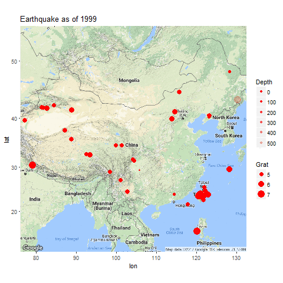
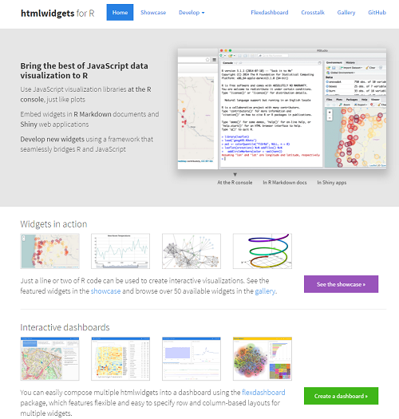

```{r setup, include=FALSE}
## User-defined options come here
knitr::opts_chunk$set(warning = FALSE, message = FALSE, 
                      fig.path = "A03_07_interactive_files/figure-html/")
```

## 目录

- [基础](#3)
- [animation](#7)
- [htmlwidgets家族](#10)
- [rCharts](#25)
- [其他](#34)

# 基础

## 静态图 vs 动态图、交互图 {.smaller}

<div class="columns-2">

#### 静态图

- 静态呈现
- 多用于文稿

```{r static, fig.width=4.5, fig.height=2.5}
library(ggplot2)
p <- ggplot(diamonds, aes(x=cut, fill=clarity)) +
    geom_bar(position="dodge")
print(p)
```

<p class="forceBreak"></p>

#### 动态/交互图

- 动态呈现/支持交互（点击、轻拂…）
- 多用于网页

```{r dynamic interactive}
library(plotly)
ggplotly(p, width=400, height=300)
```

</div>

## 动态图

- 可通过animation包实现
- 动画呈现，但不支持交互

<div class="columns-2">

```r
library(animation)
saveGIF({
    dev.control("enable")
    for (col in levels(diamonds$color)){
        print(ggplot(
            diamonds[diamonds$color==col, ], 
            aes(x=cut, fill=clarity)
            ) + geom_bar(position="dodge") +
            ggtitle(paste("color:", col))) 
    }
}, "diamonds.gif")
```

<p class="forceBreak"></p>

</img>

</div>

## 交互图

- 交互图(htmlwidgets家族、ggvis等)是动态图中的特例，更便于用户挖掘信息
- 支持通过控件、图形元素交互（点击、轻拂、框选、…）
- 多用于网页

```{r dynamic}
ggplotly(p, height=300)
```

# animation

## [animation](https://yihui.name/animation)包

- 生成多个静态图片，再调用第三方工具压制为动画（gif、flash、pdf）
- `saveGIF` 系统要求:
    - ImageMagick (http://imagemagick.org) 或
    - GraphicsMagick (http://www.graphicsmagick.org) 或
    - LyX (http://www.lyx.org)
- `saveLatex` 系统要求: (PDF)LaTeX
- `saveSWF` 系统要求: SWF Tools (http://swftools.org)
- `saveVideo` 系统要求:
    - FFmpeg (http://ffmpeg.org) 或
    - avconv (https://libav.org/avconv.html)

## 用例 {.smaller}

<div class="columns-2">

```r
library(readr); library(ggmap)
earthquake <- read_csv(
    "A03_07_interactive_files/files/earthquake.csv"
names(earthquake)[c(1, 3, 4, 5, 6)] <- c(
    "Date", "lat", "long", "Depth", "Grat")
earthquake$Year <- as.integer(
    format(earthquake[["Date"]], "%Y"))
earthquake$Grat <- as.numeric(
    gsub("^M(.+)$", "\\1", earthquake[["Grat"]]))
saveGIF({
    gg.map <- ggmap(get_googlemap("China", zoom=4))
    for (yr in sort(unique(earthquake$Year))){
        print(gg.map + geom_point(
            aes(long, lat, size=Grat, alpha=Depth),
            data=earthquake[earthquake$Year==yr,], 
            color='red') + scale_alpha(range=c(1, 0.2))+
            ggtitle(paste("Earthquake as of", yr)))
    }
}, "earthquake.gif")
```

<p class="forceBreak"></p>

</img>

</div>

# htmlwidgets家族

## [htmlwidgets](http://www.htmlwidgets.org/)包 {.smaller}

<div class="columns-2">

</img>

<p class="forceBreak"></p>

#### RStuio Inc. 出品的基建包

- 开发者贡献了庞大的htmlwidgets家族包: 基于htmlwidgets框架开发API，将第三方JavaScript可视化库移植到R
- 用户用R直接调用可视化JS库: 可嵌入Rmarkdown文档、Shiny应用

#### htmlwidgets框架

```
R/
|-- <fun>.R
inst/
|-- htmlwidgets/
|   |-- <pkg>.js
|   |-- <pkg>.yaml
|   |-- lib/
|   |   |-- <lib folder>/
|   |   |   |-- <some>.js
|   |   |   |-- plugins/
|   |   |   |   |-- <some>.js
```

</div>

## [recharts](http://madlogos.github.io/recharts/index_cn.html)包 {.smaller}

<div class="columns-2">

- 作者: 本人
- 简介: 基于百度ECharts库，支持点、条、线、雷达、饼、力导、漏斗、和弦、事件河流图及地图。
- 安装: 不能直接通过CRAN。需要`devtools::install_github( "madlogos/recharts")`

```r
library(recharts)
totGDP <- data.table::dcast(
    ChinaGDP, Prov~., sum, value.var='GDP')
ChinaGDP <- ChinaGDP[order(ChinaGDP$Year),]
echartr(ChinaGDP, Prov, GDP, Year, 
    type="map_china") %>% 
    setDataRange(splitNumber=0, 
        valueRange=range(totGDP[, 2]), 
        color=c('red','orange','yellow',
                'limegreen','green')
    ) %>% setTheme(width=400, height=400) %>%
    setTitle("China GDP by Provice, 2012-2014")
```

<p class="forceBreak"></p>

[点击查看](A03_0701_recharts.html)
<iframe src="A03_0701_recharts.html"></iframe>

</div>

## [leaflet](http://rstudio.github.io/leaflet)包 {.smaller}

<div class="columns-2">

- 作者: Rstudio Inc.
- 简介: 基于Leaflet库，可绘制各类动态地图，并添加丰富的指示图层(标点、多边形、弹出框等)。
- 安装: CRAN

```r
library(leaflet)
pal <- colorQuantile("YlOrRd", NULL, n = 4)
leaflet(quakes[1:100,]) %>% 
  addProviderTiles("Esri.WorldTopoMap") %>%
  addCircleMarkers(~long, ~lat, 
    popup=~as.character(mag),
    label=~as.character(mag), 
    color=~pal(mag))
```

<p class="forceBreak"></p>

[点击查看](A03_0702_leaflet.html)
<iframe src="A03_0702_leaflet.html"></iframe>

</div>

## [plotly](https://plot.ly/r/)包 {.smaller}

<div class="columns-2">

- 作者: Plotly
- 简介: 基于plotly库，可绘制各类动态图，并支持直接将ggplot2对象转换为plotly。
- 安装: CRAN

```r
d <- diamonds[sample(nrow(diamonds), 500), ]
plot_ly(d, x = d$carat, y = d$price, 
        text = paste("Clarity: ", d$clarity),
        mode = "markers", color = d$carat, 
        size = d$carat)
```

<p class="forceBreak"></p>

[点击查看](A03_0703_plotly.html)
<iframe src="A03_0703_plotly.html"></iframe>


</div>

## [**D**ata**T**ables](http://rstudio.github.io/DT/)包 {.smaller}

- 作者: Rstudio Inc.
- 简介: 基于DT库，可将数据框或矩阵绘制成交互表格，支持筛选、排序。
- 安装: CRAN

```r
library(DT)
datatable(iris, options=list(pageLength = 5))
```

[点击查看](A03_0704_datatable.html)
<iframe src="A03_0704_datatable.html"></iframe>


## [wordcloud2](https://github.ocm/lchiffon/wordcloud2)包 {.smaller}

<div class="columns-2">

- 作者: Dawei Lang
- 简介: 基于wordcloud2库，可绘制交互词云，且支持自定义图形词云等。
- 安装: CRAN

```r
library(wordcloud2)
wordcloud2(demoFreq[1:100,], size=0.5)
```

<p class="forceBreak"></p>

[点击查看](A03_0705_wordcloud2.html)
<iframe src="A03_0705_wordcloud2.html"></iframe>

</div>

## [Highcharter](http://jkunst.com/highcharter/)包 {.smaller}

<div class="columns-2">

- 作者: Joshua Kunst
- 简介: 基于Highcharts库，可绘制点、线、柱、地图、股价图等多种图形。商业用途需要申请许可。
- 安装: CRAN

```r
library(magrittr)
library(highcharter)
highchart() %>% 
  hc_title(
    text="Scatter chart with size and color") %>% 
  hc_add_series(
    mtcars[, c("wt", "mpg","drat", "hp")], 
    type="scatter", 
    mapping=hcaes(wt, mpg, size=drat, color=hp))
```

<p class="forceBreak"></p>

[点击查看](A03_0706_highcharter.html)
<iframe src="A03_0706_highcharter.html"></iframe>

</div>

## [dygraphs](https://rstudio.github.io/dygraphs/)包 {.smaller}

<div class="columns-2">

- 作者: Rstudio Inc.
- 简介: 基于dygraphs库，用于绘制各类时间序列图，支持缩放、高亮等交互。
- 安装: CRAN

```r
library(dygraphs)
lungDeaths <- cbind(mdeaths, fdeaths)
dygraph(lungDeaths)
```
<p class="forceBreak"></p>
[点击查看](A03_0707_dygraph.html)
<iframe src="A03_0707_dygraph.html"></iframe>

</div>

## [visNetwork](https://datastorm-open.github.io/visNetwork/)包 {.smaller}

<div class="columns-2">

- 作者: datastorm-open
- 简介: 基于vis.js库，可绘制多种交互网络图。
- 安装: CRAN

```r
edges <- data.frame(
    from = sample(1:10,8), to = sample(1:10, 8), 
    label = paste("Edge", 1:8),
    length = c(100,500), width = c(4,1), 
    arrows = c("to", "from", "middle",
        "middle;to"),
    dashes = c(TRUE, FALSE), title = paste("Edge", 1:8),
    smooth = c(FALSE, TRUE), 
    shadow = c(FALSE, TRUE, FALSE, TRUE)) 
nodes <- data.frame(id = 1:10, 
    group = c("A", "B"))
library(visNetwork)
visNetwork(nodes, edges)
```

<p class="forceBreak"></p>
[点击查看](A03_0708_visnetwork.html)
<iframe src="A03_0708_visnetwork.html"></iframe>

</div>

## [networkD3](http://christophergandrud.github.io/networkD3/)包 {.smaller}

<div class="columns-2">

- 作者: Christopher Gandrud
- 简介: 基于D3.js库，可绘制多种交互网络图。
- 安装: CRAN

```r
library(networkD3)
data(MisLinks, MisNodes)
forceNetwork(
    Links = MisLinks, Nodes = MisNodes, 
    Source = "source", Target = "target", 
    Value = "value", NodeID = "name",
    Group = "group", opacity = 0.4)
```

<p class="forceBreak"></p>
[点击查看](A03_0709_networkD3.html)
<iframe src="A03_0709_networkD3.html"></iframe>

</div>

## [d3heatmap](https://github.com/rstudio/d3heatmap)包 {.smaller}

<div class="columns-2">

- 作者: Rstudio Inc.
- 简介: 基于D3.js库，可绘制多种交互热力图。
- 安装: CRAN

```r
library(d3heatmap)
d3heatmap(mtcars, scale = "column", 
    colors = "Spectral")
```

<p class="forceBreak"></p>
[点击查看](A03_0710_d3heatmap.html)
<iframe src="A03_0710_d3heatmap.html"></iframe>

</div>


## [threejs](https://github.com/bwlewis/rthreejs)包 {.smaller}

<div class="columns-2">

- 作者: B. W. Lewis
- 简介: 基于three.js库，可绘制3D散点图、3D球图等。
- 安装: CRAN

```r
library("threejs")
library(maps)
earth <- paste0("A03_07_interactive_files/",
    "figure-html/world.topo.bathy.jpg")
cities <- world.cities[order(world.cities$pop,
    decreasing=TRUE)[1:1000],]
value <- 100 * cities$pop / max(cities$pop)
col <- colorRampPalette(c("red", "gold"))(
    10)[floor(10 * value/100) + 1]
globejs(img=earth, bg="white", emissive="#aaaacc",
    lat=cities$lat, long=cities$long, value=value,
    color=col, atmosphere=TRUE)
```

<p class="forceBreak"></p>
[点击查看](A03_0711_threejs.html)
<iframe src="A03_0711_threejs.html"></iframe>

</div>


## [DiagrammeR](https://rich-iannone.github.io/DiagrammeR/)包 {.smaller}

<div class="columns-2">

- 作者: Richard Iannone
- 简介: 基于d3.js + viz.js + mermaid.js库，可绘制流程图、关系图等。
- 安装: CRAN

```r
library(DiagrammeR)
library(magrittr)
mermaid("
    graph TD
    A(Rounded)-->B[Rectangular]
    B-->C{A Rhombus}
    C-->D[Rectangle One]
    C-->E[Rectangle Two]
")
```

<p class="forceBreak"></p>
[点击查看](A03_0712_DiagrammeR.html)
<iframe src="A03_0712_DiagrammeR.html"></iframe>

</div>


## [rbokeh](http://hafen.github.io/rbokeh)包 {.smaller}

<div class="columns-2">

- 作者: Bokeh
- 简介: 基于bokeh库，可绘制多种交互图。
- 安装: CRAN

```r
library(rbokeh)
z <- lm(dist ~ speed, data = cars)
p <- figure(width = 400, height = 400) %>%
  ly_points(cars, hover = cars) %>%
  ly_lines(lowess(cars), legend = "lowess") %>%
  ly_abline(z, type = 2, legend = "lm")
p
```

<p class="forceBreak"></p>
[点击查看](A03_0713_rbokeh.html)
<iframe src="A03_0713_rbokeh.html"></iframe>

</div>

# rCharts

## 简介

- 作者: Ramnath Vaidyanathan
- 简介: 集成多个JavaScript库。语法类似于lattice，可生成常用的主要交互图。
    - 基于[Ploychart](https://github.com/Polychart/polychart2)库: 主函数`rPlot`
    - 基于[MorrisJS](https://github.com/oesmith/morris.js)库: `mPlot`
    - 基于[NVD3](http://nvd3.org/)库: `nPlot`
    - 基于[XCharts](https://github.com/tenXer/xcharts/)库: `xPlot`
    - 基于[HighCharts](http://www.highcharts.com/)库: `hPlot`
    - 基于[leaflet](http://leafletjs.com/)库: `Leaflet`
    - 基于[Rickshaw](https://github.com/shutterstock/rickshaw)库: `Rickshaw`
- 安装: 未部署到CRAN，需要`devtools::install_github( 'ramnathv/rCharts')`

## rPlot: 常用交互图 {.smaller}

```r
library(rCharts); library(knitr)
hair_eye = as.data.frame(HairEyeColor)
r1 <- rPlot(Freq ~ Hair | Eye, color = 'Eye', data = hair_eye, type = 'bar')
r1$show("iframesrc")
```
<iframe src="A03_0715_rplot.html"></iframe>

## mPlot: 常用交互图 {.smaller}

```r
data(economics, package = "ggplot2")
econ <- transform(economics, date = as.character(date))
m1 <- mPlot(x = "date", y = c("psavert", "uempmed"), type = "Line", data = econ)
m1$set(pointSize = 0, lineWidth = 1)
m1$show("iframesrc")
```
<iframe src="A03_0716_mplot.html"></iframe>

## nPlot: d3.js交互图 {.smaller}

```r
hair_eye_male <- subset(as.data.frame(HairEyeColor), Sex == "Male")
n1 <- nPlot(Freq ~ Hair, group = "Eye", data = hair_eye_male, type = "multiBarChart")
n1$print(n1$params$dom, include_assets=TRUE)
```
<iframe src="A03_0717_nplot.html"></iframe>


## xPlot: 常用交互图 {.smaller}

```r
uspexp <- reshape2::melt(USPersonalExpenditure)
x1 <- xPlot(value ~ Var2, group="Var1", data = uspexp, type = "line-dotted")
x1$show('iframesrc')
```
<iframe src="A03_0718_xplot.html"></iframe>

## hPlot: 常用交互图 {.smaller}

```r
h1 <- hPlot(x = "Wr.Hnd", y = "NW.Hnd", data = MASS::survey, 
    type = c("line", "bubble", "scatter"), group = "Clap", size = "Age")
h1$show('iframesrc')
```
<iframe src="A03_0719_hplot.html"></iframe>


## Leaflet: 交互地图 {.smaller}

```r
map3 <- Leaflet$new()
map3$setView(c(51.505, -0.09), zoom = 13)
map3$marker(c(51.5, -0.09), bindPopup = "<p> Hi. I am a popup </p>")
map3$marker(c(51.495, -0.083), bindPopup = "<p> Hi. I am another popup </p>")
map3$show('iframesrc')
```
<iframe src="A03_0720_rleaflet.html"></iframe>

## Rickshaw: 常用交互图 {.smaller}

```r
usp <- reshape2::melt(USPersonalExpenditure)
usp$Var2 <- as.numeric(as.POSIXct(paste0(usp$Var2, "-01-01")))
p4 <- Rickshaw$new();  p4$layer(value ~ Var2, group = "Var1", data = usp, type = "area")
p4$set(slider = TRUE, height = 350);  p4$show('iframesrc')
```
<iframe src="A03_0721_rickshaw.html"></iframe>

# 其他

## [ggiraph](https://davidgohel.github.io/ggiraph)包 {.smaller}

- 作者: David Gohel
- 简介: 基于d3.js库，可使用ggplot2语法生成SVG交互图。
- 安装: CRAN

<div class="columns-2">

```r
library(maps); library(ggiraph)
crimes <- data.frame(state = tolower(
    rownames(USArrests)), USArrests)
states_ <- sprintf("<p>%s</p>", 
    as.character(crimes$state) )
table_ <- paste0("<table><tr><td>UrbanPop</td>", 
    sprintf("<td>%.0f</td>", crimes$UrbanPop),
    "</tr><tr>", "<td>Assault</td>", 
    sprintf("<td>%.0f</td>", crimes$Assault), 
    "</tr></table>")
onclick <- sprintf("window.open(\"%s%s\")", 
    "http://en.wikipedia.org/wiki/",
    as.character(crimes$state))
```

<p class="forceBreak"></p>

```r
crimes$labs <- paste0(states_, table_)
crimes$onclick <- onclick
states_map <- map_data("state")
gg_map <- ggplot(crimes, aes(map_id = state)) +
    geom_map_interactive(aes(
        fill = Murder, tooltip = labs,
        data_id = state, onclick = onclick),
    map = states_map) + coord_map() +
    expand_limits(x = states_map$long, 
        y = states_map$lat)
ggiraph(code = print(gg_map))
```
---

[点击查看](A03_0714_ggiraph.html)
<iframe src="A03_0714_ggiraph.html"></iframe>

</div>

## [ggvis](https://ggvis.rstudio.com/)包

- 作者: RStudio Inc.
- 简介: 基于vega库，借鉴ggplot2语法和shiny框架（必须），生成SVG交互图。
- 安装: CRAN

```r
library(ggvis)
mtcars %>% 
  ggvis(~wt, ~mpg) %>% 
  layer_points(
    fill = ~factor(cyl),
    size := input_slider(100, 1000, value = 100)) %>%
  layer_smooths(span = input_slider(0.5, 1, value = 1))
```


## [googleVis](https://github.com/mages/googleVis#googlevis)包: Google Charts库的R语言接口 {.smaller}

- 作者: Gesmann Markus
- 安装: CRAN

```{r gvisMergeExample, results='asis'}
library(googleVis)
op <- options(gvis.plot.tag='chart')
Geo <- gvisGeoChart(Exports, locationvar='Country', colorvar='Profit', options=list(height=300, width=500)) 
Tbl <- gvisTable(Exports, options=list(height=300, width=200))
plot(gvisMerge(Geo, Tbl, horizontal=TRUE))
```


## {.grayblue}

<p style="font-size:100px;font-family:'Arial Black'"><br/>Thank you! </p>
<br><br>
[返回目录](http://madlogos.github.io/R_Tutorial)

