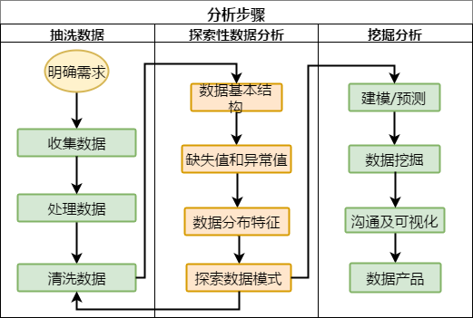

```{r setup, include=FALSE}
## User-defined options come here
knitr::opts_chunk$set(warning = FALSE, message = FALSE, 
                      fig.path = "A04_04_exploratory1_files/figure-html/")
```

## 目录

- [概述](#3)
- [缺失值](#10)
- [异常值](#18)
- [分布特征](#23)

# 概述

## 探索性数据分析(EDA)

目的

- 帮助形成解释观测**现象成因**的假说
- 对统计推断**基础假设**进行评估
- 为选取合适的**统计工具和技术**提供支持
- 为未来通过试验/调查**收集数据**提供基础

> In statistics, exploratory data analysis (EDA) is an approach to analyzing data sets to **summarize their main characteristics**, often with visual methods. A statistical model can be used or not, but primarily EDA is for seeing what the data can tell us beyond the **formal modeling** or **hypothesis testing** task. Exploratory data analysis was promoted by _John Tukey_ to encourage statisticians to explore the data, and possibly formulate hypotheses that could lead to new data collection and experiments.  --- [Wikipedia](https://en.wikipedia.org/wiki/Exploratory_data_analysis)


## 基本步骤



# 数据结构

## 码本Codebook {.smaller}

- 码本是数据集的基础说明文档。获得数据后，首先要阅读[码本](http://ccjr.csusb.edu/docs/researchmanualdocs/creatingacodebook.pdf))。

- 码本描述数据集的内容、结构和版式。

<div class="columns-2">

撰写得当的码本"包含了数据文件中每个变量的完整的、自解释(self-explanatory)的信息"[^codebook]

- 变量名 variable
- 变量标签 variable label
- 变量描述 question text
- 取值 value
- 取值标签 value label
- 统计小结 summary statistics
- <缺失值> missing data
- <跳转逻辑> skip pattern
- <备注> notes

[^codebook]: http://www.nlsinfo.org/nlsy97/97guide/chap3.htm#threethree

<p class="forceBreak"></p>

```
        LEXINGTON-FAYETTE POLICE DATA
Police Records for Auto Larceny and Commercial Burglary
Codebook (ROARK SYSTEM) January 01, 1999 – Nov. 12, 2000
EVENTNO Indicates the dispatch number for the event, which 
        is unique for each call for service.
CASENO  Indicates the dispatch number for the event, which
        is unique for each call for service.
DATE    Indicates the string form of the date that the call
        for service took place. For example an event 
        occurring on Jan 2, 1999 would appear as 19990102.
year    Indicates the year in 4 digits that the call for 
        service took place. For this database, 1999, 2000, 
        or 2001.
mon     Indicates the month in two digits that the call for
        service took place.
        “01” = January  “07” = July
        ...
        “06” = June     “12” = December
day     Indicates the day in two digits that the call for 
        service took place.
txtdate Indicates the abbreviated form of the date that 
        the call for service took place. (mm/dd/yy)
```

</div>

## 自行生成码本 {.smaller}

<div class="columns-2">

```r
> Hmisc::describe(cars)
```

```
cars 

 2  Variables      50  Observations
---------------------------------------
speed 
       n  missing distinct     Info ...
      50        0       19    0.996 ...
                                                                                                         
Value         4    7    8    9   10 ...
Frequency     2    2    1    1    3 ...
Proportion 0.04 0.04 0.02 0.02 0.06 ...
---------------------------------------
dist 
       n  missing distinct     Info ...
      50        0       35    0.999 ...

lowest :   2   4  10  ,  highest: ...
---------------------------------------
```

<p class="forceBreak"></p>


```r
> memisc::codebook(cars)
```

```
========================
   speed
------------------------
   Storage mode: double
          Min.:   4.000
       1st Qu.:  12.000
        Median:  15.000
          Mean:  15.400
       3rd Qu.:  19.000
          Max.:  25.000
          
========================
   dist
------------------------
   Storage mode: double
          Min.:    2.000
       1st Qu.:   26.000
        Median:   36.000
          Mean:   42.980
       3rd Qu.:   56.000
          Max.:  120.000
```

</div>

## 实例 {.smaller}

<div class="columns-2">

```r
> library(ggplot2)
> ?diamonds
```

```
A data frame with 53940 rows and 10 variables:

price       price in US dollars (\$326–\$18,823)
carat       weight of the diamond (0.2–5.01)
cut         quality of the cut (Fair, Good, Very Good, 
            Premium, Ideal)
color       diamond colour, from J (worst) to D (best)
clarity     a measurement of how clear the diamond is 
            (I1 (worst), SI1, SI2, VS1, VS2, VVS1, 
            VVS2, IF (best))
x           length in mm (0–10.74)
y           width in mm (0–58.9)
z           depth in mm (0–31.8)
depth       total depth percentage = z / mean(x, y) = 
            2 * z / (x + y) (43–79)
table       width of top of diamond relative to widest 
            point (43–95)
```
<p class="forceBreak"></p>

```r
> str(diamonds)
>
```

```
Classes ‘tbl_df’, ‘tbl’ and 'data.frame':	53940 obs.
of  10 variables:
 $ price  : int  326 326 327 334 335 336 336 337 337 ...
 $ carat  : num  0.23 0.21 0.23 0.29 0.31 0.24 0.24 
                 0.26 0.22 0.23 ...
 $ cut    : Ord.factor w/ 5 levels "Fair"<"Good"<..: 
                 5 4 2 4 2 3 3 3 1 3 ...
 $ color  : Ord.factor w/ 7 levels "D"<"E"<"F"<"G"<..: 
                 2 2 2 6 7 7 6 5 2 5 ...
 $ clarity: Ord.factor w/ 8 levels "I1"<"SI2"<"SI1"<..: 
                 2 3 5 4 2 6 7 3 4 5 ...
 $ x      : num  3.95 3.89 4.05 4.2 4.34 3.94 3.95 ...
 $ y      : num  3.98 3.84 4.07 4.23 4.35 3.96 3.98 ...
 $ z      : num  2.43 2.31 2.31 2.63 2.75 2.48 2.47 ...
 $ depth  : num  61.5 59.8 56.9 62.4 63.3 62.8 62.3 ...
 $ table  : num  55 61 65 58 58 57 57 55 61 61 ...
```

</div>

# 缺失值

## 缺失的产生及类型

#### NA的产生

- 机械: 存储失败、系统故障、收集失败等
- 人为: 主观失误、有意隐瞒、历史局限等

#### NA的类型

- 完全随机缺失(missing completely at random, **MCAR**): 缺失是完全随机的，不依赖任何可观测/不可观测变量
- 随机缺失(missing at random, **MAR**): 缺失不是完全随机的，依赖于其他完全变量(如: 男性更倾向于漏答，但与抑郁程度无关)
- 非随机缺失(missing not at random, **MNAR**): 缺失的值依赖于不完全变量本身缺失的原因(如: 抑郁程度越重，越倾向于漏答)，为**不可忽略的无应答**。

## 缺失的影响

- 损失了有用的信息
- 不确定性增加，确定性效应更难把握
- 数据挖掘时，缺失值会使模型拟合失败

```r
> mean(c(1:10, NA))
[1] NA

> lm(Solar.R~Ozone, airquality, na.action=NULL)
Error in lm.fit(x, y, offset = offset, singular.ok = singular.ok, ...) : 
  NA/NaN/Inf in 'x'
```

- R处理缺失的基本方法(`optionas("na.action")`): 
    - **`"na.omit"`**, `"na.fail", "na.exclude", "na.pass"`

## 找到缺失

<div class="columns-2">

```{r mice}
library(mice)
md.pattern(airquality)
```

- 完全变量: Wind, Temp, Month, Day
- 完整记录: 72.5%

```r
> sum(complete.cases(airquality))/
+ nrow(airquality)
[1] 0.7254902
```

<p class="forceBreak"></p>

```{r fluxplot, fig.width=5, fig.height=4.5}
fluxplot(airquality)
```
</div>

## 缺失是否随机 {.smaller}

<div class="columns-2">

从月份分布看，缺失不随机

```r
> library(reshape2)
> o <- dcast(airquality, Month ~ is.na(Ozone), 
+ length, value.var="Month")
> chisq.test(o[,2:3])

	Pearson's Chi-squared test
	
data:  o[, 2:3]
X-squared = 44.751, df = 4, p-value = 4.48e-09
```

```{r na pattern1, echo=FALSE, fig.width=5, fig.height=2.5}
library(ggplot2); library(reshape2)
o <- dcast(airquality, Month ~ is.na(Ozone), 
    length, value.var="Month")
o <- melt(o, id="Month")
names(o) <- c("Month", "IsNA", "Percent")
ggplot(o, aes(Month, Percent, fill=IsNA, color=IsNA)) + 
    geom_bar(alpha=0.6, stat="identity", position="fill") + theme_minimal() +
    scale_y_continuous(labels=scales::percent)
```

<p class="forceBreak"></p>

但从气温和风速分布上看，缺失是随机的

```r
> m1 <- t.test(Temp~is.na(Ozone), airquality)
> m2 <- t.test(Wind~is.na(Ozone), airquality)
> t(rbind(unlist(m1[1:4]), unlist(m2[1:4])))
                    [,1]       [,2]
statistic.t  -0.02683064 -0.6091059
parameter.df 60.44704944 63.6459520
p.value       0.97868320  0.5446224
conf.int1    -3.64330595 -1.6893132
conf.int2     3.54684742  0.8999377
```

```{r na pattern2, echo=FALSE, fig.width=5, fig.height=2.5}
aq <- airquality
aq$OzoneNA <- is.na(aq$Ozone)
aq <- melt(aq[,c("OzoneNA", "Temp", "Wind")], id="OzoneNA")
ggplot(aq, aes(OzoneNA, value, fill=OzoneNA, color=OzoneNA)) + 
    geom_boxplot(alpha=0.6) + facet_grid(~variable) + theme_minimal()
```

</div>

## 缺失的处理

<div class="columns-2">

- 部分删除(缺失比例较大)
    - 删除个案(行)
    - 删除变量(列)
- 插补(Imputation)
    - 主观处理: 人工填写, 特殊值
    - 均值/中位数/众数
    - 预测
        - 热卡(hotdecking, 同类均值)
        - 回归
        - 期望值最大化
        - 多重插补(mice)        

<p class="forceBreak"></p>

-
    - 机器学习
        - k最近邻(kNN)
        - 决策树(rpart/C5.0)
        - 支持向量机
    
- 忽略
    - 构建哑元(dummy variable) 
    - 直接~~暴力~~建模拟合
        - Bayes网络
        - 人工神经网络(ANN)
        - 随机森林(rf)
    
</div>

## 多重插值(Mulivariate Imputation) {.smaller}

```{r, echo=FALSE}
op <- options(digits=4, width=120)
```

```{r imp}
imp <- lapply(list(list("pmm", 5), list("pmm", 10), list("rf", 10)), function(lst){
    mice(airquality, method=lst[[1]], maxit=lst[[2]], print=FALSE)})
summary(pool(with(imp[[1]], lm(Ozone~Temp+Wind))))
summary(pool(with(imp[[2]], lm(Ozone~Temp+Wind))))
summary(pool(with(imp[[3]], lm(Ozone~Temp+Wind))))
```

```{r, echo=FALSE}
options(op)
```

---

```{r imp plot, echo=FALSE, fig.width=3.3}
par(mfrow=c(1,3))
plot(imp[[1]], main="MaxIt=5, Predictive Mean Matching")
plot(imp[[2]], main="MaxIt=10, Predictive Mean Matching")
plot(imp[[3]], main="MaxIt=10, Random Forest")
par(mfrow=c(1,1))
```


# 异常值

## 异常值(Outlier)

- 异常值: 样本中的个别值，其数值明显偏离它（或他们）所属样本的其余观测值，也称异常数据、离群值。
    - 测量误差
    - 实验方法错误
- 衡量标准
    - 正态样本: 3$\sigma$
    - $\bar{x} \pm$ 1.5 IQR
    - LOF(局部异常因子)
- 可能造成的影响
    - 改变模型拟合结果
    - 出现奇异梯度，导致算法提前终止

## 找到异常值

<div class="columns-2">

```{r outlier, fig.width=5, fig.height=4.5}
boxplot(airquality$Wind)
```

<p class="forceBreak"></p>

- IQR = Q~75~ - Q~25~
- 异常值: [Q~25~ - 1.5\*IQR, Q~75~ + 1.5\*IQR]以外的值

```r
> boxplot(airquality$Wind, plot=FALSE)$out
[1] 20.1 18.4 20.7
```

```r
> ub <- quantile(airquality$Wind, 3/4) + 
+ 1.5 * IQR(airquality$Wind)
> lb <- quantile(airquality$Wind, 1/4) - 
+ 1.5 * IQR(airquality$Wind)
> with(airquality, Wind[Wind>ub | Wind<lb])
[1] 20.1 18.4 20.7
```

</div>

## 异常值Grubb's检验和处理

```r
> library(outliers)
> grubbs.test(airquality$Wind)

	Grubbs test for one outlier

data:  airquality$Wind
G = 3.04920, U = 0.93843, p-value = 0.1518
alternative hypothesis: highest value 20.7 is an outlier
```

- 最大值20.7不是异常值

- 处理: 删除、插值、变量变换、更改模型

## (引申)模型诊断:异常值、高杠杆值

```{r, echo=FALSE}
op <- par(mar=c(4, 4, 1, 2))
```

"RR.engineer"、"minister"两个点对模型有较大影响。

```{r infPlot, fig.height=4}
car::influencePlot(lm(prestige ~ income + education, data=car::Duncan))
```

```{r, echo=FALSE}
par(op)
```


# 分布特征

## 可视化很重要 {.smaller}

Anscombe, Francis J. (1973)

```{r anscombe, echo=FALSE, fig.width=10, fig.height=5}
par(mfrow=c(2,2), mar=c(4, 4, 2, 2))
for (i in 1:4) {
    plot(anscombe[, c(i, i+4)], pch=19, bty="n")
    abline(lm(as.formula(paste0("y", i, "~x", i)), anscombe), col="tomato")
    coefs <- coef(lm(as.formula(paste0("y", i, "~x", i)), anscombe))
    text(10, 7, paste(round(coefs[1], 2), "+", round(coefs[2], 2), "*", names(coefs)[2]), col="tomato")
}
par(mfrow=c(1,1), mar=c(5.1, 4.1, 4.1, 2.1))
```

## 定量数据: 直方图 + 核密度曲线

```r
# 调整版面参数
op <- par(mfrow=c(2,2), mar=c(4, 4, 2, 2))

# 循环: 绘制密度直方图，并上覆核密度曲线
for (i in 1:4){
    hist(airquality[,i], col="lightskyblue", 
        main=paste("Histogram of", names(airquality)[i]),
        xlab=names(airquality)[i], border="white", prob=TRUE)
    lines(density(airquality[,i], na.rm=TRUE), lwd=2)
}

# 重置版面参数
par(op)
```

---

```{r hist, echo=FALSE, fig.width=10, fig.height=6}
op <- par(mfrow=c(2,2), mar=c(4, 4, 2, 2))
for (i in 1:4){
    hist(airquality[,i], col="lightskyblue", 
         main=paste("Histogram of", names(airquality)[i]),
         xlab=names(airquality)[i], border="white", prob=TRUE)
    lines(density(airquality[,i], na.rm=TRUE), lwd=2)
}
par(op)
```

## 定性数据: 条图

```r
# 调整版面参数
op <- par(mfrow=c(1,2), mar=c(4, 4, 2, 2))

# 循环: 绘制条图
for (i in 5:6){
    barplot(table(airquality[,i]), col="lightskyblue", 
            main=paste("Count of", names(airquality)[i]),
            xlab=names(airquality)[i], border="deepskyblue", horiz=TRUE)
}

# 重置版面参数
par(op)
```

---

```{r bar, echo=FALSE, fig.width=10, fig.height=6}
op <- par(mfrow=c(1,2), mar=c(4, 4, 2, 2))
for (i in 5:6){
    barplot(table(airquality[,i]), col="lightskyblue", 
            main=paste("Count of", names(airquality)[i]),
            xlab=names(airquality)[i], border="deepskyblue", horiz=TRUE)
}
par(op)
```


## {.grayblue}

<p style="font-size:100px;font-family:'Arial Black'"><br/>Thank you! </p>
<br><br>
[返回目录](http://madlogos.github.io/R_Tutorial)

