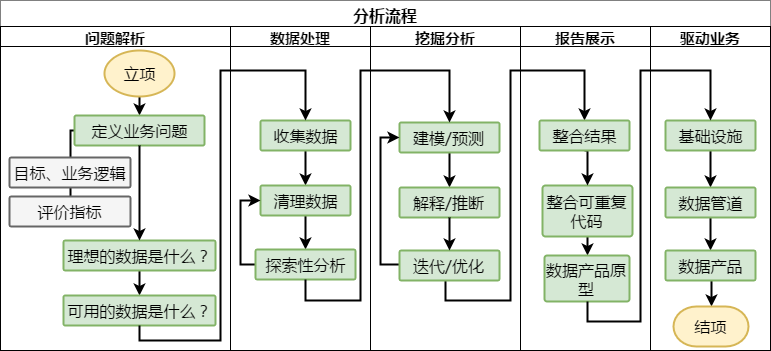
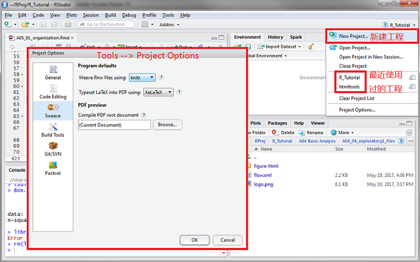

```{r setup, include=FALSE}
## User-defined options come here
knitr::opts_chunk$set(warning = FALSE, message = FALSE, 
                      fig.path = "A05_01_organization_files/figure-html/")
```

## 目录

- [分析流程](#3)
- [分析工程](#6)


# 分析流程

## 流程图示



## 注意事项

1. 数据分析中最重要的，是**定义你的问题**
    - 正确定义问题，需要提前熟悉业务的要求/逻辑
1. 收集数据
    - 尽可能收集原始数据，而非处理过的汇总
    - 注意开源数据的使用条款
    - 引述数据源，记录采集地址和时间
1. **记录数据清洗的所有步骤**
1. 记录建模步骤、调参依据，及不确定性度量方法
1. 结果解释要紧扣问题，努力探索因果
1. 反复自我诘问，优化模型

# 分析工程

## 如何建立分析工程?



## 建立分析工程有什么好处?

1. 每个工程有独立的工作目录、历史记录、开发环境，互不干扰
    - 独立的.Rprofile、.RData、.Rhistory
    - 可通过prackat镜像一套隔离开发环境(特定的程序包版本,等)
    - 每次进入工程，自动载入前次退出时的环境、文件
1. 便于利用Git/SVN对工程进行版本控制
1. RStudio还为分析工程绑定了很多实用功能
    - BuildTool选择package，可开发R程序包
    - BuildTool选择website，可编译静态网站
    - BuildTool也选makefile和自定义，支持其他工程开发类型

> 双击.Rproj文件即可启动已创建的分析工程

## 建议的工程结构 {.smaller}

<div class="columns-2">

分开存放不同类型、不同阶段的资料

- 数据 Data
    - 原始数据 Raw
    - 处理后的数据 Processed
- 图表 Figure
    - 探索性图表 Exploratory
    - 终稿图表 Final
- 代码 Code
    - 粗代码 Raw Code: 探索性代码
    - 终稿代码 Final Code: 注释、格式化
    - Rmarkdown / LaTeX文档
- 文本 Text
    - README: (可选)项目说明、处理过程
    - 分析报告/应用 Report/Application

<p class="forceBreak"></p>

#### 示例工程结构

文件夹名称均小写，不含空格

```
[project_work_directory]/
   |-- README
   |-- data
   |   |-- raw
   |   |-- processed
   |-- code
   |   |-- raw
   |   |-- final
   |   |-- scripts
   |-- doc
   |   |-- documents
   |   |-- references
   |-- assets
   |   |-- libs
   |   |-- figure
   |   |-- css
   |-- tmp
   |   |-- doc
   |   |-- figure
   |-- misc
```

</div>

## 注意事项

1. 任何时候，**不要修改原始数据**
    - 可将多阶段处理的中间数据集都保存在工程目录内
1. (条件允许的话)建议使用Git进行版本管理，并注意备份
1. **记录所有步骤**
1. Raw和Final:
    - Raw强调快速便捷，可以极少注释，保留无效处理和分析
    - Final强调整洁、注释，只保留成稿所需的部分
        - 小段注释，简单解释what, when, why, ...
        - 大段注释放在段落前，详细解释目的、方法、判断等
1. 建议使用隔离的开发环境，锁定开发工具和依赖包版本
    - 部署工程成果时，将该开发环境整体照搬为一个实例（instance）

## {.grayblue}

<p style="font-size:100px;font-family:'Arial Black'"><br/>Thank you! </p>

<br/>[回到主目录](http://madlogos.github.io/R_Tutorial)

