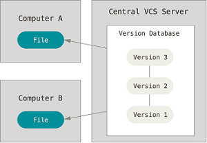

```{r setup, include=FALSE}
## User-defined options come here
knitr::opts_chunk$set(warning = FALSE, message = FALSE, 
                      fig.path = "A05_02_git_files/figure-html/")
```

## 目录

- [版本控制系统](#3)
- [Git](#8)
- [例子](#14)


# 版本控制系统

## 版本的故事


## 版本控制

> 版本控制是一种记录一个或若干文件内容变化，以便将来查阅特定版本修订情况的系统。 - Git官方

版本控制的价值

- 统一管理文件的**所有**修订版本
- 回溯特定版本：单个文件甚或整个项目
- 比对所有修订细节
- 备份和灾难恢复

## [版本控制系统的演化](https://git-scm.com/book/zh/v2/起步-关于版本控制)

<div class="col-3L">

#### 本地版本控制系统

如RCS


</div><div class="col-3C">

#### 集中式版本控制系统

如SVN、ClearCase、VSS、CVS



</div><div class="col-3R">

#### 分布式版本控制系统

如Git、BitKeeper、Mercurial


</div>

## 各版本管理系统比较

方面   | 本地式 | 集中式 | 分布式
-----+---------+--------+----------
速度 | 快 | 慢 | 快
网络要求 | 不需网络，离线 | 提交需联网 | 支持离线
灵活性 | 无法无天 | 集中式工作流 | 支持多工作流:parnter或集中式
数据完整性 | 易缺损 | 元数据可能缺失 | 按元数据方式存储，最完整
并行协作 | 难 | 一般 | 易
学习曲线 | 上手快 | 上手快 | 有一定学习曲线
应用场景 | 个人项目 | 企业项目 | 开源项目

# Git

## [Git](https://git-scm.com/)

- Linux之父Linus Torvalds缔造
- 最流行的分布式版本控制系统
- Git的源代码托管在全球最大代码托管平台GitHub上，GitHub则基于Git技术

<div class="columns-2">


<p class="forceBreak"></p>


</div>

## 安装及配置

### 安装

到[Git官网](https://git-scm.com/downloads)，找到操作系统对应的安装文件/指导，执行安装

### 配置

全局(`--global`)设置用户名和email

```git
$ git config --global user.name "John Doe"
$ git config --global user.email johndoe@example.com
```

## 界面

<div class="columns-2">

#### GUI


<p class="forceBreak"></p>

#### Bash


</div>

</div>

## [RStudio中启用Git](https://www.rstudio.org/links/using_version_control?version=1.0.143&mode=desktop) {.smaller}

<div class="col-2L">

#### Git Executable

Tools -> Global options -> Git Executable


</div><div class="col-2R">

#### 启用git

Tools -> Project options -> 启用git


</div>

## 典型用法 {.smaller}

<div class="col-2L">

1. 代码库托管在Git服务器
1. 开发者从服务器fork，在本地分支上开发
1. 提交(commit)本地分支到服务器


</div><div class="col-2R">

1. 创建本地分支: `git clone`
1. 当前更改
    - 添加文件: `git add`
    - 移动/重命名: `git mv`
    - 删除: `git rm`
1. 分支
    - 操作分支: `git branch`
    - 切换分支: `git checkout`
    - 提交: `git commit`
1. 协作
    - 从其他分支拉取: `git fetch / git pull`
    - 推送到其他分支: `git push`

</div>

# 例子

## 共享并行模式


## [共享目录](A05_02_git_files/files/TestRepo)中创建裸仓库

<div class="col-2L">

- 注意:
    - 通过map network drive将共享目录所在位置创建为盘符，如Z: (否则RStudio可能无法正常工作)
    - 共享目录对所有用户开放full control权限
    - 裸仓库不保留工作文件，仅保存修改痕迹
- 方法
    - 打开Git Bash，进入目标路径

    ```git
    cd <共享路径>/TestRepo  # 伪代码
    git init --bare
    ```

</div><div class="col-2R">


</div>
</div>

## 将共享仓库克隆到本地

<div class="col-2L">

- 注意:
    - 本地仓库如为远程磁盘，也应映射一个盘符，如H:
- 方法1
    - 在Git Bash中运行
    
    ```git
    git clone <共享路径>/TestRepo
    ```
    
- 方法2 
    - Rstudio中创建新项目
    - Version Control -> git
    - 填入url、repo名称和本地路径

</div><div class="col-2R">


</div>
</div>

## 本地工作分支

<div class="col-2L">

### 创建分支

```git
git checkout -b work
```


</div><div class="col-2R">

</div><div class="col-2R">

### 切换分支

```git
git checkout master
```

### 删除分支

```git
git branch -d work
```

</div>

## 查看更改 {.smaller}

- 默认分支为master，建议先做一次初始化提交
- 切到work分支，新增note.txt，并修改REAME

<div class="columns-2">

Bash

```git
$ git status

On branch work
Changes not staged for commit:
  (use "git add <file>..." to update what will be committed)
  (use "git checkout -- <file>..." to discard changes in working directory)

        modified:   README

Untracked files:
  (use "git add <file>..." to include in what will be committed)

        note.txt
```

<p class="forceBreak"></p>

GUI


</div>

## 状态更改 {.smaller}

<div class="col-2L">

- git系统下，文件状态包括
    - untracked: 未跟踪，新增加的文件。`git add`则添加跟踪。
    - tracked: 已跟踪，包括三种
        - unmodified: 未更改
        - modified: 已更改
        - staged: 已暂存
- 将暂存(staged)的文件提交(commit)到本地仓库，形成一个快照
- `git log`查看提交历史
- 每次提交，都会检查sha1校验和，确保文件完整性
- 该sha1 Hash值就是本次commit的ID

</div><div class="col-2R">

```git
$ git add *
$ git commit -m "add note.txt"
[Work a50dba4] add note.txt
 2 files changed, 1 insertions(+)
 create mode 100644 note.txt
$ git log
commit 42e62ea88fddc...57bc9a (HEAD -> work)
Author: John Doe <john.doe@example.com>
Date:   Fri Jun 23 15:03:52 2017 +0800

    add note.txt

commit add2d1ec93d...3637c2 (origin/master, master)
Author: John Doe <john.doe@example.com>
Date:   Fri Jun 23 15:02:17 2017 +0800

    init
```

</div>

---


## 版本管理 (1): git tag {.smaller}

<div class="col-2L">

- 继续修改note.txt
- 某个关键版本设置版本号v1.0

```git
echo $'hotfix 1:\r\n' > note.txt
echo $'\t1. Foo.\r\n\t2. Bar.' >> note.txt
git add .
git commit -m "hotfix 1"
git tag -a "v1.0" -m "Ver 1.0"
echo $'\r\nhotfix 2:\r\n' >> note.txt
echo $'\t1. Ti.\r\n\t2. Da.' >> note.txt
git add .
git commit -m "hotfix 2"
echo $'\r\nhotfix 3:\r\n' >> note.txt
echo $'\t1. Ha.\r\n\t2. HaHa.' >> note.txt
git add .
git commit -m "hotfix 3"
git log --all
```

- 能够看到work分支下的新提交

</div><div class="col-2R">


```git
$ git log
commit 8aea41c3...0b4bc3 (HEAD -> work)
Author: John Doe <john.doe@example.com>
Date:   Fri Jun 23 15:09:23 2017 +0800

    hotfix 3

commit 79784f72...203665e
Author: John Doe <john.doe@example.com>
Date:   Fri Jun 23 15:09:18 2017 +0800

    hotfix 2

commit 4fd9edc7e...58d2f1 (tag: v1.0)
Author: John Doe <john.doe@example.com>
Date:   Fri Jun 23 15:08:59 2017 +0800

    hotfix 1

commit 42e62ea88fddc9...5c57bc9a
Author: John Doe <john.doe@example.com>
Date:   Fri Jun 23 15:03:52 2017 +0800

    add note.txt
```
</div>

## 版本管理 (2): 查看快照

<div class="column-2">

- 通过commit sha1的前7位或tag指定快照
- 我想要采用v1.0时的note.txt

```git
$ git checkout v1.0

HEAD is now at 4fd9edc... hotfix 1
```

- 此时，指针位于历史提交位置，即头-指针分离(detached HEAD)状态

```git
$ vi note.txt
```

```txt
hotfix 1:

	1. Foo.
	2. Bar.
```
</div>

## 版本简化/回退: git reset

<div class="col-2L">

- 我们希望把hotfix 1-3的更改都整合为v1.0，简化提交链
- 使用git reset --mixed，将指针退回v1.0的前次提交
    - 如参数设为--hard，则直接丢弃v1.0后的所有更改，即硬回退
    - 其他可选参数包括--soft、--merge等
- 重新git commit，将hotfix 1以后的变化整合在一次提交里

```git
$ git reset --mixed 42e62ea
Unstaged changes after reset:
M       note.txt
```

</div><div class="col-2R">

- 查看提交历史，只剩下hotfix 1之前的一次提交

```git
$ git log
commit 42e62ea88f...bc9a (HEAD -> work)
Author: John Doe <john.doe@example.com>
Date:   Fri Jun 23 15:03:52 2017 +0800

    add note.txt
```

- 重新整合提交，生成新的v1.0

```git
git add.
git commit -m "hotfix 1-3"
git tag -f "v1.0" -m "Ver 1.0"
```

</div>


## 将本地分支推送到共享仓库

```git
git checkout work
git push -u
```

相当于

```git
git push origin work
```

如共享仓库并没有work分支，需要设定远程上游

```git
git push --set-upstream origin work
```

## 从共享拉取远程提交

- 只拉取
    - 拉取后要手动合并(`git merge`)

```git
git checkout work
git fetch
```

- 拉取并合并

```git
git pull
```

## 合并分支 {.smaller}

<div class="col-2L">

- `git diff` 查看不同分支的差异

```git
$ git diff master work

diff --git a/README b/README
index e69de29..4baf047 100644
--- a/README
+++ b/README
@@ -0,0 +1 @@
+Hello world.
\ No newline at end of file
diff --git a/note.txt b/note.txt
new file mode 100644
index 0000000..0de80fa
--- /dev/null
+++ b/note.txt
@@ -0,0 +1,14 @@
+hotfix 1:
+
+       1. Foo.
+       2. Bar.
:
```

</div><div class="col-2R">

- `git merge`合并分支
- 如出现冲突，必须处理掉冲突才能合并

```git
$ git merge master work
Updating add2d1e..6060ff4
Fast-forward
 README   |  1 +
 note.txt | 14 ++++++++++++++
 2 files changed, 15 insertions(+)
 create mode 100644 note.txt
```

</div>

## 学习资源

- 官网: <https://git-scm.com/book/zh/v2/>
- 动手练习: [Try Git](https://try.github.io/levels/1/challenges/1)
- 技术博客: [廖雪峰的Git教程](http://www.liaoxuefeng.com/wiki/0013739516305929606dd18361248578c67b8067c8c017b000)


## {.grayblue}

<p style="font-size:100px;font-family:'Arial Black'"><br/>Thank you! </p>

<br/>[回到主目录](http://madlogos.github.io/R_Tutorial)

