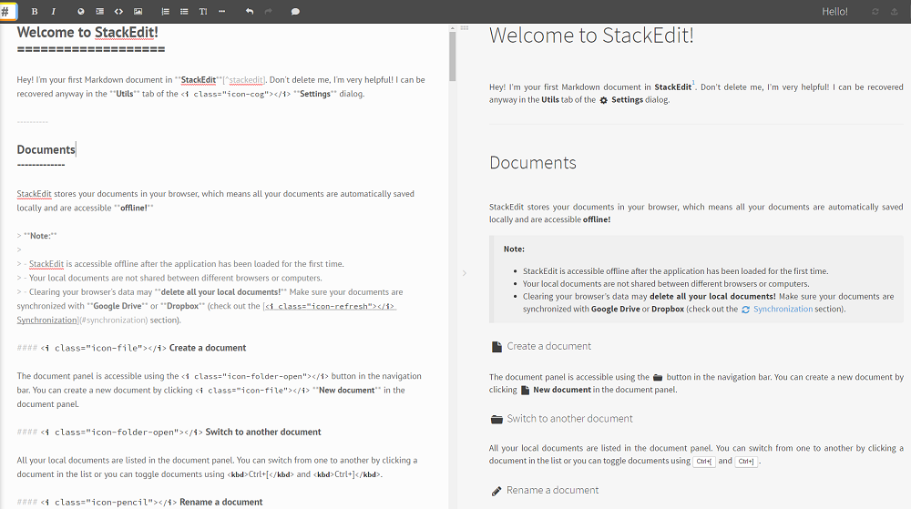
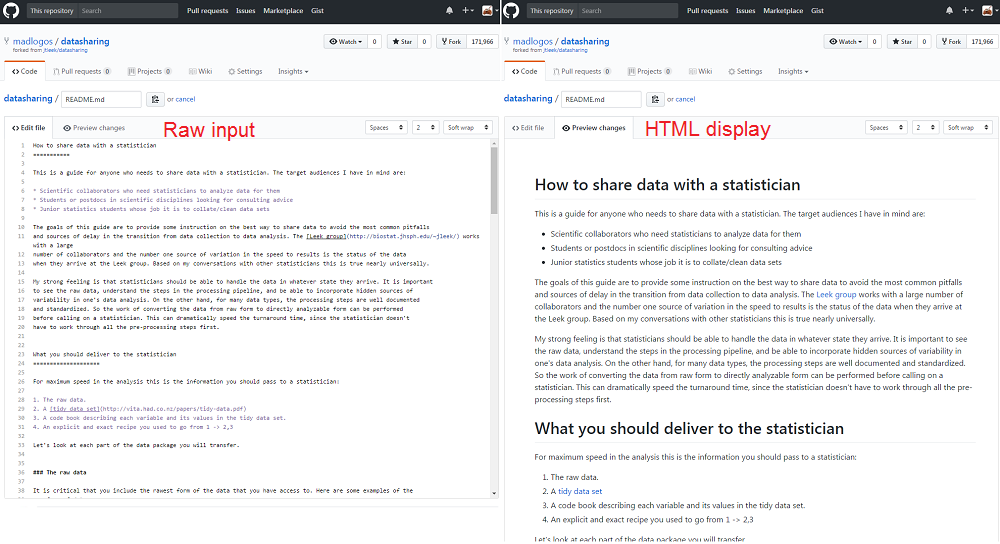
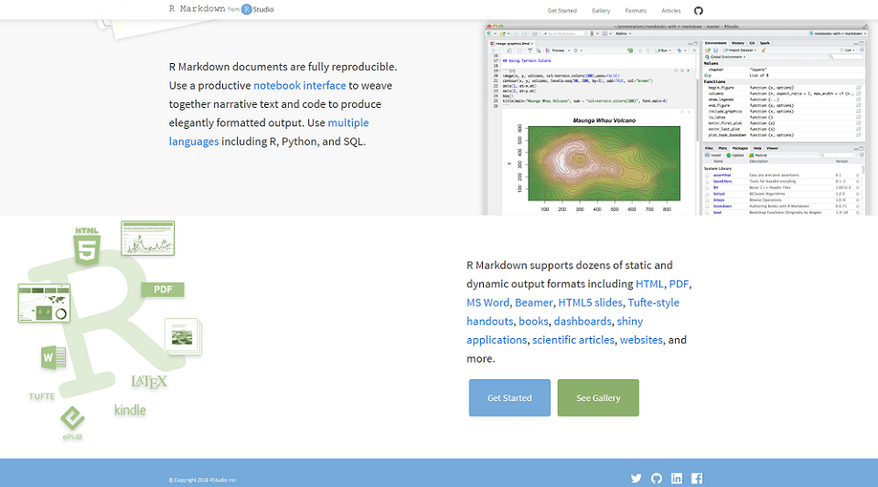
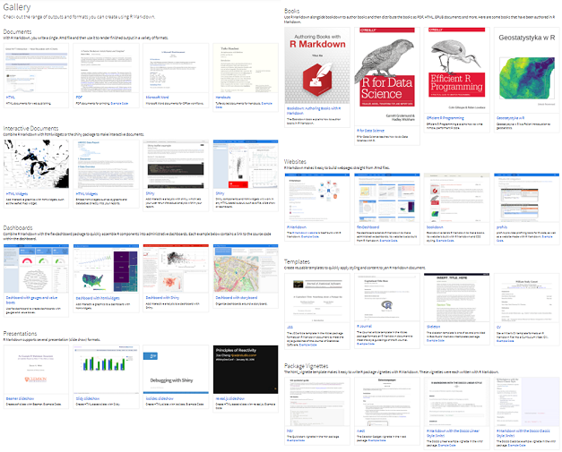
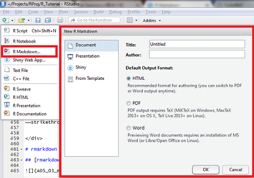
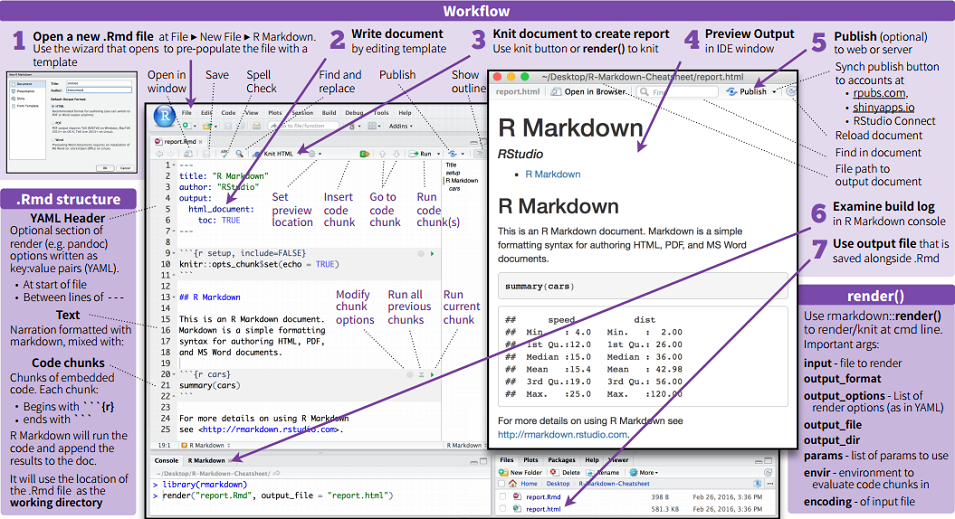
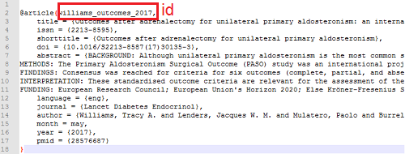
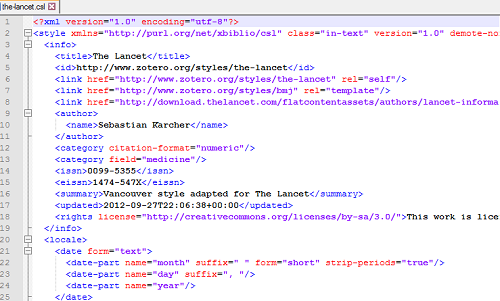
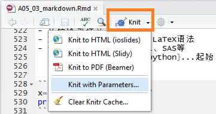

```{r setup, include=FALSE}
## User-defined options come here
knitr::opts_chunk$set(warning = FALSE, message = FALSE, 
                      fig.path = "A05_04_markdown_files/figure-html/")
```

## 目录

- [简介](#3)
- [基本语法](#8)
- [rmarkdown](#21)


# 简介

## 什么是markdown?

> Markdown is a text-to-HTML conversion tool for web writers. Markdown allows you to write using an easy-to-read, easy-to-write plain text format, then convert it to structurally valid XHTML (or HTML).
> <br /><br />
> -- [John Gruber](http://daringfireball.net/projects/markdown)

- 作者: John Gruber 和 [Aaron Swartz](https://en.wikipedia.org/wiki/Aaron_Swartz)
- 目标: 成为一种适用于网络的书写语言，实现“易读、易写”
- 优点: 轻量、易学(半小时上手)，让写作者能更关注内容本身(而非排版)
- 应用广泛: **GitHub**、reddit、Stack Exchange、简书、...

## markup vs markdown

其实markdown也是一种markup(标记)语言

<div class="columns-2">

#### 常用的markup: HTML/XML

```html
<h1>Title 1</h1>

<p>Bla <b>bla</b> bla.</p>
<hr>

<ul>
    <li>Item 1</li>
    <li>Item 2</li>
</ul>

</img>
```
<p class="forceBreak"></p>

#### 对应的markdown

```md
# Title 1

Bla **bla** bla.

* * *

- Item 1
- Item 2


```

</div>

## 本地编辑器: StackEdit



## GitHub



# 基本语法

## 标题 (h1 - h6) {.smaller}

<div class="columns-2">

```md
# Header 1

Header 1
==========

## Header 2

Header 2
-----------

### Header 3

#### Header 4

##### Header 5

###### Header 6
```

<p class="forceBreak"></p>

<h1>Header 1</h1>
<h2>Header 2</h2>
<h3>Header 3</h3>
<h4>Header 4</h4>
<h5>Header 5</h5>
<h6>Header 6</h6>

</div>

## 编号

<div class="columns-2">

##### 无序

```md
* Item 1
* Item 2
    + Item 2a
    + Item 2b
        - Item 2b1
        - Item 2b2
```
* Item 1
* Item 2
    + Item 2a
    + Item 2b
        - Item 2b1
        - Item 2b2

<p class="forceBreak"></p>

##### 有序

```md
1. Item 1
1. Item 2
1. Item 3
1. Item 4
    + Item 4a
    + Item 4b
```

1. Item 1
1. Item 2
1. Item 3
1. Item 4
    + Item 4a
    + Item 4b

</div>

## 强调

<div class="columns-2">

##### 斜体

```md
*italic*

_italic_*_
```

<emph>italic</emph>

<emph>italic</emph>

<p class="forceBreak"></p>

##### 粗体

```md
**bold**

__bold__
```

<b>bold</b>

<b>bold</b>

</div>

## 断行、分割

<div class="col-2L">

##### 断行

- 行末加两个以上空格

```md
Roses are red,   
Violets are blue.
```

Roses are red,   
Violets are blue.

- 如行末不多加空格

```md
Roses are red, 
Violets are blue.
```

Roses are red,
Violets are blue.

</div><div class="col-2R">

##### 分割线

三个或以上星号/短横杠

```md
---

***
```

<hr>

<hr>


</div>

## 链接、图片

<div class="columns-2">

##### 链接

```md
<http://www.google.com>
[Google](http://www.google.com)
```
<http://www.google.com>

[Google](http://www.google.com)

<p class="forceBreak"></p>

##### 图片

```md

```


</div>

## 引文

```md
A friend once said:

> ###### Rule No.1
> - It's always better to give 
> than to receive.   
> - Refer to the above.
```

A friend once said:

> ###### Rule No.1
> - It's always better to give 
> than to receive.   
> - Refer to the above.

## 代码

<div class="columns-2">

##### 行内代码

- 功能性

```{r, echo=FALSE, comment=NA}
cat("There were \`r nrow(cars)` cars studied")
```

There were `r nrow(cars)` cars studied


- 无功能性

```{r, echo=FALSE, comment=NA}
cat("Let's use dataset `cars`.")
```

Let's use dataset `cars`.

<p class="forceBreak"></p>

##### 代码块

- 功能性

```{r, echo=FALSE, comment=NA}
cat("```{r}\nsummary(cars$dist)\n```")
summary(cars$dist)
```

- 无功能性

```{r, echo=FALSE, comment=NA}
cat("```\nsummary(cars$speed)\n```")
```

</div>

## 表格

<div class="columns-2">

```md
First Header  | Second Header
------------- | -------------
Content Cell  | Content Cell
Content Cell  | Content Cell
Content Cell  | Content Cell
```

First Header  | Second Header
------------- | -------------
Content Cell  | Content Cell
Content Cell  | Content Cell
Content Cell  | Content Cell

<p class="forceBreak"></p>

```md
| First Header | Second Header |
|:-------------+--------------:|
| Content `Cell` | Content *Cell* |
| Content Cell | [Content](google.com) Cell |
| Content Cell  | Content **Cell** |
```

| First Header | Second Header |
|:-------------+--------------:|
| Content `Cell` | Content *Cell* |
| Content Cell | [Content](google.com) Cell |
| Content Cell  | Content **Cell** |

</div>

## $\LaTeX$公式

<div class="columns-2">

##### 行内公式

```{r, echo=FALSE, comment=NA}
cat("$\\LaTeX$ grammar for\n",
    "$\\delta=(\\alpha+\\beta)/\\gamma$")
```

$\LaTeX$ grammar for $\delta=(\alpha+\beta)/\gamma$

<p class="forceBreak"></p>

##### 成块公式

```{r, echo=FALSE, comment=NA}
cat("Bayes Equation:\n$$P(B|A)=\\frac{P(A|B)P(B)}{P(A)}$$")
```

Bayes Equation: $$P(B|A)=\frac{P(A|B)P(B)}{P(A)}$$

</div>

## 注释

##### 注释型链接

```md
I spend so much time reading [R bloggers][1] and [Simply Statistics][2]!  

[1]: http://www.r-bloggers.com/   "R bloggers"  
[2]: http://simplystatistics.org/ "Simply Statistics"  
```

I spend so much time reading [R bloggers][1] and [Simply Statistics][2]!  

[1]: http://www.r-bloggers.com/   "R bloggers"  
[2]: http://simplystatistics.org/ "Simply Statistics"  
    
##### 脚注

```md
I spend so much time reading R bloggers[^rb]

[^rb]: R-bloggers "R-bloggers is a sets of blogs for R users."
```

I spend so much time reading R bloggers [^rb]

[^rb]: R-bloggers is a sets of blogs for R users.


## 锚点

```md
Go back to [Page 5](#5).
```

Go back to [Page 5](#5).

```md
<p id="anchor-1">bla bla</p>
Go to [anchor1](#anchor-1)
```

<p id="anchor-1">bla bla</p>
Go to [anchor1](#anchor-1)

## 其他

<div class="col-2L">

##### 上下标

```md
superscript^2^
```
superscript^2^

```md
subscript~2~
```
subscript~2~

</div><div class="col-2R">

##### 删除线

```md
~~strikethrough~~
```

~~strikethrough~~


</div>

# rmarkdown

## [rmarkdown](http://rmarkdown.rstudio.com/index.html)包



## [官方示例](http://rmarkdown.rstudio.com/gallery.html)



## 在Rstudio中创建RMarkdown(.Rmd)文档

<div class="columns-2">

- 开发方: RStudio Inc.
- 基于markdown语法，支持R、Python、SQL等程序语言
- 工作界面支持notebook
- 支持Word/HTML/PDF静态文档、交互文档、仪表盘、手册、图书、网站等
- 可安装`rticles`包，基于内置模板生成报告

<p class="forceBreak"></p>



</div>

## rmarkdown文档的[结构](https://www.rstudio.com/wp-content/uploads/2016/03/rmarkdown-cheatsheet-2.0.pdf)



## YAML头

- YAML: 主要用于编写配置文件的标记语言，较XML、json等更简洁
- 基本语法规则
    - 大小写敏感
    - 使用缩进而非嵌套表示层级关系
    - 缩进时**不允许使用Tab键**，只允许使用空格。
    - 缩进的空格数目不重要，只要相同层级的元素左侧对齐即可
- rmarkdown头部YAML
    - 以三连横杠起始、结束
    - 记录配置参数: title、author、date、output、reference、params等
    - 通过配置output的主要参数，即可将文档转成相应格式

## 文档体

- 文档体包括文字和代码
- 文字部分支持markdown和LaTeX语法
- 代码支持R、Python、SQL、SAS等
    - 以 ` ```{r}` 或 ` ```{python}` ...起始
    - 以 ``` 结束
- 一个`r, engine=python`的例子

```{r, engine='python'}
x="Hello, python world!"
print(x.split(' '))
```

## 参考文献 - 外部法

<div class="columns-2">

- 将文献导入Zotero，再导出为.bib
- 在YAML头定义bibliography和[csl](http://citationstyles.org/)


```
bibliography: example.bib
csl: the-lancet.csl
```

- 在正文中`@<文献id>`引用某条文献,或
    - 例子 @williams_outcomes_2017
- `[@<文献1id>;@<文献2id>]`引用文献
    - 例子 [@williams_outcomes_2017]
- 文献会列表显示在文档末尾


<p class="forceBreak"></p>




</div>

## 参考文献 - 内部法 {.smaller}

- 直接将各条文献按YAML语法写入YAML头
- 引用方法同外部法 [@williams_outcomes_2017;@fenner2012a]

```yaml
---
references:
- id: fenner2012a
  title: One-click science marketing
  author:
  - family: Fenner
    given: Martin
  container-title: Nature Materials
  volume: 11
  URL: 'http://dx.doi.org/10.1038/nmat3283'
  DOI: 10.1038/nmat3283
  issue: 4
  publisher: Nature Publishing Group
  page: 261-263
  type: article-journal
  issued:
    year: 2012
    month: 3
---
```

## `params`

- 在YAML头指定参数列表
- 文档代码块中直接以 `params$<对象>` 引用这些参数
- 提高文档的复用性

```{r, echo=FALSE, comment=NA}
cat("---\ntitle: Sample\noutput: html_document\nparams:\n    data: \"iris\"\n---\n\n```{r}\nsummary(params$data)\n```")
```

## 生成文档

**.Rmd文档** --[*knit*]--> **.md文档** --[*Pandoc*]--> **最终文档**

- Pandoc是一个开源工具，当生成pdf时，需要调用MikTeX、TexLive等组件

<div class="columns-2">

##### 1. `Knit`按钮



<p class="forceBreak"></p>

##### 2. `render`函数

```
render(input, output_format = NULL, 
       output_file = NULL, output_dir = NULL,
       output_options = NULL, 
       intermediates_dir = NULL,
       knit_root_dir = NULL,
       runtime = c("auto", "static", "shiny", 
            "shiny_prerendered"),
       clean = TRUE, params = NULL, 
       knit_meta = NULL, envir = parent.frame(),
       run_pandoc = TRUE, quiet = FALSE, 
       encoding = getOption("encoding"))
```

</div>


## {.grayblue}

<p style="font-size:100px;font-family:'Arial Black'"><br/>Thank you! </p>

<br/>[回到主目录](http://madlogos.github.io/R_Tutorial)

## 参考文献
