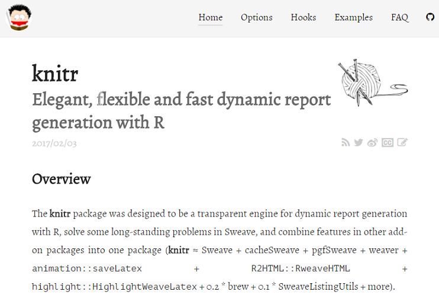
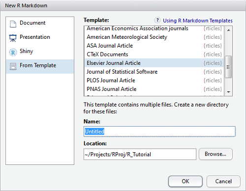
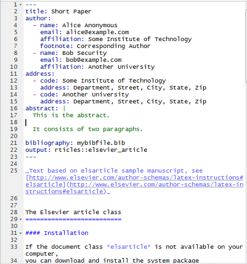
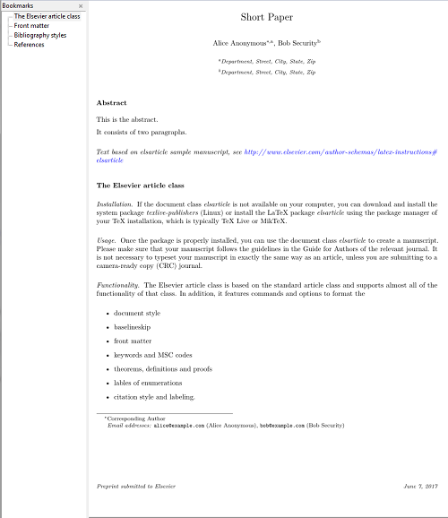
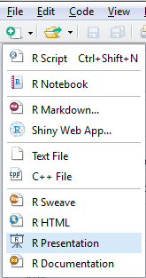
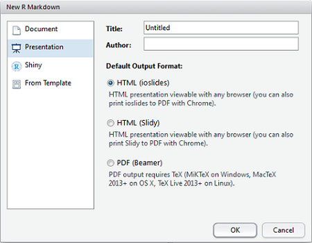
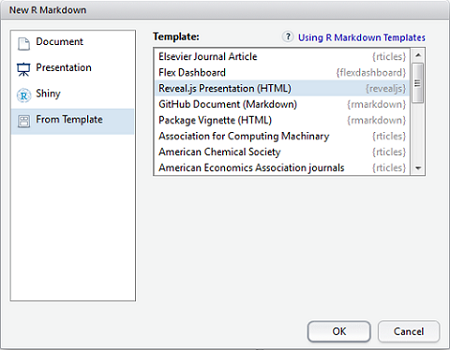
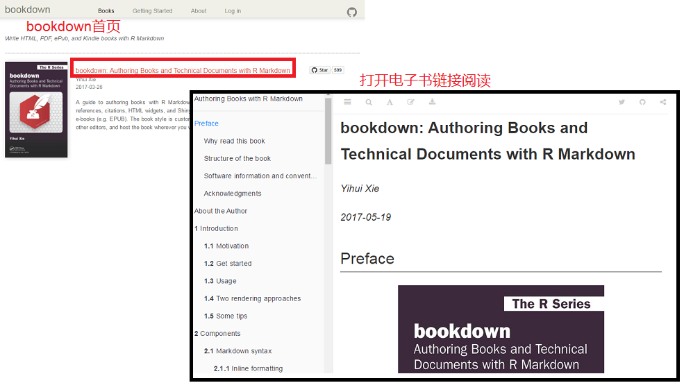
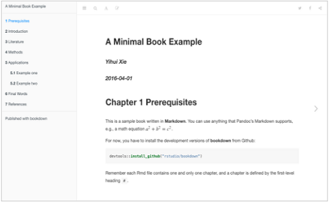
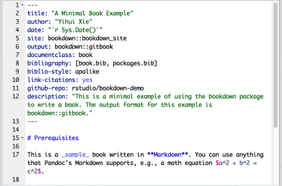

```{r setup, include=FALSE}
## User-defined options come here
knitr::opts_chunk$set(warning = FALSE, message = FALSE, 
                      fig.path = "A05_05_knitr_files/figure-html/")
```

## 目录

- [knitr基础](#3)
- [knitr进阶](#24)
- [其他类型](#35)
- [bookdown](#41)
- [blogdown](#45)


# knitr基础

## [knitr](https://yihui.name/knitr/)包



## 主要特点

- knitr是rmarkdown实现动态报告的“透明引擎”
    - 完全承袭前述[rmarkdown](A05_04_markdown.html)的文档结构
    - 包括YAML头和文档体（由文本块和代码块穿插构成）
- 文本块
    - 支持markdown或LaTeX语法
    - 可内嵌行内代码(Inline code)
- 代码块(code chunk)
    - 支持全局参数配置
    - 支持在每个代码块进行局部参数配置
    - 体现R作为胶水语言的优越性，支持多种程序语言作为分析引擎

## 局部配置

` ```{r, <选项1>=..., <选项2>=..., ....}`   
`<代码块>`   
` ``` `

支持12类选项:

<div class="col-2L">

- [代码求解(evaluation)](#7)
- [文本结果(text result)](#8)
- [代码修饰(code decoration)](#10)
- [缓存(cache)](#11)
- [作图(plot)](#13)
- [动画(animation)](#17)

</div><div class="col-2R>

- [代码块(code chunk)](#18)
- [子文档(child document)](#18)
- [语言引擎(language engine)](#19)
- [选项模板(option template)](#20)
- [提取源代码(extract source)](#20)
- [其他(others)](#20)

</div>  

## 代码求解: `eval`: (`TRUE`; 逻辑型)

<div class="col-2L">

`eval=TRUE`:

```{r, eval=TRUE}
summary(cars)
```

</div><div class="col-2R">

`eval=FALSE`:

```{r, eval=FALSE}
summary(cars)
```

</div>

## 文本结果(1)

- **`echo`**: (`TRUE`; 逻辑型或数值型) 是否打印源代码，或从第几行开始打印源代码
- **`results`**: ('markup'; 文本型) 取值包括
    - 'markup': 装裱特定输出文本(如LaTeX)
    - 'asis': 输出原始格式
    - 'hold': 运行完整个代码块后才输出
    - 'hide': 隐藏输出
- `collapse`: (`FALSE`; 逻辑型，仅限markdown结果) 是否把代码和结果输出到同一个文本块

## 文本结果(2)

- **`warning`**: (`TRUE`; 逻辑型) 是否输出警告信息
- **`error`**: (`TRUE`; 逻辑型) 是否输出错误信息
- **`message`**: (`TRUE`; 逻辑型) 是否输出提示信息
- `split`: (`FALSE`; 逻辑型) 是否将输出结果分割到不同文件，仅限.Rnw, .Rtex, 和 .Rhtml
- **`include`**: (`TRUE`; 逻辑型) 结果是否输出到结果文档
- `strip.white`: (`TRUE`; 逻辑型) 是否移除源代码块首尾空行
- `class.output`: (`NULL`; 文本型) 添加可以和css联用的class类型，对于HTML较实用


## 代码修饰

- **`tidy`**: (`FALSE`; 逻辑型) 是否使用`formatR::tidy_source()`整理代码
    - `tidy.opts`: (`NULL`; list) `tidy.source()`列表参数，如`tidy.opts=list(blank=FALSE,` `width.cutoff=60)`
- `prompt`: (`FALSE`; 逻辑型) 是否加提示符
- **`comment`**: ('##'; 文本型) 输出源代码时，行前添加的前缀符
- `highlight`: (`TRUE`; 逻辑型) 是否高亮显示代码
- `size`: ('normalsize'; 文本型) 默认LaTeX输出的字号
- `background`: ('#F7F7F7'; 文本型或数值型) LaTeX输出的代码块背景色
- `class.source`: (`NULL`; 文本型) 添加可以和css联用的class类型，对于HTML较实用

## 缓存(1)

- `cache`: (`FALSE`; 逻辑型) 是否缓存代码块结果，如设定缓存，仅当结果变化时才重新求解
- `cache.path`: ('cache/'; 文本型) 缓存文件的前缀名(默认存在工作目录下的cache文件夹内)
- `cache.vars`: (NULL) 变量名向量，规定哪些变量存入缓存数据库。NULL时，所有变量都存
- `cache.globals`: (NULL) 不是由当前代码块产生的变量名向量
- `cache.lazy`: (`TRUE`) `lazyLoad()`还是直接`load()`对象
- `cache.comments`: (NULL) 如设为FALSE，修改代码块内的注释不会令缓存失效
- `cache.rebuild: (`FALSE`) 如设为TRUE，强制重建该代码块的缓存

## 缓存(2)

- `dependson`: (`NULL`; 文本型或数值型) 代码块标题向量，指定本代码块依赖于哪些其他代码块
    - 如`dependson`为数值向量，则表示代码块序号。`dependson=c(-1, -2)`表示前两个代码块
- `autodep`: (`FALSE`; 逻辑型) 是否自动找出依赖代码块

## 作图(1)

- **`fig.path`**: ('figure/'; 文本型) 作图文件名前缀，可以是一个路径
- `fig.keep`: ('high'; 文本型) 代码块内的图如何保留，有5种选择:
    - 'high': 只保留高水平图(低水平改动被并入);
    - 'none': 都不保留;
    - 'all': 均保留(低水平改动产生新图)
    - 'first': 只保留第一幅图
    - 'last': 只保留最后一幅图
    - 如设为数值型向量，则依此序号保留低水平图


## 作图(2) 

- `fig.show`: ('asis'; 文本型) 如何显示/安排这些图，有4种选择:
    - 'asis': 显示效果和在R命令行运行结果一样;
    - 'hold': 直到运行完该代码块才出图;
    - 'animate': 如该代码块产出多图，则将所有图整合成动画;
    - 'hide': 产生图，但不显示到输出文档
- **`dev`**: (LaTeX输出为'pdf', HTML/markdown输出为'png'; 文本型) 指定作图设备，包括R基础作图设备及Cairo、cairoDevice、tikzDevice包中的设备
- `dev.args`: (`NULL`) 传递给作图设备的参数，如`dev.args=list(bg='yellow',` `pointsize=10)`
- **`fig.ext`**: (`NULL`; 文本型) 图形输出文件扩展名

## 作图(3)

- `dpi`: (72; 数值型) 位图设备分辨率DPI，(dpi * inches = pixels)
- **`fig.width`**, **`fig.height`**: (均为7; 数值型) 图宽和图高，单位为英寸
- `fig.asp`: (`NULL`; 数值型) 图形高宽比，一旦锁定，图高自动适配
- **`out.width`**, **`out.height`**: (`NULL`; 文本型) 最终输出文件中的图宽及图高，单位可多样
- `out.extra`: (`NULL`; 文本型) 图形的额外选项，如LaTeX中`out.extra='angle=90'`会将图翻转90度
- `fig.retina`: (1; 数值型) 仅用于HTML输出，对于视网膜屏，该代码块的dpi会被改为dpi * fig.retina，out.width改为fig.width * dpi / fig.retina
- `resize.width`, `resize.height`: (`NULL`; 文本型) LaTeX中的\resizebox{}{}用到的的宽和高
- `fig.align`: ('default'; 文本型) 输出文档中图的对齐方式 (可以是left, right或center)

## 作图(4)

- `fig.env`: ('figure') 作图的LaTeX环境， 如设`fig.env='marginfigure'`得到`\begin{marginfigure}`
- **`fig.cap`**: (`NULL`; 文本型) 在LaTeX中，作图环境所用的图标题
- `fig.scap`: (`NULL`; 文本型) 短标题
- **`fig.lp`**: ('fig:'; 文本型) 图标题前缀，用于`\label{}`
- `fig.pos`: (''; 文本型) 图的位置，用于`\begin{figure}[fig.pos]`
- `fig.subcap`: (`NULL`) 子图的标题
- `fig.process`: (`NULL`) 用于后处理图文件的函数
- `fig.showtext`: (`NULL`) 如TRUE，作图前调用`showtext::showtext.begin()`
- `external`: (`TRUE`; 逻辑型) 是否外部化tikz设备 (将tikz设备预编译为PDF)
- `sanitize`: (`FALSE`; 文本型) 是否清理tikz设备 (转义特殊的LaTeX字符)

## 动画

- `interval`: (1; 数值型) 动画框之间暂停的秒数
- `aniopts`: ('controls,loop') 动画的额外选项
- `ffmpeg.bitrate` (1M; 文本型) 传递给FFmpeg的`-b:v`参数，控制FFmpeg创建的WebM视频质量
- `ffmpeg.format` (webm; 文本型) FFmpeg视频格式，即视频文件扩展名

## 代码块、子文档

### 代码块

- `code`: (`NULL`; 文本型) 如提供，则覆写当前代码块的代码
- `ref.label`: (`NULL`; 文本型) 代码块标题构成的文本向量，当前代码块将从这些代码块继承代码

### 子文档

- `child`: (`NULL`; 文本型) 子文档文件名构成的文本向量，如指定，则引入这些文档，运行并将结果插入主文档

##  语言引擎

- **`engine`**: ('R'; 文本型) 当前代码块的程序语言名称，目前可用'R'、'python'、'awk'/'gawk'，对象`knit_engines`可用于设置其他语言的引擎
- `engine.path` (`NULL`; 文本型): 引擎可执行程序的路径，该选项允许你使用系统中其他版本的可执行程序
    - `engine.path`也可以是一个路径列表，为多个引擎设定多个路径，如
    
    ```r
    knitr::opts_chunk$set(engine.path = list(
      python = '~/anaconda/bin//python',
      ruby = '/usr/local/bin/ruby'
    ))
    ```
## 其他模板、提取源代码、其他选项

### 其他模板

- `opts.label`: (`NULL`; 文本型) the label of options set in `opts_template`设定的选项标签，可用来保存一些常用的代码块选项

### 提取源代码

- `purl`: (`TRUE`; 逻辑型) 运行`purl()`从源文档提取源代码时，纳入还是排除代码块

### 其他选项

- `R.options`: (`NULL`) 代码块的本地R选项，它们是临时性的`options()`

## 全局选项

可通过`opts_knit`修改，如

```r
opts_knit$set(progress = TRUE, verbose = TRUE)
```

- 在rmarkdown模板中，首个代码块标签为`r` `setup`，其中就包括了几个常用的全局选项
- 建议保持该结构，将文档培植信息、全局选项都写到首个代码块中
- 全局选项作用于文档内所有代码块
    - 代码块选项比全局选项优先级更高，会覆写该代码块的设定
- 一共有24个全局选项

----

- `animation.fun`: (hook_ffmpeg_html) 在HTML输出中创建动画的钩子函数，默认用FFmpeg将图片转为MP4视频
- `aliases`: (`NULL`) 命名的文本向量，指定代码块选项的别称，如`c(h = 'fig.height',` `w = 'fig.width')`将`fig.height`简称为`h`，`fig.width`简称为`w`，懒人必备
- `base.dir`: (`NULL`) 生成图形的绝对路径
- `base.url`: (`NULL`) HTML页面的基础URL
- `child.path`: ('') 子文档的搜索路径，默认从父文档所在路径开始找
- `concordance`: (`FALSE`) 是否产生一个同步文件匹配输出行号与输入行号
- `eval.after`: (`fig.cap`) 选项名组成的文本向量，被指定的选项将在代码块求解之后再求解 (如指定`eval.after='fig.cap'`，则将在求解完代码块，得到x的取值后，再求解`fig.cap=paste('p-value is',` `t.test(x)$p.value)`
- `global.par`: (`FALSE`) 如TRUE，前个代码块的`par()`选项会被应用到下个代码块
- `header`: 当文档开始前，被插入到输出文档的文字 (如LaTeX中 `\documentclass{article}` 之后，或HTML中`<head>`之后)

-----

- `latex.options.color`, `latex.options.graphicx` (`NULL`): 分别是LaTeX包color和graphicx的选项
- `out.format`: (`NULL`) 可以是'latex', 'sweave', 'html', 'markdown'和'jekyll'
- `progress`: (`TRUE`) 运行knitr时是否显示进度条
- `root.dir`: (`NULL`) 求解代码块时的根目录，如NULL，则为该文档所在目录
- `self.contained`: (`TRUE`) 输出文档是否打包为单个文件(TeX styles写入tex文档，CSS样式写入HTML文档)
- `unnamed.chunk.label`: (`unnamed-chunk`) 未命名代码块的标题前缀，默认为"unnamed-chunk"
- `upload.fun`: (`identity`) 以文件名为输入参数的函数，输出格式为HTML或Markdown时运行返回一个字符串
- `verbose`: (`FALSE`) 是否显示详细信息 (如各代码块的R代码和提示信息)，默认只打印代码块标题和选项
- `width`: (75) 设置R进程选项宽度

# knitr进阶

## 实践要点

- 初阶用markdown语法，中高阶可使用LaTeX或直接用html语法
- 参考rmarkdown各类模板文档，仔细配置YAML头
- 建议
    - 合理搭建分析工程
    - 全局配置、全局参数放在顶部代码块
    - 给每个代码块命名
    - 复用函数存入.R脚本，通过`source()`引入
    - 控制每个代码块的范围和长度
    - 函数化、参数化，提高复用性和代码效率

## 表格(1): `knitr::kable`

<div class="columns-2">

直接输出

```{r}
with(mtcars, table(gear, carb))
```

<p class="forceBreak"></p>

装裱数据框

```{r kable}
knitr::kable(with(mtcars, table(gear, carb)),
    align="llccrr")
```

</div>

## 表格(2): `xtable`

<div class="col-2L">

默认LaTeX，knitr可自动适配为tibble

```{r xtable}
library(xtable)
with(mtcars, xtable(table(gear, carb)))
```

</div><div class="col-2R">

如使用print()，代码块results设为'asis'

```{r xtable html, results='asis'}
x <- with(mtcars, xtable(table(gear, carb)))
print(x, type="html")
```

</div>


## 表格(3): `stargazer`

<div class="columns-2">

纯文本输出

```{r stargazer, comment=NA}
library(stargazer)
stargazer(iris, type="text")
```

<p class="forceBreak"></p>

HTML输出

```{r stargazer html, results='asis'}
stargazer(iris, type="html", 
    title="Table: iris dataset")
```

</div>

## 钩子函数

- 钩子(hook)函数是一类特殊函数，在特定情况下才触发
- knitr的钩子是最主要的用户自定义API，包括两类:
    - 代码块钩子(chunk hook)
        - 用于自定义代码块选项(所有默认选项以外的选项)
        - 通过`knit_hooks`对象设定
        - 可以在代码段运行前或后触发
    - 输出钩子(output hook)
        - 用于装裱输出
        - 有9种输出钩子供用户使用
            - `source, output, warning, message,` `error, plot, inline, chunck, document`

## 代码块钩子

代码块钩子函数的基本格式

```r
knit_hooks$set(foo_hook = function(before, options, envir) {
    if (before) {
        ## code to be run before a chunk
    } else {
        ## code to be run after a chunk
    }
})
```

- before: 代码块运行前还是运行后触发
    - 钩子函数中通过分支结构控制触发内容
- options: 任何合法的代码块[选项](#4)
    - 选项取值不能是NULL
- envir: 环境，当前代码块的环境

## 代码块钩子: `before`参数 {.smaller}

```{r hook before}
library(knitr)
knit_hooks$set(foo1 = function(before, options, envir){
    if (before) {
        paste("<p style='color:red; text-align:center; font-style:italic'>-------I appear <b>before</b>", 
              "a chunk!-------</p>")
    } else {
        paste("<p style='color:blue; text-align:center; font-style:italic'>-------I appear <b>after</b>",
              "a chunk!-------</p>")
    }
})
```

代码段选项列表中要设置该函数 (`{r, ..., foo1=任何非NULL值}`)

```{r, foo1=1}
invisible(1+1)
```

## 代码块钩子: `options`

```{r hook op}
knit_hooks$set(foo2 = function(before, options, envir){
    if (!before) {
        paste("<p style='color:red'>fig.width of the above chunk: ", 
              options$fig.width, "<br>fig.height of the above chunk: ", 
              options$fig.height, "</p>")
    } 
})
```

```{r, foo2=1}
invisible(1+1)
```

## 代码块钩子: `envir`

```{r hook env}
knit_hooks$set(foo3 = function(before, options, envir) {
    if (!before) {
        paste("Objects available in the above chunk:", paste("`", ls(envir), 
            "`", sep = "", collapse = ", "))
    }
})
```

```{r, foo3=1}
x1 <- 1
y1 <- x1^2
rm(x1)
```

## 输出钩子

```{r hook out}
knit_hooks$set(warning = function(x, options) {
    paste("<p style='color:firebrick'><b>Alarm!</b></p>", "<p style='color:red'>", 
          x, "</p>", "<p><i>warning option of the above chunk:", 
          options$warning, "</i></p>", collapse="<br>")
})
```

```{r, warning=TRUE}
sqrt(-1)
```

# 其他类型

## rticles

<div class="columns-2">

- rticles包内置了一系列期刊模板
    - ACM, ACS, AEA, AMS, ASA, ctex, elsevier_article, JSS, PLOS, PNAS, R Journal, Royal Statistical Society Journal, Statistics in Medicine
- 选取模板后，在指定路径下生成工程文件夹
- 基于.rmd框架编辑文档
- Knit编译

<p class="forceBreak"></p>



</div>

----

<div class="columns-2">



<p class="forceBreak"></p>



</div>

## [rpres幻灯片](https://support.rstudio.com/hc/en-us/sections/200130218-R-Presentations)

<div class="columns-2">

- R Presentation是RStudio提供的一种HTML5网页幻灯片框架
- 基于markdown语法，也支持LaTeX和MathJax
- 可以简单地修改css，实现分栏等效果
- 即时预览

<p class="forceBreak"></p>



</div>

## rpres基本要点 {.smaller}

<div class="col-2L">

- 每页标题下添加`========`，下面可加配置参数
    - type支持section, sub-section, prompt, alert
    - left: 表示分两栏，指定左栏占比
    - transition支持none, linear, rotate, fade, zoom, concave
    - transition-speed支持default, slow, fast
    - incremental如true，则逐行展示
    - 通过id、(#/id)交叉引用
    - font-import、font-family指定字体
    - css引用自定义css样式文件
    - class套用自定义样式
- 分栏需要用`***`指定位置
- 即时预览，也可点击Preview按钮
- 可一键发布到rpubs.com

</div><div class="col-2R">

](A05_05_knitr_files/figure-html/rpres-code.png)

</div>

## 其他rmarkdown幻灯片

<div class="col-2L">

#### [ioslides](http://rmarkdown.rstudio.com/ioslides_presentation_format.html), [slidy](http://rmarkdown.rstudio.com/slidy_presentation_format.html), [beamer](http://rmarkdown.rstudio.com/beamer_presentation_format.html)

- ioslides^[样例](https://github.com/rstudio/ShinyDeveloperConference/tree/master/Debugging)^, slidy^[样例](https://rpubs.com/sdplus/vulcan74)^均为HTML幻灯片，beamer^[样例](http://svmiller.com/rmarkdown-example.pdf)^为PDF幻灯片
- 本系列幻灯片均基于iosildes
- 需要懂一点html和css



</div><div class="col-2R">

#### [Reveal.js](http://rmarkdown.rstudio.com/revealjs_presentation_format.html)

- 基于Reveal.js的HTML幻灯片^[样例](https://github.com/rstudio/ShinyDeveloperConference/tree/master/Reactivity)^
- 放映效果更佳
- 需要懂一点html和css



</div>

# bookdown

## 简介

- Yihui Xie开发的另一个基于rmarkdown的包
- 可快速生成电子出版物，如epub、kindle、html、pdf电子书籍
    - [GitBook](https://www.gitbook.com)、Bootstrap、Tufte等样式
    - LaTeX/PDF
    - epub、mobi
- 支持图表标题、交叉引用等书籍必备特性
- 支持嵌入HTML widgets/shiny apps等高级特性
- 可发布到[bookdown.org](https://bookdown.org/)网站

---



## 用法

<div class="columns-2">

- 从GitHub fork/clone [bookdown demo](https://github.com/rstudio/bookdown-demo)，或下载[zip压缩包](https://github.com/rstudio/bookdown-demo/archive/master.zip)
- 用RStudio打开bookdown demo，创建为一个工程



<p class="forceBreak"></p>

- 阅读/编辑文件
- 打开index.rmd，Knit编译本章，Build Book编译全书
- 帮助: 阅读[Yihui的手册](https://bookdown.org/yihui/bookdown/software-information-and-conventions.html)



</div>

# blogdown

## 简介

- Yihui Xie开发的另一个基于rmarkdown和Hugo的包
- 可快速基于Hugo生成器生成静态博客网站
- 将这个静态网站打包为工程，commit并push到GitHub，即生成一个公共博客
- GitHub本身支持创建名为`<用户名>.github.io`的仓库，用作博客
    - GitHub官方建议的方案是[利用Jekyll生成静态网站](https://help.github.com/articles/using-jekyll-as-a-static-site-generator-with-github-pages/)
    - 此外也有大量第三方生成器方案，如Hexo等
    - blogdown用Hugo替代Jekyll，速度更快

## [用法](https://bookdown.org/yihui/blogdown/)

- 安装blogdown包
- `install_hugo()` 安装Hugo
- `install_theme()` 从GitHub安装博客主题
- `new_site()` 创建新网站
- 配置config.toml等
- `new_content()` 在工作目录创建新文档
- `build_site()` 利用Hugo编译所有.rmd文档
- `serve_site()` 本地预览静态网站
- commit ==> push

## {.grayblue}

<p style="font-size:100px;font-family:'Arial Black'"><br/>Thank you! </p>

<br/>[回到主目录](http://madlogos.github.io/R_Tutorial)
