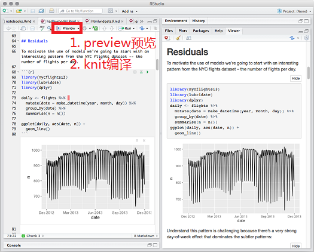
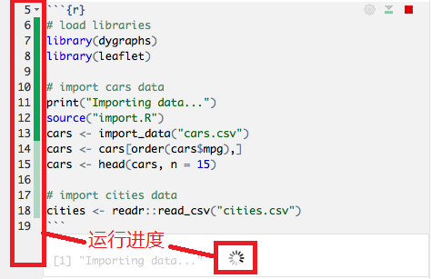
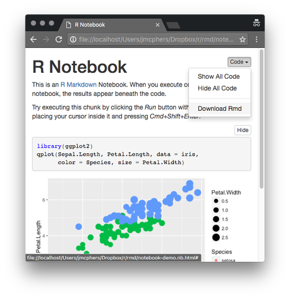
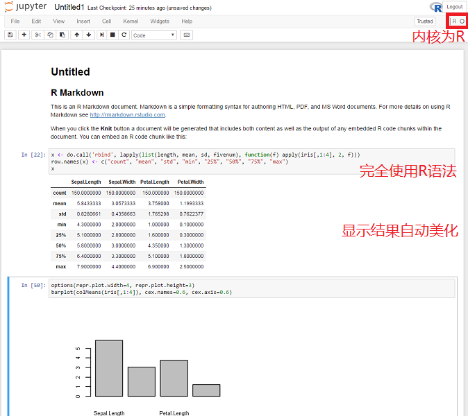

```{r setup, include=FALSE}
## User-defined options come here
knitr::opts_chunk$set(warning = FALSE, message = FALSE, 
                      fig.path = "A05_06_notebook_files/figure-html/")
```

## 目录

- [R Notebook](#3)
- [Jupyter Notebook](#8)
- [Anaconda](#17)


# R Notebook

## [简介](http://rmarkdown.rstudio.com/r_notebooks.html)

- 要求RStudio 1.0以上版本
- R Notebook是一种特殊的rmarkdown文档类型
    - 支持独立、交互运行单个代码块
    - 代码块运行结果即时显示在文档体内
- 更灵活，更便于探索
- notebook运行模式也可以用在.R脚本或普通.rmd文档
    - **Ctrl + Alt + I** (OS X: *Cmd + Option + I*)插入代码块
    - [Run chunk]按钮，或**Ctrl + Shift + Enter** (OS X: *Cmd + Shift + Enter*)运行当前代码块
    - 鼠标选取代码片断，**Ctrl + Shift + Enter** (OS X: *Cmd + Shift + Enter*)运行选中代码

## 创建R Notebook

**创建 --> 编辑 --> 设置**





## 交互运行

<div class="columns-2">

交互运行时，能看到进度条



<p class="forceBreak"></p>

交互运行完毕后，结果显示在代码块下方


</div>

## 快速分享

- R Notebook生成的HTML文件为.nb.html格式
- 可以一键切换浏览模式(显示/隐藏源代码)



# Jupyter Notebook

## [简介](http://jupyter.org/)

- 开源网络应用，用户可以快速创建基于网络的notebook应用
- 前身是IPython，仅支持Python
- 如今已成为数据科学领域的流行工具，额外支持R, Julia, Scala等
- 便于通过网络共享(GitHub, dropbox, [nbviewer](https://nbviewer.jupyter.org/), ...)
- 内建为网络服务，便于嵌入Web交互部件(视频、音频、JavaScript)
- 整合大数据工具(Spark等)，用户可使用熟悉的工具(ggplot2, pandas等)直接处理大数据集

## 创建Notebook

- 命令行(如Shell)输入`jupyter notebook`


- 启动Jupyter Notebook网络服务，浏览器打开 <localhost:8888/tree>


## 使用

- 新建notebook，选择合适的内核(kernel)
- Jupyter Notebook操作单元是cell，类似于R Notebook中的chunk
    - **Alt + Enter**添加新cell
    - 3种类型(cell type): Code, Markdown, Raw NBConvert
    - 写完代码后，**Shift + Enter**运行
    - **相当于把Jupyter Notebook当成R IDE来用**
- File --> Download as，保存为.ipynb，.html，或.pdf
- 关闭标签页，并到Jupyter Notebook Home关闭该内核
- 关闭Shell窗口，即关闭Jupyter Notebook服务

---- 


---- 



## Python也是一个好工具

- Python是当今数据科学领域最热门的语言之一
    - 较完备的机器学习、深度学习工具
    - 适合处理大数据
- 与R相比，Python学习曲线较平缓
    - 语法更符合计算机科学背景的技术人员的习惯
    - 方法明确，一种问题通常只对应一种解决方法
    - 文档更为完备，开发者社区更大
- Python是一种更通用的语言
    - 适合搭建网络应用等工具

---

<div class="columns-2">


<p class="forceBreak"></p>


</div>

## 那么问题来了...

#### 我怎么安装Python和Jupyter Notebook呢?    


- 从[Python](https://www.python.org/)装起，再通过`pip`工具逐个安装必要的[扩展库](https://pypi.python.org/)

- 但在Windows上，扩展库往往有很深的库依赖链，安装过程很容易出错

- 推荐用一个具备较成熟的包管理能力的Python发行版

# Anaconda

## [简介](https://anaconda.org/)

<div class="col-2L">

- Anaconda是Continuum Analytics公司出品的套件
    - Python有很多发行版，如WinPython， Python(x,y)
    - Anaconda是目前最适合数据科学家的一个发行版
- Anaconda极大地便利了数据科学家
    - 一站式管理Python及其扩展库(`conda`或`miniconda`)
    - 整合Jupyter Notebook, Spyder, Orange乃至RStudio等工具
    - 通过其他内核(如IRkernel, sas_kernel等)扩展分析处理能力

</div><div class="col-2R">


</div>

## [安装配置Anaconda](https://docs.continuum.io/anaconda/install) {.smaller}

#### 安装

到[下载页](http://continuum.io/downloads.html)下载对应的Anaconda Installer

- Windows: 如无法取得管理员权限，应选"just for me"
- MacOS: 包括GUI安装和命令行安装
- Linux: `bash <路径>.sh`命令

#### 配置

<div class="columns-2">

通过.condarc配置conda(通道、代理等)

- Windows: `C:\Users\<用户>\.condarc`
- MacOS: `~/.condarc`
- Linux: `/opt/<用户>/anaconda/.condarc`

<p class="forceBreak"></p>

.condarc一般包含内容:

```
channels:
  - r
  - defaults
proxy_servers:
  http: http://<用户名>:<密码>@<代理服务器>:<端口号>
  https: https://<用户名>:<密码>@<代理服务器>:<端口号>
```

</div>

## [conda命令](https://docs.continuum.io/docs_oss/conda)

- conda是与pip类似的包管理工具(Anaconda自带conda)
    - conda可以用来管理Anaconda本身
- 查看conda信息: `conda info`
- 帮助: `conda help`
- 罗列包: `conda list`
- 寻找包: `conda search <参数> <包名>`
- 安装包: `conda install <参数> <包名>`
- 更新包: `conda update <参数> <包名>`
- 卸载包: `conda remove <参数> <包名>`

## 管理扩展包

- Anaconda内置150个包，此外可自行安装300多个包
    - 可直接通过Anaconda Navigator图形界面安装扩展包
    - 也可通过`conda install`命令自行安装
    - 非conda包可通过pip来安装
- 部分参数 `conda install|update|remove <参数> <包名>`
    - `-h` 打开帮助
    - `-f` 强制安装
    - `-c` 'default'以外的下载通道，默认为'anaconda.org'
    - `-n` 指定所装入的环境
    - `-v` 明细安装信息

## 加装R内核

- 通过`conda install -c r r-essential`命令在Anaconda安装独立的R环境
    - 该环境包括R及百来个常用包、Rtools组件
    - 不依赖既有的R环境及附加包，但要占用额外的空间
- [利用已有的R环境](https://irkernel.github.io/installation/)
    - 在R中执行两步:
    
    ```r
    install.packages(c('repr', 'IRdisplay', 'evaluate', 'crayon', 'pbdZMQ', 'devtools', 
        'uuid', 'digest'))
    devtools::install_github('IRkernel/IRkernel')
    ```
    
    - 将IRkernel配置写入Jupyter
    
    ```r
    IRkernel::installspec()
    ```

  
## {.grayblue}

<p style="font-size:100px;font-family:'Arial Black'"><br/>Thank you! </p>

<br/>[回到主目录](http://madlogos.github.io/R_Tutorial)
