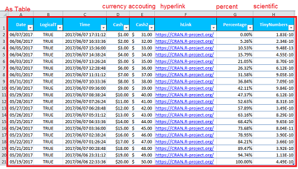
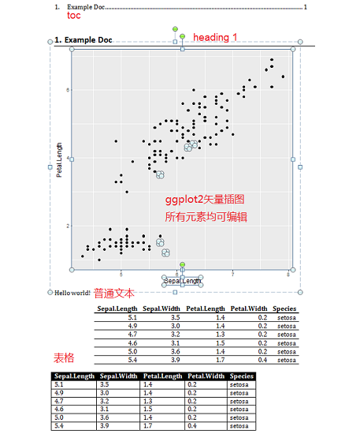
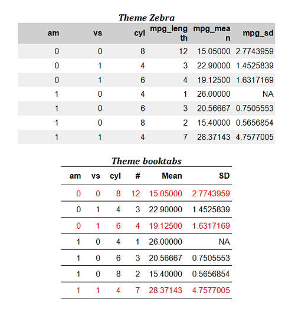
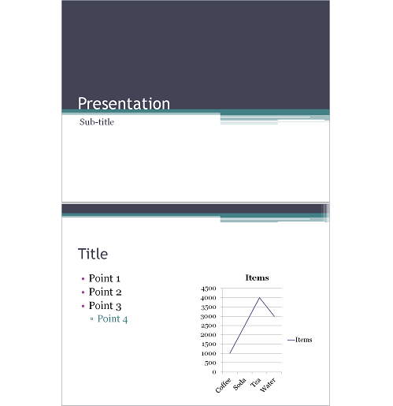

```{r setup, include=FALSE}
## User-defined options come here
knitr::opts_chunk$set(warning = FALSE, message = FALSE, 
                      fig.path = "A05_07_msDoc_files/figure-html/")
```

## 目录

- [MS Office的自动化策略](#3)
- [高级(High-level)方法](#6)
- [次高级(lower-level)方法](#11)
- [低级(low-level)方法](#18)


# MS Office的自动化策略

## 绕不开的Office

<div class="col-2L">

#### MS Office有诸多缺点

- 优点即缺点: 图形化操作
    - 可重复性极差
    - 自动化难度较大
- Office软件依赖
    - 难以和未安装Office的用户分享
- 分析计算能力相对弱
- 撰写和排版往往难以分开

</div>

<div class="col-2R">

#### 但仍是我们绕不过的山

- Office仍是商业组织最常用的分析/报告工具
    - 广泛安装部署
    - 组织的历史数据资产多以Office格式存在
    - 受众最广泛
    - 老板/客户只认可Office格式的文档
- Office依然有难以取代的优点
    - 快速探索、创建文档
    - 快速开发分析工具

</div>

## 常用的Office自动化策略

> 在R中，几乎没有完美的Office自动化方案，   
> 所以——能不用Office就别用。

- VBA (Visual Basic for Applications)
- 使用通用编程语言操作DCOM接口，生成Office文档，如
    - Python的PyWin32
- 利用报表工具生成Office文档，如
    - SAS的ODS模块

# 高级(High-level)方法

## knitr

#### 优点

- 基本方法和生成html报告一样
- 不纠结于排版，聚焦分析和内容
    - 可生成后再套用自定义样式

#### 缺点

- 仅支持MS Word
- 不支持较复杂的美工效果
    - 最多能生成wmf，无法生成OLE图表

## knitr示例

<div class="col-2L">


</div>

<div class="col-2R">


</div>

## openxlsx (或xlsx, XLConnet)

#### 优点

- 通过高级函数直接操作Excel对象
- 操作步骤完全可重复
- 基于Rcpp，速度更快

#### 缺点

- xlsx和XLConnet依赖rJava，速度较慢
- openxlsx和xlsx只支持xlsx，不支持xls
- 这几个包均只能处理Excel

## openxlsx示例 {.smaller}

<div class="col-2L">

```r
library(openxlsx)
df <- data.frame(
    "Date" = Sys.Date()-0:19, 
    "LogicalT" = TRUE,
    "Time" = Sys.time()-0:19*60*60,
    "Cash" = paste("$",1:20), 
    "Cash2" = 31:50,
    "hLink" = "https://CRAN.R-project.org/",
    "Percentage" = seq(0, 1, length.out=20),
    "TinyNumbers" = runif(20) / 1E9, 
    stringsAsFactors = FALSE)
class(df$Cash) <- "currency"
class(df$Cash2) <- "accounting"
class(df$hLink) <- "hyperlink"
class(df$Percentage) <- "percentage"
class(df$TinyNumbers) <- "scientific"
hs <- createStyle(fontColour = "#ffffff", 
    fgFill = "deepskyblue", halign = "center", 
    valign = "center", textDecoration = "Bold",
    border = "TopBottomLeftRight")
write.xlsx(df, file = "writeXLSXTable3.xlsx", 
    asTable = TRUE, borders = "rows", 
    headerStyle = hs)
```

</div>

<div class='col-2R'>



</div>


# 次高级(lower-level)方法

## officer

- 作者[David Gohel](https://github.com/davidgohel/officer)
- 是ReporteRs的升级版，基于Rcpp，速度更快
    - (ReporteRs基于rJava)
- 采用统一的语法，直接操作MS Word、PowerPoint
    - 先初始化
    - 添加页面/占位，再添加元素
    - 通过rvg、devEMF等包扩展，输出矢量图
    - 通过flextable包扩展，输出自定义的美观表格
- 采用%>%管道化操作，代码可读性和效率更高


## officer - [MS Word](https://davidgohel.github.io/officer/articles/word.html) {.smaller}

<div class="col-2L">

- 初始化: `read_docx`
- 可用样式: `styles_info`
- 添加/替换成段元素
    - `body_add_par`
    - `body_add_img`
    - `body_add_table`
    - `body_add_break`
    - `body_add_toc`
    - `body_add_gg`
- 添加段内元素
    - `slip_in_img`
    - `slip_in_seqfield`
    - `slip_in_text`
    - `slip_in_tableref`
    - `slip_in_plotref`

</div>

<div class="col-2R">

- 指针(cursor)操作
    - `cursor_begin`
    - `cursor_end`
    - `cursor_reach`
    - `cursor_backward`
    - `cursor_forward`
    - `cursor_bookmark`
- 删除内容: `body_remove`
- 章节: `body_end_section`
- 书签: `body_bookmark`
- 小结: `docx_summary`

</div>


## officer - MS Word 示例 {.smaller}

<div class="col-2L">

```r
library(officer)
library(ggplot2)
library(magrittr)
gg <- ggplot(iris, aes(
    Sepal.Length, Petal.Length)) + 
    geom_point()
doc <- read_docx() %>% 
    body_add_toc() %>%
    body_add_par("Example Doc", 
        style = "heading 1") %>%
    rvg::body_add_vg(print(gg)) %>% 
    body_add_par("Hello world!", 
        style = "Normal") %>% 
    body_add_par("", style = "Normal") %>% 
    body_add_table(head(iris), 
        style = "table_template") %>%
    body_add_par("", style = "Normal") %>%
    body_add_table(head(iris), 
        style = "Table Professional")
print(doc, target = "first_example.docx")
```

rvb::body_add_vg: 添加可编辑图

</div>

<div class="col-2R">



</div>

## officer - MS PPT

<div class="col-2L">

- 初始化: `read_pptx`
- 可用样式: `layout_sumamry`
- 添加页面: `add_slide`
- 移除页面: `remove_slide`
- 定位页面: `on_slide`
- 添加文本: 
    - `ph_with_text`
    - `ph_add_text`
    - `ph_add_par` / `ph_add_fpar`
    - [layout_properties](https://davidgohel.github.io/officer/reference/layout_properties.html)

</div>

<div class="col-2R">

- 添加图片: 
    - `ph_with_image`
    - `ph_with_image_at`
- 添加表格
    - `ph_with_table`
    - `ph_with_table_at`
- 页面布局: `slide_summary`
- 外部链接: `ph_hyperlink`
- 内部链接: `ph_slidelink`
- 删除内容: `ph_remove`


</div>


## officer - MS PPT示例 {.smaller}

<div class="col-2L">

```r
pres <- read_pptx() %>% 
    add_slide(layout = "Two Content", 
        master = "Office Theme") %>%
    ph_with_text(type = "body", 
        str = "A first text"， index = 1) %>%
    ph_add_par(id_chr='2', level = 2) %>%
    ph_add_text("body (index 1) is text") %>% 
    ph_with_text(type = "body", 
        str = "A second text", index = 2) %>%
    ph_with_img_at(
        src = file.path(Sys.getenv("R_HOME"), 
            "doc", "html", "logo.jpg"), 
        left = 5.15, top = 2.5, height = 1.06, 
        width = 1.39) %>%
    ph_with_text(type = "title", str = "A title") %>%
    ph_with_text(type = "ftr", 
        str = "Slide footer") %>%
    ph_with_text(type = "dt", 
        str = format(Sys.Date())) %>%
    add_slide(layout = "Title and Content", 
        master = "Office Theme") %>%
    ph_with_text(type = "title", str = "mtcars") %>%
    ph_with_table(type = "body", value = head(mtcars))
print(pres, target = "ph_with_table.pptx")
```

</div>

<div class="col-2R">


</div>

## flextable {.smaller}

<div class="col-2L">

```r
library(flextable)
library(data.table)
dat <- dcast(data.table(mtcars), 
    am + vs + cyl ~., list(length, mean, sd), 
    value.var="mpg")
ft1 <- flextable(
    data = as.data.frame(dat)) %>% 
    theme_zebra()
ft2 <- flextable(
    data = as.data.frame(dat)) %>% 
    theme_booktabs() %>% 
    set_header_labels(
        mpg_length = "#", mpg_mean = "Mean", 
        mpg_sd = "SD") %>% 
    color(i = ~ mpg_length > 3, color = "red") %>% 
    autofit() 
read_docx() %>% 
    body_add_par(value="Theme Zebra", 
        style="table title") %>%
    body_add_flextable(ft1) %>% 
    body_add_par("") %>%
    body_add_par(value="Theme booktabs", 
        style="table title") %>%
    body_add_flextable(ft2) %>%
    print(target = "flextable.docx")
```

</div>

<div class="col-2R">



</div>


# 低级(low-level)方法

## COM (组建对象模型)

- 微软的一种面向对象的编程模式
- 让组件和客户端无需中介即可相互通讯
- 用一个应用程序(客户端)对另一个应用程序实现的对象(自动化服务器)进行操作
- MS Office广泛使用COM技术，如OLE
    - 在Word中动态链接Excel表格，即OLE对象
    - 通过Word(客户端)操作Excel OLE对象(服务器)
- COM进一步衍生出了DCOM、COM+等技术

## [RDCOMClient](http://www.omegahat.net/RDCOMClient/)包

- 作者Duncan Temple Lang
- 可搭配[SWinTypeLibs](https://github.com/omegahat/SWinTypeLibs)包
- [简介](http://www.omegahat.net/RDCOMClient/Docs/introduction.html)
    - 把R作为客户端访问自动化服务器(Office文档)，通过IDispatch接口操作COM对象
    - 初始化: `ppt = COMCreate("Powerpoint.Application")`
    - 调用方法: `comObj$methodName(arg1, arg2, arg3, ...)`
    - 对象属性: `comObj[['comPropertyName']]`
    - 较类似于VBA，例子参见[Omegahat](http://www.omegahat.net/RDCOMClient/examples)

## 示例 {.smaller}

```r
library(RDCOMClient)
# 初始化，创建COM对象，套模板
ppt <- COMCreate("Powerpoint.Application")
ppt[['Visible']] <- TRUE
slide <- ppt[['Presentations']]$add()
slide$ApplyTheme("C:\\Program Files (x86)\\Microsoft Office\\Document Themes 14\\Urban.thmx")
# 添加页面，标题和副标题
slide[['Slides']]$add(1, 1)
x <- slide[['Slides']][[1]][['Shapes']][[1]][['TextFrame']][['TextRange']]
x[['Text']] <- "Presentation"
x <- slide[['Slides']][[1]][['Shapes']][[2]][['TextFrame']][['TextRange']]
x[['Text']] <- "Sub-title"
# 第二页，标题
slide[['Slides']]$add(2, 5)
x <- slide[['Slides']][[2]][['Shapes']][[1]][['TextFrame']][['TextRange']]
x[['Text']] <- "Title"
# 第二页，左栏，四个列表
x <- slide[['Slides']][[2]][['Shapes']][[2]][['TextFrame']][['TextRange']]
x[['Text']] <- paste(paste("Point", 1:4), collapse="\r")
# 最后一个列表缩进一档
x <- slide[['Slides']][[2]][['Shapes']][[2]][['TextFrame']][['TextRange']]$Paragraphs(4)
x[['IndentLevel']] <- 2
```

## 示例(续) {.smaller}

<div class="col-2L">

```r
# 第二页右栏，新建图
x <- slide[['Slides']][[2]][['Shapes']
    ]$AddChart(4)[['Chart']] #xlLine
# 操作内嵌数据表，修改数据
gCd <- x[['ChartData']]
gWb <- gCd[['Workbook']]
gWs <- gWb[['Worksheets']][[1]]
xlr <- gWs$Range("C1:G5")
xlr$ClearContents()
gWs$ListObjects("Table1")$Resize(gWs$Range("A1:B5"))
xv <- gWs$Range("Table1[[#Headers],[Series 1]]")
xv[['Value']] <- "Items"
xv <- gWs$Range("a2"); xv[['Value']] = "Coffee"
xv <- gWs$Range("a3"); xv[['Value']] = "Soda"
xv <- gWs$Range("a4"); xv[['Value']] = "Tea"
xv <- gWs$Range("a5"); xv[['Value']] = "Water"
xv <- gWs$Range("b2"); xv[['Value']] = 1000
xv <- gWs$Range("b3"); xv[['Value']] = 2500
xv <- gWs$Range("b4"); xv[['Value']] = 4000
xv <- gWs$Range("b5"); xv[['Value']] = 3000
gCd$Activate()
gWb$close(TRUE)
```

</div>

<div class="col-2R">


</div>


## {.grayblue}

<p style="font-size:100px;font-family:'Arial Black'"><br/>Thank you! </p>

<br/>[回到主目录](http://madlogos.github.io/R_Tutorial)
