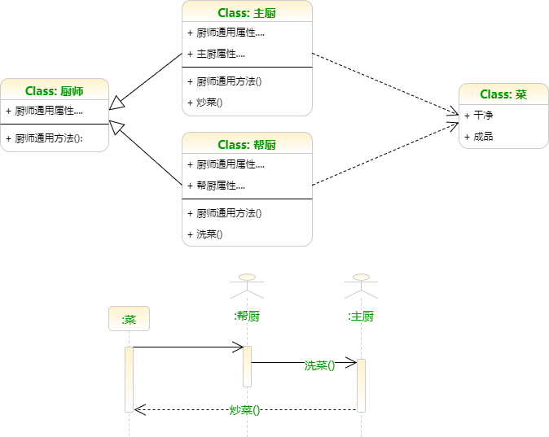

```{r setup, include=FALSE}
## User-defined options come here
Sys.setlocale("LC_CTYPE", "Chs")
knitr::opts_chunk$set(warning = FALSE, message = FALSE, 
                      fig.path = "B01_01_OOP_S3_files/figure-html/")
```

## 目录

- [面向对象编程(Object-oriented Programming)](#3)
- [S3系统](#9)
- [实例](#19)

<p class="footer">Copyright © 2016-2017 Aetna Inc. <span class="cranberry">内部使用，请勿外传。</span><br>部分内容借鉴**Hadley Wickham** [Advanced R](http://adv-r.had.co.nz).</p>

# 面向对象编程(Object-oriented Programming)

## 面向过程(POP) vs 面向对象(OOP) {.smaller}

+------+---------------------------------------------+-----------------------------------------------+
| 方面 | 面向过程 (以事件过程为中心)                 | 面向对象 (以对象为中心)                       |
+======+=============================================+===============================================+
| 特点 | - 传统的编程思维，适合较简单/底层的线性事务 | - 较为抽象，更接近人类的思维特点 |
|      | - 自顶而下，流程化、线性、步骤化            | - 高度抽象，封装、继承、多态 |
+------+---------------------------------------------+-----------------------------------------------+
| 优点 | - 流程明确                                  | - 结构清晰，易模块化  |
|      | - 效率高                                    | - 易扩展、易维护，代码重用率高 |
+------+---------------------------------------------+-----------------------------------------------+
| 缺点 | - 扩展性差                                  | - 效率低            |
|      | - 维护难度大                                | - 复杂性高 |
+------+---------------------------------------------+-----------------------------------------------+
| 举例 | - (菜) -> 洗菜过程 -> (干净的菜)            | - 厨师[类]，定义<洗菜>和<炒菜>方法 |
|      | - (干净的菜) -> 炒菜过程 -> (成品)          | - 菜[类]，定义<干净>、<成品>等属性 |
|      | - 先后调用洗菜和炒菜过程，输出成品          | - 厨师实例A.洗菜，厨师实例B.炒菜   |
+------+---------------------------------------------+-----------------------------------------------+

---




## OOP的特征

- **封装**(Encapsulation)
    - 把客观事物封装成抽象的类(class)，不同的类有不同的静态(属性attribute)及动态(方法method)特性
    - 类的属性和方法只开放给可信的类操作，对不可信的类隐藏
    - *例: 主厨有特别封装的方法（如“炒菜”），帮厨和杂工等都不能使用该方法*
- **继承**(Inheritance)
    - 子类自动共享父类数据结构和方法的机制
    - 无需重写原来的类，即可对该类的功能进行扩展
    - *例：主厨和帮厨都继承厨师的通用方法，如“进入后厨”*
- **多态**(Polymorphism)
    - 由继承产生的相关的不同类，其对象对同一消息会做出不同的响应
    - *例：同样的“拿薪水”方法，主厨和帮厨适用不同的计薪体系*

## 基本操作

- 定义
    - 声明类(class): `汽车`
    - 定义类的属性(颜色、厂牌、发动机等)和方法(启动、加速、刹车等)
- 使用
    - 初始化一个对象: 一辆汽车A
    - 对该对象应用方法: A.启动()
- 扩展
    - 根据需要创建子类(自动档、手动档)
    - 重写/扩展子类属性/方法(换档等)

## OOP的设计原则: SOLID {.smaller}

> 高内聚，低耦合。High cohesion and low couping.

- **S**ingle Responsibility Principle 单一职责原则
    - 一个类应该有且只有一个去改变它的理由(一个类应该只有一项工作)
- **O**pen-Close Principle 开放封闭原则
    - 对象或实体应该对扩展开放，对修改封闭
- **L**iskov Substitution Principle 里氏替换原则
    - 子类必须能够替换其父类，否则不应当设计为其子类
- **I**nterface Segration Principle 接口隔离原则
    - 将大的接口打散成多个小的独立的接口
- **D**ependence Inversion Principle 依赖倒置原则
    - 实体必须依靠抽象而不是具体实现(高层次的模块不应该依赖于低层次的模块，它们都应该依赖于抽象)

# S3系统

## S3

- S3源于S语言，是基于泛型函数(generic function)而非类层次结构的的独特的OO系统
    - 泛型函数用法: `函数(对象, 参数列表)`
        - 函数(如`summary`, `plot`)根据对象的类，自动调用适用的方法
    - 类层次结构的用法: `对象.方法(参数列表)`
- R有三种OO系统: S3, S4和RC
    - 可利用`pryr::otype`和`pryr::ftype`判定对象/函数属于哪个OO系统
- S3非常自由，不需要专门对类作出定义
    - 直接创建对象，并定义类

## 创建类 {.smaller}

在S3中，创建和初始化可以同时完成

```{r}
library(pryr)
car1 <- structure(list(manuf="VW", color="white", brand="Golf"), class="Car")
otype(car1)
str(car1)
```

或

```r
car1 <- list(manuf="VW", color="white", brand="Golf")
class(car1) <- "Car"
```

## 创建子类

```{r}
car2 <- structure(list(manuf="VW", color="red", brand="Audi"), 
                  class=c("Auto", "Car"))
car3 <- structure(list(manuf="VW", color="black", brand="Santana"), 
                  class=c("Manual", "Car"))
bike1 <- structure(list(manuf="Yongjiu", color="yellow", brand="ofo"), class="Bike")
## 是否属于Car类?
sapply(list(car2, car3, bike1), inherits, what="Car")
```

## 方法: 泛型函数

```{r}
## 泛型函数shiftGear，采取"shiftGear"方法
shiftGear <- function(x, from, to, ...) {
    ## 校验数据结构
    stopifnot(all(c("manuf", "color", "brand") %in% names(x)))
    ## 调用shiftGear方法
    UseMethod("shiftGear")
}
ftype(shiftGear)
```

## 封装和多态

```{r}
shiftGear.Manual <- function(x, from, to, ...) {
    if (from == to) {  ## 针对Manual类对象，定义专用的shiftGear方法
        print(paste(class(x)[1], "类: 不需要换档"))
    }else{
        print(paste(class(x)[1], "类:", x$color, x$manuf, x$brand, 
                    "踩离合，再从", from, "档隔级换到", to))
    }
}
shiftGear.Car <- function(x, from, to, ...) {  ## Car类的通用shiftGear方法
    paste("我不知道怎么给", class(x)[1], "类", x$color, x$manuf, x$brand, "换档")
}
shiftGear.default <- function(x, ...) paste(class(x)[1], "类: 无法换档")  ## 默认的shiftGear方法
methods(shiftGear)
```

## {.smaller}

- 不同类的车，对换档方法的响应是不同的
- 换档方法被封装到手动档类，自动档的车不能使用换档方法

```{r}
shiftGear(car2, 2, 4)
shiftGear(car3, 2, 2)
shiftGear(car3, 5, 2)
shiftGear(bike1, 1, 2)
```

## 继承

- 定义Auto类下的一个子类
- 该类对象自动继承Auto及Car类的所有属性和方法

```{r}
notACar <- list(manuf="Nobody", color="opaque", brand="Nobrand")
class(notACar) <- c("NotACar", class(car2))
shiftGear(notACar)
```

## `magrittr::%>%`

- 可以用magrittr包的%>%实现管道化
- 将OOP语法改为更主流的主谓格式: 对象.方法

```r
x %>% f(y)  ## 等价于
f(x, y)
```

```{r}
library(magrittr)
car3 %>% shiftGear(4, 2)
```

## 定义类的同时定义方法

将方法定义在类内部 (建议用RC)

```{r}
move <- function(car, speed, ...) UseMethod("move")
move.Car <- function(car, speed, ...) 
    print(paste(car$color, car$manuf, car$brand, "时速", speed, "行驶"))
car4 <- structure(list(manuf="Toyota", color="white", brand="Accord",
                       move=function(speed, ...) move(car4, speed, ...)),
                  class=c("Auto", "Car"))
car4$move(40)
```

# 实例

## 需求

<div class="columns-2">

> 计算右表图形的面积<br>
> 部分计算公式重温如下:

- 三角形面积 = 边 \* 邻边 \* sin(夹角) / 2 
    - 等边三角形面积 = 边 ^ 2 * sin(pi/3)
- 平行四边形面积 = 边 \* 邻边 \* sin(夹角)
   - 矩形面积 = 边 \* 邻边
   - 菱形面积 = 边 ^ 2 \* sin(夹角)

<p class="forceBreak"></p>

```{r, echo=FALSE}
shapes <- data.frame(shape=c("三角形", "平行四边形", "矩形", "菱形", "正方形", "等边三角形"),
                     edge=rep(10, 6), neighbor=c(rep(20, 3), rep(NA, 3)),
                     angle=c(45, 60, NA, 45, NA, NA))
knitr::kable(shapes, row.names=TRUE)
```

</div>

## 一般解决方案

- 笨拙，但是实现起来非常直观
    - 逐行套用公式硬算
    - 循环: 遍历各行，根据shape套用公式
    - 向量计算: 根据shape分割数据，矢量化套用函数

```{r}
areas <- c(with(shapes[1,], edge * neighbor * sin(pi*angle/180) / 2),
           with(shapes[2,], edge * neighbor * sin(pi*angle/180)),
           with(shapes[3,], edge * neighbor),
           with(shapes[4,], edge ^ 2 * sin(pi*angle/180)),
           with(shapes[5,], edge ^ 2),
           with(shapes[6,], edge ^ 2 * sin(pi*60/180)) / 2)
areas
```

## 建模思路

1. 建立三角形"Triangle"、平行四边形"Parallelogram"两个大类
    - 建立calcArea方法，分别对两个大类计算面积
1. 在两个大类下建立等边三角形、矩形、菱形等子类
    - 建立imputeNeighbor方法，对各个子类作邻边补全
    - 建立imputeAngle方法，对各个子类作夹角补全
1. 给所有对象正确赋类
1. 应用imputeNeighbor、imputeAngle和calcArea方法

## 实现-1 {.smaller}

- 建立calcArea方法
- 注意计算sin时，角度转为弧度
- 为避免类型错误，外置一个工具函数toNum，将edge, neighbor, angle转为数值

```{r}
toNum <- function(shape, ...){
    shape$neighbor <- as.numeric(shape$neighbor)
    shape$edge <- as.numeric(shape$edge)
    shape$angle <- as.numeric(shape$angle)
    return(shape)
}
```

```{r}
calcArea <- function(shape, ...) UseMethod("calcArea")  ## 泛型函数
calcArea.Triangle <- function(shape, ...)   ## 三角形通用公式
    with(toNum(shape), edge * neighbor * abs(sin(pi * angle / 180)) / 2)
calcArea.Parallelogram <- function(shape, ...)   ## 平四通用公式
    with(toNum(shape), edge * neighbor * abs(sin(pi * angle / 180)))
calcArea.default <- function(shape, ...) NA  ## 默认不计算面积
```

## 实现-2 {.smaller}

- 编写工具函数ifNA (如为NA，则返回替补值)

```{r}
ifNA <- function(x, y) if (is.na(x)) y else x
```

<div class="col-2L">

- 建立imputeNeighbor方法(如为NA，用edge替补)

```{r}
imputeNeighbor <- function(shape, ...)   ## 泛型函数
    UseMethod("imputeNeighbor")

imputeNeighbor.default <- function(shape, ...){  
    shape$neighbor <- with(
        shape, ifNA(neighbor, edge))
    return(shape)
}
```

</div><div class="col-2R">

- 建立imputeAngle方法

```{r}
imputeAngle <- function(shape, ...)   ## 泛型函数
    UseMethod("imputeAngle")

imputeAngle.RegularTriangle <- function(shape, ...) {
    shape$angle <- ifNA(shape$angle, 60)
    return(shape)
}
imputeAngle.Square <- function(shape, ...) {
    shape$angle <- ifNA(shape$angle, 90)
    return(shape)
}
imputeAngle.ExactSquare <- imputeAngle.Square
imputeAngle.default <- function(shape, ...) 
    return(shape)
```
    
</div>

## 实现-3 {.smaller}

<div class="columns-2">

- 类名

```{r}
newshapes <- shapes
newshapes$shapeclass <- c(
    "Triangle", rep("Parallelogram", 4), "Triangle")
newshapes$shape <- c(
    "Triangle", "Parallelogram", "Square", "Rhombus", 
    "ExactSquare", "RegularTriangle")
```

- 赋类、赋子类

```{r}
newshapes <- apply(newshapes, 1, function(x) 
    structure(as.list(x), class=unname(
        x[c('shape', 'shapeclass')])))
```

- 调整后的数据结构

```r
str(newshapes)
```

<p class="forceBreak"></p>

```
List of 6
 $ :List of 5
  ..$ shape     : chr "Triangle"
  ..$ edge      : chr "10"
  ..$ neighbor  : chr "20"
  ..$ angle     : chr "45"
  ..$ shapeclass: chr "Triangle"
  ..- attr(*, "class")= chr [1:2] 
        "Triangle" "Triangle"
 $ :List of 5
  ..$ shape     : chr "Parallelogram"
  ..$ edge      : chr "10"
  ..$ neighbor  : chr "20"
  ..$ angle     : chr "60"
  ..$ shapeclass: chr "Parallelogram"
  ..- attr(*, "class")= chr [1:2] 
        "Parallelogram" "Parallelogram"
 $ :List of 5
  ..$ shape     : chr "Square"
  ..$ edge      : chr "10"
  ..$ neighbor  : chr "20"
  ..$ angle     : chr NA
  ..$ shapeclass: chr "Parallelogram"
  ..- attr(*, "class")= chr [1:2] 
        "Square" "Parallelogram"
 ...
```

</div>

## 实现-4

- 补全参数，计算面积

```{r}
newareas <- newshapes %>% lapply(imputeNeighbor) %>% lapply(imputeAngle) %>% 
    sapply(calcArea)
```

- 和传统解法结果相同
- 如类型增/改，只需补充impute和calc过程，即可扩展，框架不变

```{r}
rbind(legacySolution=areas, oopSolution=newareas)
```

## {.teal}

<p style="font-size:100px;font-family:'Arial Black'"><br/>Thank you! </p>


