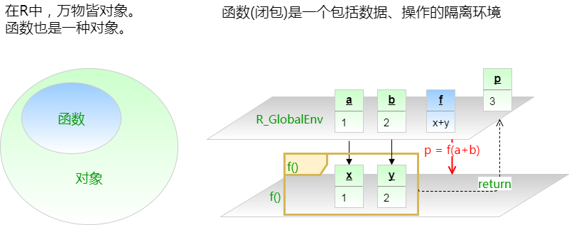

```{r setup, include=FALSE}
## User-defined options come here
Sys.setlocale("LC_CTYPE", "Chs")
knitr::opts_chunk$set(warning = FALSE, message = FALSE, 
                      fig.path = "B01_03_advFunc_files/figure-html/")
```

## 目录

- [知识扩展](#3)
- [操作皆函数](#9)
- [函数参数](#15)
- [特殊调用](#22)

<p class="footer">Copyright © 2016-2017 Aetna Inc. <span class="cranberry">内部使用，请勿外传。</span><br>部分内容借鉴**Hadley Wickham** [Advanced R](http://adv-r.had.co.nz).</p>

# 知识扩展

## 函数的结构

R有两类函数: 闭包(closure)和内置(primitive)函数

<div class="col-2L">

#### 闭包

- 由R代码写成
- 包括3部分: 形参(formals, 即arglist)、函数体(body)和环境
- 和普通R对象一样，也有attributes、class等属性

```r
function (arglist) expr 
return(value)
```

</div><div class="col-2R">

#### 内置函数

- 由C语言写成，通常内置于base包内
- 没有形参(arglist)、函数体(body)和环境
- 没有attributes、class等属性

```r
function (arglist) .Primitive(method)
```

</div>

## 例子 {.smaller}

<div class="col-2L">

- 构造一个自定义函数addN

```{r}
addN <- function(x, n=1) return(x+n)
formals(addN)
body(addN)
environment(addN)
```

</div><div class="col-2R">

- 查看内置函数sum

```{r}
sum
formals(sum)
body(sum)
environment(sum)
```

</div>

## 函数、对象、环境



---

```{r echo=FALSE}
rm(list=ls())
```

```{r}
f <- function(x, y) {
    print(list("本闭包环境"=ls()))
    print(list("上一层环境"=ls(envir=parent.frame())))
    return(x+y)}
a <- 1; b <- 2
```

<div class="col-2L">

当前环境有些什么对象?

```{r}
list("当前环境"=ls())
```

</div><div class="col-2R">

运行f()函数，该闭包环境里有些什么对象?

```{r}
f(a, b)
```

</div>

## 作用域

- 作用域(scoping)的概念会在[B01_04](B01_04_env.html)讲

```{r}
f <- function(x) x + y
y <- 10
```

<div class="col-2L">

函数定义中找不到y，则到上一级环境中找

```{r}
f(1)
```

</div><div class="col-2R">

如果找到R_GlobalEnv仍找不到，则返回错误

```r
rm(y)
f(1)
```

```
Error in f(1) : object 'y' not found
```

</div>

# 操作皆函数

-----

> “To understand computations in R, two slogans are helpful:   
>     
> - Everything that exists is an object.   
> - Everything that happens is a function call."   
> — John Chambers

## 代数算符

<div class="col-2L">

```{r}
x <- 5
y <- 3
c(x + y, `+`(x, y))
all.equal(x + y, `+`(x, y))
```

</div><div class="col-2R">

 算符函数     | 等价于
--------------|------------
 \`-\`(5, 2)  |  5 - 2
 \`*\`(5, 2)  |  5 \* 2
 \`/\`(5, 2)  |  5 / 2
 \`%%\`(5, 2) |  5 %% 2
 \`==\`(5, 2) |  5 == 2

</div>

## 这些也是函数

```r
for (i=1:2) print(i)
```

```{r}
`for`(i, 1:2, print(i))
```

```r
if (3>2) print("y") else print("n")
```

```{r}
`if`(3>2, print("y"), print("n"))
```


## 连这些也是函数

<div class="col-2L">

```{r}
`[`(1:5, 3)
`[`(iris, 4, 5)
`[[`(as.list(1:4), 2)
```

</div><div class="col-2R">

```{r}
`{`(print("a"), print(3))
`<-`(x, 4); x
```

</div>

## 用函数自定义操作符

排列组合

```{r}
`%A%` <- function(n, m) choose(n, m) * factorial(m)
`%C%` <- function(n, m) choose(n, m)
```

```{r}
5 %A% 3
5 %C% 3
```

# 函数参数

## 参数匹配原则

- 完整参数名精确匹配
- 参数名前缀模糊匹配
- 参数顺序匹配

<div class="col-2L">

```{r}
f <- function(first, second, third=5) 
    c(first=first, second=second, 
      third=third)
```

```{r}
f("a", TRUE)
```

</div><div class="col-2R">

```{r}
f(second="a", TRUE)
f(t="a", TRUE, f=5)
```

</div>

## 参数列表实践建议

- 函数作者

    - 参数名称要意义明确，**避免过长或过度缩写**
    - 无默认值的参数在前，有默认值的参数在后
    - 最重要的无默认值参数放在最前面
    - CRAN的附加包规范禁止使用参数模糊匹配，故尽量用参数全名
    - 在...后面的参数，必须用完整参数名精确匹配

- 函数使用者

    - 第一、二个参数不妨用顺序匹配，其余的尽量用精确匹配
    - 尽量避免模糊匹配

## 参数缺失和默认值

```{r}
f <- function(x, y) {
    if (missing(x)) x <- 0
    if (missing(y)) y <- 0
    return(c(x, y))
}
f()
```

等价于

```r
f <- function(x=0, y=0) c(x, y)
```

## 限定参数取值范围

<div class="col-2L">

- 数值

```{r}
f <- function(x=1:4) {
    stopifnot(x %in% 1:4)
    paste("out:", x[[1]])
}
f()
```


```r
f(6)
```

```
Error: x %in% 1:4 is not TRUE 
```

</div><div class="col-2R">

- 非数值

```{r}
f <- function(x=c("a", "b")) {
    x <- match.arg(x)
    paste("out:", x)
}
f()
```

```r
f('c')
```

```
Error in match.arg(x) : 
    'arg' should be one of “a”, “b” 
```

</div>

## dot dot dot (...)

- `...`匹配所有的“其他”参数，可轻松地传递给其他函数
    - 用`list(...)`捕获所有未匹配参数
- `...`过于灵活，可导致参数跳过校验而不报错

<div class="col-2L">

```{r}
f <- function(..., na.rm=TRUE) {
    # 解析...参数
    args <- unlist(list(...))
    # 校验: 如不是全为数值，则报错
    stopifnot(all(is.numeric(args)))
    # 计算均值
    mean(unlist(args), na.rm=na.rm)
}
f(1, 4, 6, 9, NA)
```

</div><div class="col-2R">

```r
f(1, 4, 6, 9, "m")
```

```
Error: all(is.numeric(args)) is not TRUE 
```

</div>

----

<div class="col-2L">

```{r}
f <- function(...){
    args <- list(...)
    if ("x" %in% names(args)) 
        print(mean(args$x))
    if ("y" %in% names(args)) 
        print(sd(args$y))
    plot(...)
}
```

```r
f(x=1:5, y=log(1:5), 
  col="blue", type="b")
```

</div><div class="col-2R">

```{r dot dot dot, echo=FALSE, fig.width=5, fig.height=3.5}
f(x=1:5, y=log(1:5), col="blue", type="b")
```

</div>

# 特殊调用

## 替换函数

- 形如`fun<-`，具体用法为`fun() <-`
- 事实上R生成了一个修改后的副本，然后才删除原本

<div class="col-2L">

```{r}
library(pryr)
x <- 1:10
address(x)
`revise<-` <- function(x, n, value) {
    x[[n]] <- value
    x
}
```

</div><div class="col-2R">

```{r}
revise(x, 5) <- 7
x
address(x)
```

- 等价于`x[5] <- 7` (内置函数`[<-`)
- 内部方法(primitive)可实现原位替换
- 拷贝修改机制有时可能导致内存溢出

</div>

## 返回值

- 函数返回`return()`函数显式定义的值，**并跳出调用栈**
- 如没有`return`，则返回函数最后一个求解出的值

<div class="col-2L">

```{r}
f <- function(x, y){
    if (x < y) {
        "lower"
    }else{
        "higher or equal"
    }
}
f(4, 3)
```

</div><div class="col-2R">

```{r}
f <- function(x, y){
    if (!all(is.numeric(x), 
             is.numeric(y))) 
        return(
            "Must be both numeric!")
    if (x < y) {
        "lower"
    }else{
        "higher or equal"
    }
}
f("a", 3)
```

</div>

## on.exit()

- 函数退出调用栈时，通过`on.exit()`函数可触发钩子
- 通常用于重置状态，恢复运行前的设置

<div class="col-2L">

```r
f <- function(x){
    setwd("C:")
    x
}
f(1)
```

```
[1] 1
```

```r
getwd()
```

```
[1] "C:/"
```

</div><div class="col-2R">

```r
f <- function(x){
    old.wd <- getwd()
    on.exit(setwd(old.wd))
    x
}
f(1)
```

```
[1] 1
```

```r
getwd()
```

```
[1] "/R_Tutorial/B01 FP And OOP"
```

</div>

## {.teal}

<p style="font-size:100px;font-family:'Arial Black'"><br/>Thank you! </p>


