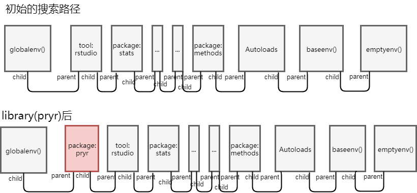
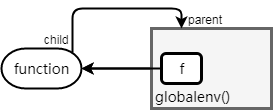
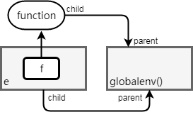

```{r setup, include=FALSE}
## User-defined options come here
Sys.setlocale("LC_CTYPE", "Chs")
knitr::opts_chunk$set(warning = FALSE, message = FALSE, 
                      fig.path = "B01_04_env_files/figure-html/")
```

## 目录

- [作用域(Scope)](#3)
- [环境](#10)
- [函数环境](#17)

<p class="footer">部分内容借鉴**Hadley Wickham** [Advanced R](http://adv-r.had.co.nz).</p>

# 作用域(Scope)

## 作用域: 静态和动态

> **作用域:** 一组程序规则，定义识别符号(identifier)和实体(entity)之间的绑定(binding，即名-实映射)。作用域决定了R如何查找一个符号的值。

<div class="col-2L">

#### 词法作用域(lexical scoping)

- (也叫静态作用域) 对象在编译时有一个静态确定的作用域，该对象仅在此作用域内可见，该作用域以外不可访问
- R广泛采用此法作用域，常见的作用域有函数闭包、附加包命名空间、R工作空间等
- R会根据这些作用域**创建时**（而非调用时）的层级关系查找对象求值

</div><div class="col-2R">

#### 动态作用域(dynamic scoping)

- 编译时只有一个环境，每次求值时，都从这个唯一的环境中查询和更改
- R根据这些作用域在何处调用，查找对象求值
- 在非标准求值中，可能会遇到动态作用域

</div>

## 词法作用域的基本概念

- **名称覆盖** (name masking)

    首先查找函数体内的对象是否有符合对应名称的变量，如果没有的话，就再上升一层继续查找

- **函数和变量** (functions v.s. variables)

    如果函数和变量的名称一样的话，会根据当时的语法去判断是函数还是变量

- **全新起始** (a fresh start)

    函数每次运行，其中的变量都是重新建立的，和上次运行没有关系

- **动态查找** (dynamic lookup)
    
    R 语言中，对变量的查找是在函数运行的时候进行的，而不是在建立的时候

## 名称覆盖

<div class="col-2L">

```{r}
x <- 1
f1 <- function(){
    y <- 2
    f2 <- function(){
        z <- 3
        c(x, y, z)
    }
    f2()
}
f1()
```

</div><div class="col-2R">

```{r}
x <- 1; y <- 4; z <- 5
f1 <- function(){
    y <- 2; z <- 6
    f2 <- function(){
        z <- 3
        c(x, y, z)
    }
    f2()
}
f1()
```

</div>

## 函数和变量

函数和变量一视同仁

```{r}
f1 <- function(x) x+1
f2 <- function(){
    f1 <- 10
    f1(f1)
}
f2()
c(c=c)
```

## 全新起始

每次运行`f()`，会生成一个新的环境

```{r}
f <- function(){
    if (exists("x")) x <- x + 1 else  x <- 1
    x
}
f()
f()
```

## 动态查找 {.smaller}

- 一个函数闭包应尽量不依赖外层环境的对象，以免意外修改导致错误
- 可用`codetools::findGlobals()`查看非自包含函数的外部依赖

<div class="col-2L">

f()的运算过程依赖外部对象x

```{r}
f <- function() x
x <- 1; f()
x <- 2; f()
codetools::findGlobals(f)
```

</div><div class="col-2R">

甚至可以覆写函数/算符

```{r}
"+" <- `c`
1+1
1:2 + c("a", "b")
```

</div>

# 环境(env)

## 什么是环境？

环境就是一组名-实绑定。

<div class="col-2L">

```r
e <- new.env(); e
```

```
<environment: 0x0000000026a45c78>
```

```r
e$a <- FALSE
e$b <- 1:2
e$c <- e$b
ls.str(e)
```

```
a :  logi FALSE
b :  int [1:2] 1 2
c :  int [1:2] 1 2
```

</div><div class="col-2R">


</div>

## 环境和列表的区别 {.smaller}

#### 环境和列表相似

- 可以用`$`或`[[`访问对象
- 可以通过`as.list`和`as.environment`相互转换

#### 但也有例外

- 一个环境中的所有对象名称都是唯一的
    - 但同一个名字可以用在不同环境中
- 环境中的对象名称是无序的
    - 不存在“第几个对象”
- 环境有上级(父parent)环境
    - 唯一例外是空环境
- 环境有引用语义(reference semantics)
    - 修改副本环境，原环境也会被改变

## 环境层级

<div class="col-2L">

- 特殊环境

    - `globalenv()`:    
        全局环境，即交互工作空间
    - `baseenv()`:    
        基础环境，base包引入的环境
    - `emptyenv()`: 空环境
    - `environment()`: 当前环境
    
- `search()`   
    可查看globalenv()的所有父环境
- `searchpaths()`可查看搜索路径
- `parent.env()`查看父环境

</div><div class="col-2R">

```{r}
searchpaths()
```

</div>

## 搜索路径




## 环境操作 {.smaller}

<div class="col-2L">

- 创建环境e

    ```r
    e <- new.env()
    ```

- 环境内创建对象

    ```r
    e$a <- FALSE
    e[['b']] <- 1:2
    assign(".c", e$b, envir=e)
    ```

- 查看环境(默认不显示e$.c)

    ```r
    ls.str(e, all.names=TRUE)
    ```
    
    ```
    .c :  int [1:2] 1 2
    a :  logi FALSE
    b :  int [1:2] 1 2
    ```

</div><div class="col-2R">

- 判断某对象是否存在

    ```r
    exists(".c", envir=e)
    ```

- 两个环境是否相同

    ```r
    identical(environment(), globalenv())
    ```

- 找父环境

    ```r
    parent.env(e)
    ```

    ```
    <environment: R_GlobalEnv>
    ```

- 删除

    ```r
    rm("a", envir=e)
    ```
    
</div>

## 跨环境递归查找 {.smaller}

<div class="col-2L">

```{r, results='asis'}
e1 <- new.env(parent=globalenv())
e2 <- new.env(parent=e1)
e3 <- new.env(parent=e2)
e1$x <- 1
e2$y <- 2
e3$x <- 3
e1; e2; e3
```

用一个递归算法，层层向上查找

```{r}
find_up <- function(name, env){
    if (exists(name, envir=env, inherits=FALSE))
        env
    else find_up(name, parent.env(env))
}
```

</div><div class="col-2R">

```{r}
find_up("x", e3)
find_up("y", e3)
find_up("plot", e3)
```

</div>

# 函数环境

## 函数环境的类型

- **闭包环境**(enclosing environment)

    - 当函数被创建出来，有且只有一个闭包环境
    - 闭包环境是不变的，决定了函数如何查找值

- **绑定环境** (binding environment)

    - 通过`<-`将函数定义绑定给一个名称，定义出一个绑定环境
    - 绑定环境决定我们如何通过名称查到函数
    
- **执行环境** (execution environment)

    - 调用函数，产生一个临时的执行环境，存储执行过程中产生的变量
    
- **调用环境** (calling environment)

    - 每个执行环境关联一个调用环境

## 闭包环境和绑定环境

<div class="col-2L">

- `environment()`获得函数的闭包环境

```{r}
f <- function(x) x+y
environment(f)
# f的闭包环境是globalevn()
```



</div><div class="col-2R">

- 绑定环境取决于函数符号的位置
    - 附加包较特殊，拥有package和namespace两套环境。引入后，产生imports和namespace环境
    - globalenv()中改写附加包函数，不改变其原始绑定环境

```{r}
e <- new.env(parent=globalenv())
e$f <- function() 0
# e$f的绑定环境为e，但闭包环境是globalenv()
```




</div>

## 执行环境

<div class="col-2L">

```r
f <- function(x){
    cat("执行环境:\n")
    print(environment())
    print(list("0> init"=
        ls.str(environment())))
    a <- 10
    print(list("1> a <- 10"=
        ls.str(environment())))
    o <- x + a
    print(list("2> o <- x + a"=
        ls.str(environment())))
    return(o)
}
f(5)
```

</div><div class="col-2R">

```{r, echo=FALSE}
f <- function(x){
    cat("执行环境:\n")
    print(environment())
    print(list("0> init"=ls.str(environment())))
    a <- 10
    print(list("1> a <- 10"=ls.str(environment())))
    o <- x + a
    print(list("2> o <- x + a"=ls.str(environment())))
    return(o)
}
f(5)
```

</div>

## 调用环境 {.smaller}

<div class="col-2L">

```{r}
a <- 1
f <- function(){
    a <- 2
    cat("f()\n")
    print(environment())
    cat("执行:", get("a", environment()), "\n")
    print(parent.frame())
    cat("调用:", get("a", parent.frame()), "\n")
    g <- function() {
        a <- 3
        cat("\ng()\n")
        print(environment())
        cat("执行:", get("a", environment()), "\n")
        print(parent.frame())
        cat("调用:", get("a", parent.frame()), "\n")
    }
    g()
}
```

```r
local({cat(".GlobalEnv\n")
    print(environment())
    cat("执行:", get("a", environment()), "\n")
    print(parent.frame())
    cat("调用:", get("a", parent.frame()), "\n")})
```

</div><div class="col-2R">

```
## .GlobalEnv
## <environment: R_GlobalEnv>
## 执行: 1 
## <environment: R_GlobalEnv>
## 调用: 1
```

```{r}
f()
```

</div>

## 引用语义

```{r}
# 函数modify_a将一个对象的元素"a"改为2
modify_a <- function(x) invisible(x$a <- 2)
```

<div class="col-2L">

- 列表采用"复制后修改"，原对象不改变

```{r}
lst <- list(a=1)
lst$a
modify_a(lst)
lst$a
```

</div><div class="col-2R">

- 环境有引用语义，原对象会改变

```{r}
env <- new.env()
env$a <- 1
ls.str(env)
modify_a(env)
ls.str(env)
```

</div>

## {.grayblue}

<p style="font-size:100px;font-family:'Arial Black'"><br/>Thank you! </p>

<br/>[回到主目录](http://madlogos.github.io/R_Tutorial)

