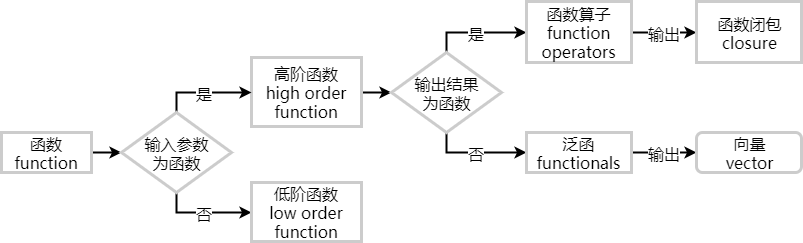

```{r setup, include=FALSE}
## User-defined options come here
knitr::opts_chunk$set(warning = FALSE, message = FALSE, 
                      fig.path = "B01_06_funl_opr_files/figure-html/")
```

## 目录

- [泛函(Functionals)](#3)
- [函数算子(Function Operators)](#12)

<p class="footer">部分内容借鉴**Hadley Wickham** [Advanced R](http://adv-r.had.co.nz).</p>

# 泛函 (Functionals)

## 什么是泛函

- 泛函: 输入参数为函数，输出结果为向量的一类函数
- 最典型的泛函就是`apply`家族函数
- 上节讲到的高阶函数`Reduce`、`Filter`等也都是泛函
- 泛函常用于迭代循环、数值计算



## 典型的泛函: lapply

<div class="col-2L">

把传统的循环结构

```r
for (x in xs) fun(x)
```

转化为更紧凑的形式

```r
lapply(xs, fun)
```


</div><div class="col-2R">

### 优点

- lapply用C语言编写，更高效
- 代码语义更贴近解题意图
- 将过程函数化，减少bug


</div>

## 自己写一个泛函

<div class="col-2L">

- 对向量x算一下n位移动平均/中位/...
- 对xts的模拟股价数据算日均线

```{r}
moveN <- function(x, n, fun=mean, ...){
    stopifnot(length(x)>n)
    o <- sapply(n:(length(x)), 
        function(i) fun(x[(i-n+1):i]), ...)
    c(rep(NA, n-1), o)
}
library(xts); data(sample_matrix)
mvAvg <- sapply(
    c(5, 10, 30, 60), function(n)
        moveN(sample_matrix[,4], n, mean))
dimnames(mvAvg) <- list(
    dimnames(sample_matrix)[[1]],
    c("d5", "d10", "d30", "d60"))
```

</div><div class="col-2R">

```r
plot(as.xts(sample_matrix[,'Close']))
for (i in 1:4) print(
    lines(as.xts(mvAvg[,i]), col=i+1))
legend('bottomleft', 
       legend=colnames(mvAvg), 
       text.col=2:5)
```


</div>

## 并行 {.smaller}

- 函数式编程的一个重大优势就是便于并行
- 可用parallel包提供的并行版`apply`家族函数进行并行计算
- 并行计算并不总能提高效率，因为分配队列和多核调度本身也产生开销

<div class="col-2L">

扩充diamonds数据集，然后建模

```r
library(ggplot2)
diamonds1 <- as.data.frame(do.call("rbind", 
    rep(list(diamonds), 100)))  ## "349.8 Mb"
df.lst <- split(diamonds1, diamonds1$clarity)
models <- lapply(df.lst, function(df) 
    lm(price~carat, df))
```

(结果略。) 

**按"p"查看传统方法和并行方法的耗时对比**

</div><div class="col-2R">

- (多CPU核计算机) 可用`lapply`的并行版`mclapply` (Linux/OSX) 或`parLapply` (Windows) 优化


```r
library(parallel)
cl <- makeCluster(detectCores()) # 创建集群
models <- parLapply(cl, df.lst, function(df) 
        lm(price~carat, df))
sapply(models, function(m) coef(m)[[2]])
```

```
       I1       SI2       SI1       VS2       
 4209.793  7870.255  8090.348  8626.157
      VS1      VVS2      VVS1        IF 
 9000.726 10077.188 10469.250 11625.441 
```

```r
stopCluster(cl)  # 最后记得关闭集群
```

</div>

<div class="notes">

- 传统方法

```r
system.time(lapply(df.lst, function(df) 
    lm(price~carat, df)))
```

```
   user  system elapsed 
   7.42    1.29   61.20 
```

- 并行方法

```r
system.time(parLapply(
    cl, df.lst, function(df) lm(price~carat, df)))
```

```
   user  system elapsed 
  15.82   22.62   50.90
```

</div>


## 扩展: `plyr`包

- plyr包提供了一套apply家族的衍生函数，贯彻SAC(split-apply-combine)策略

<div class="col-2L">

- base包

in\\out	    | list	| data frame	| array
------------|-------|---------------|-----------
list	    | `lapply)`	|          | `sapply()`
data frame	| `by()`	|              |	
array		|       |              |	`apply()`


</div><div class="col-2R">

- plyr包

in\\out	| list	| data frame	| array
--------|-------|---------------|-----------
list	| `llply()`	| `ldply()`	| `laply()`
data frame|	`dlply()` | `ddply()`	| `daply()`
array	| `alply()`	| `adply()`	| `aaply()`

</div>

## 数值计算 

- 泛函常用于数值计算，如
    - `integrate()`: f()函数的曲线下面积
    - `uniroot()`: f()何时取值为零
    - `optimise()`: f()取最大/小值的位置

<div class="col-2L">

```{r}
integrate(dnorm, -1.96, 1.96)
```

```{r}
uniroot(function(x) cos(x) - x, lower = -pi, 
        upper = pi, tol = 1e-9)$root
```

</div><div class="col-2R">

```{r}
unlist(optimise(cos, c(0, 2 * pi)))
```

```{r}
unlist(optimise(sin, c(0, 2 * pi), 
                maximum=TRUE))
```

</div>

## {.smaller}

(按"p"看代码)

<div class="col-2L">

```{r integrate, echo=FALSE, fig.width=5, fig.height=2.7}
par(mar=c(3.1, 4.1, 2.1, 2.1))
cord.x <- c(-1.96, seq(-1.96, 1.96, 0.01), 1.96) 
cord.y <- c(0, dnorm(seq(-1.96, 1.96, 0.01)), 0) 
curve(dnorm(x, 0, 1), xlim=c(-3, 3)) 
polygon(cord.x, cord.y, col='skyblue')
```

```{r uniroot, echo=FALSE, fig.width=5, fig.height=2.7}
par(mar=c(3.1, 4.1, 2.1, 2.1))
f <- function(x) cos(x) - x
uroot <- uniroot(f, lower = -pi, upper = pi, tol = 1e-9)$root
curve(f, xlim=c(-pi, pi))
rect(-pi, f(pi), uroot, 0, col=rgb(1, 0, 0, 0.25), border=2, lwd=0.1)
points(uroot, 0, cex=1, pch=19, col=2)
```

</div><div class="col-2R">

```{r optimise1, echo=FALSE, fig.width=5, fig.height=2.7}
par(mar=c(3.1, 4.1, 2.1, 2.1))
min <- optimise(sin, c(0, 2 * pi))[[2]]
where.min <- optimise(sin, c(0, 2 * pi))[[1]]
curve(sin, xlim=c(0, 2*pi))
rect(0, min, where.min, min, col=rgb(1, 0, 0, 0.25), border=2, lwd=0.1)
points(where.min, min, cex=1, pch=19, col=2)
```

```{r optimise2, echo=FALSE, fig.width=5, fig.height=2.7}
par(mar=c(3.1, 4.1, 2.1, 2.1))
max <- optimise(sin, c(0, 2 * pi), maximum=TRUE)[[2]]
where.max <- optimise(sin, c(0, 2 * pi), maximum=TRUE)[[1]]
curve(sin, xlim=c(0, 2*pi))
rect(0, min, where.max, max, col=rgb(1, 0, 0, 0.25), border=2, lwd=0.1)
points(where.max, max, cex=1, pch=19, col=2)
```

</div>

<div class="notes">

请自行分别运行下面的命令

```r
cord.x <- c(-1.96, seq(-1.96, 1.96, 0.01), 1.96) 
cord.y <- c(0, dnorm(seq(-1.96, 1.96, 0.01)), 0) 
curve(dnorm(x, 0, 1), xlim=c(-3, 3)) 
polygon(cord.x, cord.y, col='skyblue')
```

```r
f <- function(x) cos(x) - x
uroot <- uniroot(f, lower = -pi, upper = pi, tol = 1e-9)$root
curve(f, xlim=c(-pi, pi))
rect(-pi, f(pi), uroot, 0, col=rgb(1, 0, 0, 0.25), border=2, lwd=0.1)
points(uroot, 0, cex=1, pch=19, col=2)
```

```r
min <- optimise(sin, c(0, 2 * pi))[[2]]
where.min <- optimise(sin, c(0, 2 * pi))[[1]]
curve(sin, xlim=c(0, 2*pi))
rect(0, min, where.min, min, col=rgb(1, 0, 0, 0.25), border=2, lwd=0.1)
points(where.min, min, cex=1, pch=19, col=2)
```

```r
max <- optimise(sin, c(0, 2 * pi), maximum=TRUE)[[2]]
where.max <- optimise(sin, c(0, 2 * pi), maximum=TRUE)[[1]]
curve(sin, xlim=c(0, 2*pi))
rect(0, min, where.max, max, col=rgb(1, 0, 0, 0.25), border=2, lwd=0.1)
points(where.max, max, cex=1, pch=19, col=2)
```

</div>

## 例子: 家族函数 {.smaller}

Hadley Wickham的一个例子: 基于核心工作函数，通过泛函繁衍出整个家族

<div class="col-2L">

```r
rm_na <- function(x, y, identity) {
    if (is.na(x) && is.na(y)) {
        identity
    } else if (is.na(x)) {
        y
    } else {
        x
    }
}
```

```r
add <- function(x, y, na.rm = FALSE) {
    if (na.rm && (is.na(x) || is.na(y))) 
        rm_na(x, y, 0) 
    else x + y
}
```


</div><div class="col-2R">

```r
r_add <- function(xs, na.rm = TRUE) {
    Reduce(function(x, y) 
        add(x, y, na.rm = na.rm), xs, init = 0)
}  # r_add 等价于sum()
```

```r
c_add <- function(xs, na.rm = FALSE) {
    Reduce(function(x, y) 
        add(x, y, na.rm = na.rm), xs,
            accumulate = TRUE)
}  # c_add 等价于cumsum()
```

```r
row_sum <- function(x, na.rm = FALSE) {
    apply(x, 1, r_add, na.rm = na.rm)
}  # row_sum等价于rowSums()
```

```r
col_sum <- function(x, na.rm = FALSE) {
    apply(x, 2, r_add, na.rm = na.rm)
}  # col_sum等价于colSums()
```

</div>

# 函数算子 (Function Operators)

## 什么叫函数算子 (FO)

- 函数算子: 输入参数为（一个或多个）函数，输出结果也为函数的一类函数
- 函数算子和泛函一样，可以锦上添花，但并不必需
    - 让代码更易读、更表义
    - 帮助代码写得更快
- 函数算子和泛函的差别
    - 泛函: 提取**循环结构**的模式
    - 函数算子: 提取**匿名函数**的模式
- 函数算子和工厂函数的差别
    - 工厂函数: 低阶函数，**接受向量**，返回函数
    - 函数算子: 高阶函数，**接受函数**，返回函数

## 函数算子的主要类型

- 行为函数算子 (Behavioral FO)
    - 不改变输入和输出的函数，但会添加一些行为
        - 捕获函数运行细节
        - 延时和缓存
- 输出函数算子 (Output FO)
    - 修改输出函数
        - `Negate()`, `failwith()`
        - `capture_it()`, `time_it()`
- 输入函数算子 (Input FO)
    - 修改输入函数
        - 部分应用`partial`

## 行为FO: 捕获细节 {.smaller}

- 最常见的行为FO是在函数内部捕获运行细节

<div class='col-2L'>

```r
ignore <- function(...) NULL
# 构造行为FO tee
tee <- function(fun, on_input = ignore, 
            on_output = ignore) {
    function(...) {
        on_input(...)
        output <- fun(...)
        on_output(output)
    output
    }
}
```

```r
# 求解函数g的单位根
g <- function(x) cos(x) - x
zero <- uniroot(g, c(-5, 5))
show_x <- function(x, ...) 
    cat(sprintf("%+.08f", x), "\n")
```

```r
zero$root  ## 0.739
```

</div><div class="col-2R">

```r
# 函数求解的位置
zero <- uniroot(tee(
    g, on_input = show_x), c(-5, 5))
```

```
## -5.00000000  +5.00000000  +0.28366219 
## +0.87520341  +0.72298040  +0.73863091 
## +0.73908529  +0.73902425  +0.73908529
```

```r
# 函数的值
zero <- uniroot(tee(
    g, on_output = show_x), c(-5, 5))
```

```
## +5.28366219  -4.71633781  +0.67637474 
## -0.23436269  +0.02685676  +0.00076012 
## -0.00000026  +0.00010189  -0.00000026
```

(按p看notes)

</div>

<div class="notes">

求解过程的9步迭代细节

```{r tee, echo=FALSE, fig.width=6, fig.height=2.8}
par(mar=c(3.1, 4.1, 1.1, 1.1))
g <- function(x) cos(x) - x
plot(seq(-5, 5, 0.01), g(seq(-5, 5, 0.01)), type="l")
p.x <- c(-5.00000000, +5.00000000, +0.28366219, +0.87520341, +0.72298040,
         +0.73863091, +0.73908529, +0.73902425, +0.73908529)
p.y <- c(+5.28366219, -4.71633781, +0.67637474, -0.23436269, +0.02685676,
         +0.00076012, -0.00000026, +0.00010189, -0.00000026)
points(p.x, p.y, pch=as.character(seq_along(p.x)), col=2)
plot(seq(0.72, 0.74, 0.005), g(seq(0.72, 0.74, 0.005)), type="l")
points(p.x[5:9], p.y[5:9], pch=as.character(5:9), col=2)
```

</div>

## 行为FO - 延时 {.smaller}

```r
delay_by <- function(sec.delay, f) {
  function(...) {
    Sys.sleep(sec.delay)
    f(...)
  }
}
delayed_sample <- delay_by(1, sample)
sapply(1:2, function(size) delayed_sample(1:10, size))
```

```
[[1]]
[1] 5

[[2]]
[1] 2 4
```

```r
system.time(sapply(1:2, function(size) delayed_sample(1:10, size)))
```

```
   user  system elapsed 
   0.00    0.03    2.14 
```

## 输出FO - 简单案例 {.smaller}

<div class="col-2L">

#### Negate

```r
lst <- list(a=1:2, b=list(c(3, 4)), 
    c=NULL，NULL)
```

- 无法用`lst[!is.null(lst)]`清除NULL
- 但可以用高阶函数

```r
rmNulls <- function(x) 
    Filter(Negate(is.null), x)
rmNulls(lst)
```

```
$a
[1] 1 2

$b
$b[[1]]
[1] 3 4
```

</div><div class="col-2R">

#### plyr::failwith

使用泛函时，一处出错，则整体退出

```r
sapply(list(1, pi, 'a'), log)
```

```
Error in FUN(X[[i]], ...) : non-numeric 
argument to mathematical function
```

用`failwith`可以增加容错性

```r
sapply(list(1, pi, 'a'), plyr::failwith(
    NA, log))
```

```
Error in f(...) : non-numeric argument 
to mathematical function
[1] 0.00000 1.14473      NA
```

</div>

## 输出FO - 复杂案例 {.smaller}

<div class="col-2L">

#### capture_it

```r
capture_it <- function(f) {
    function(...) 
        capture.output(f(...))
}
```

```r
str_it <- capture_it(str)
str_it(Titanic)[3]
```

```
[1] " table [1:4, 1:2, 1:2, 1:2] 
    0 0 35 0 0 0 17 0 118 154 ..." 
[2] " - attr(*, \"dimnames\")=List of 4"                        
[3] "  ..$ Class   : 
    chr [1:4] \"1st\" \"2nd\" \"3rd\" \"Crew\""
[4] "  ..$ Sex     : 
    chr [1:2] \"Male\" \"Female\""             
[5] "  ..$ Age     : 
    chr [1:2] \"Child\" \"Adult\""             
[6] "  ..$ Survived: 
    chr [1:2] \"No\" \"Yes\""
```

</div><div class="col-2R">

#### time_it

```r
time_it <- function(f) {
    function(...) system.time(f(...))
}
```

```r
compute_mean <- list(
  base = function(x) mean(x),
  sum = function(x) sum(x) / length(x)
)
x <- runif(1e6)
call_fun <- function(f, ...) f(...)
lapply(compute_mean, time_it(call_fun), x)
```

```
## $base
##    user  system elapsed 
##   0.000   0.000   0.002 
## 
## $sum
##    user  system elapsed 
##   0.000   0.000   0.001
```

</div>


## 输入FO {.smaller}

- 部分应用: `pryr::partial`

```r
rmNulls <- partial(Filter, Negate(is.null))
mean2 <- partial(mean, na.rm=TRUE)
```

- 改变输入参数的类型

```r
splat <- function(f) {
    function(args) do.call(f, args)
}
```

```r
x <- c(NA, runif(100), 1000)
args <- list(
  list(x),
  list(x, na.rm = TRUE),
  list(x, na.rm = TRUE, trim = 0.1)
)
sapply(args, splat(mean))
```

```
[1]       NA 10.4307917  0.5433686
```

## 合并FO

- `pryr::compose`或`pryr::%.%`

```r
library(pryr)
sapply(mtcars, compose(length, unique))
```

```
 mpg  cyl disp   hp drat   wt qsec   vs   am gear carb 
  25    3   27   22   22   29   30    2    2    3    6 
```

```r
square <- function(x) x^2
deviation <- function(x) x - mean(x)
sd2 <- sqrt %.% mean %.% square %.% deviation
sd2(1:10)
# 同 1:10 %>% deviation %>% square %>% mean %>% sqrt
```

```
## [1] 2.872281
```

## {.grayblue}

<p style="font-size:100px;font-family:'Arial Black'"><br/>Thank you! </p>

<br/>[回到主目录](http://madlogos.github.io/R_Tutorial)

