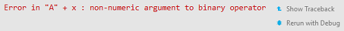

```{r setup, include=FALSE}
## User-defined options come here
knitr::opts_chunk$set(warning = FALSE, message = FALSE, 
                      fig.path = "B01_07_debug_files/figure-html/")
```

## 目录

- [异常状况](#3)
- [调试](#6)
- [异常处置](#14)
- [防御式编程](#19)

<p class="footer">Copyright © 2016-2017 Aetna Inc. <span class="cranberry">内部使用，请勿外传。</span><br>部分内容借鉴**Hadley Wickham** [Advanced R](http://adv-r.had.co.nz).</p>

# 异常状况

## 异常状况(Condition)的3个级别

- **错误**(errors/exceptions)
    - 程序遇到致命错误，无法继续，调用`stop()`函数退出执行
    - 错误信息打印到控制台时，带"Error"提示符
- **警告**(warnings)
    - 程序遇到错误，但仍可以继续执行，调用`warning()`函数显示潜在问题
    - 可以用`suppressWarnings()`函数屏蔽警告
    - 错误信息打印到控制台时，带"Warning"提示符
- **提醒**(messages)
    - 不一定是错误，调用`message()`将运行中的重要信息提示给用户
    - 可以用`suppressMessage()`函数屏蔽提醒信息
    - 信息打印到控制台时，不带异常提示符

## 例子 {.smaller}

- 错误

    ```r
    mean(a)
    ```
    
    ```
    Error in mean(a) : object 'a' not found
    ```

- 警告

    ```r
    log(-1)
    ```
    
    ```
    Warning in log(-1) : NaNs produced
    [1] NaN
    ```

- 提醒

    ```r
    library(epiR)
    ```
    
    ```
    Package epiR 0.9-87 is loaded
    Type help(epi.about) for summary information
    ```

# 调试

## 调试的重要性

> **Fred Brooks**:  Much of the essence of building a program is in fact the debugging of the specification.

- 程序的调试(debugging)和编制(composing)同等重要
- 程序缺陷(defect/bug)通常难以避免，需要通过调试技术定位、修复

#### 调试四步走

1. **发现**缺陷存在
2. **重复**缺陷的发生过程
3. **定位**缺陷位置
4. **修复**缺陷代码

## 翻检堆栈 (traceback)

- `f1`逐级调用低级函数，构成一个调用堆栈(call stack)
- 当发生错误，可**当即**用`traceback()`在堆栈中回溯
- 也可以通过RStudio的错误检查器(Error inspector)查看回溯结果

<div class="col-2L">

```r
f1 <- function(x1) f2(x1)
f2 <- function(x2) f3(x2)
f3 <- function(x3) f4(x3)
f4 <- function(x4) f5(x4)
f5 <- function(x5) "A" + x5
f1(1)
```

```
 Error in "A" + x5 : 
 non-numeric argument to binary operator 
```

</div><div class="col-2R">

点"Show Traceback"，或`traceback()`



```r
traceback()
```

```r
5: f5(x4) at #1
4: f4(x3) at #1
3: f3(x2) at #1
2: f2(x1) at #1
1: f1(1)
```

</div>

## 动态调试 (debug)

- 点击"Rerun with Debug": </img>
- 直接调用`debug()`函数 (事后要`undebug()`)

包括5个按钮:

1. **接着**(Next, `n`/F10): 执行函数的下一步
1. **步进**(Step in, `s`/Shift+F4): 类似Next，但如下一步是个函数，则进入该函数逐行调试
1. **完成**(Finish, `f`/Shift+F6): 完成执行当前循环块或函数
1. **继续**(Continue, `c`/Shift+F5): 结束调试并完成执行剩余的代码
1. **结束**(Stop, `Q`/Shift+F8): 退出调试和执行，返回全局环境

    ```r
    Error in "A" + x5 : non-numeric argument to binary operator
    Called from: f5(x4)
    Browse[1]> n
    ```

## 设置调试选项

<div class="col-2L">

- 默认遇到错误时，调用的调试选项是

```{r}
getOption("error")
```

- 可以改为`browser`，则遇错自动进入动态调试

```r
options(error = browser)
```

</div><div class="col-2R">

- 或改用其他(但记得从备份改回来)

```r
browseOnce <- function() {
  old <- getOption("error")
  function() {
    options(error = old)
    browser()
  }
}
options(error = browseOnce())
```

</div>

## recover和dump.frame {.smaller}

<div class="col-2L">

- 动态调试时，通过recover()可进入调用堆栈任一步的环境

```r
Error in "A" + x5 : 
    non-numeric argument to binary operator
Called from: f5(x4)
Browse[1]> recover()

Enter a frame number, or 0 to exit   

1: f1(1)
2: #1: f2(x1)
3: #1: f3(x2)
4: #1: f4(x3)
5: #1: f5(x4)
6: #1: (function () 
{
    .rs.breakOnError(TRUE)
})()
7: .rs.breakOnError(TRUE)
8: eval(substitute(browser(skipCalls = pos), 
    list(pos = (length(sys.frames()) - frame) + 2)), 
    envir = sys.frame(frame))
...
```

</div><div class="col-2R">

- dump.frame在当前工作目录下创建一个last.dump.rda文件用于后续调试
- 在批处理模式中，先编写下面的代码

```r
dump_and_quit <- function() {
  # 调试信息写入last.dump.rda
  dump.frames(to.file = TRUE)
  # 以出错状态退出R
  q(status = 1)
}
options(error = dump_and_quit)
```

- 如批处理出现错误，会退出R进程
- 随后可在交互模式下启用debugger窗口进行调试

```r
load("last.dump.rda")
debugger()
```

</div>

## 设置断点 (browser)

<div class="col-2L">

- 断点(break point)是常用的调试技术
- 可以在自己的函数或代码块中机智地设置断点
    - RStudio中，在行号左侧点击一下，可设置一个断点
    - 在代码中插入一行`browser`
- 运行时，程序会在断点处暂停
    - 将`browser()`插入到第一行，即相当于运行时`debug()`
    - `debug()`函数正是这么做的
- 查看无误后，Shift+F9继续执行

</div><div class="col-2R">

```r
f <- function(x){
    if (1 %in% x){
        browser()
        return("There is 1")
    }else{
        return("There is no 1")
    }
}
f(1:4)
```

```
Called from: f(1:4)
Browse[1]> x
[1] 1 2 3 4
Browse[1]> n
debug at #4: return("There is 1")
Browse[2]> n
[1] "There is 1"
```

</div>

## 调试警告

- 默认只对错误进行调试
- 如要对警告也进行调试，需要调整设置，从而使用常规的调试工具
    - 将警告转为错误: `options(warn=2)`
    - 自己写一个函数

    ```r
    message2error <- function(code) {
        withCallingHandlers(code, message = function(e) stop(e))
    }
    ```

    ```r
    f <- function() message("yup")
    message2error(f())
    ```

    ```
    Error in message("yup") : yup
    ```

# 异常处置

## try: 忽略错误

<div class="col-2L">

出现错误默认整体退出，不返回结果

```r
f <- function(x){
    log(x)
    2
}
f("1")
```

```
Error in log(x) : non-numeric argument 
    to mathematical function
```

try捕捉到的错误结果属于"try-error"类

```r
class(try(log("1")))
```

```
[1] "try-error"
```

</div><div class="col-2R">

`try()`可捕捉错误信息，并继续执行代码

```r
f <- function(x, ...){
    try(log(x), ...)
    2
}
f("1")
```

```
Error in log(x) : non-numeric argument 
    to mathematical function
[1] 2
```

`try(..., silent=TRUE)`隐藏错误信息

```r
f("1", silent=TRUE)
```

```
[1] 2
```

</div>

## tryCatch: 处置错误

<div class="col-2L">

```r
tryCatch(expr, ..., finally)
```

- `tryCatch`不但能捕捉错误，还提供了一个异常处置框架
- 将异常状况匹配给不同的处置程序(handler)进行处理

举个例子:

```{r}
show_cond <- function(expr, ...){
    tryCatch(expr, 
        error=function(cond) "error", 
        warning=function(cond) "warn",
        message=function(cond) "msg",
        finally=cat("The output: "))
}
```

</div><div class="col-2R">

```{r, results='asis'}
show_cond(log(10))
show_cond(message("!"))
show_cond(log(-1))
show_cond(log("1"))
```

</div>

## withCallingHandlers

- withCallingHandlers是在**产生异常的语境**被调用的
- tryCatch是在**tryCatch的语境**被调用的

<div class="col-2L">

```r
f1 <- function() f2()
f2 <- function() stop("Stop!")
tryCatch(f2(), error=function(e) 
    print(sys.calls()))
```

```
[[1]] tryCatch(f2(), error = function(e) 
    print(sys.calls()))
[[2]] tryCatchList(expr, classes, 
    parentenv, handlers)
[[3]] tryCatchOne(expr, names, parentenv, 
    handlers[[1L]])
[[4]] value[[3L]](cond)
```

</div><div class="col-2R">

```r
withCallingHandlers(f2(), error=function(e)
    print(sys.calls()))
```

```
[[1]] withCallingHandlers(f2(), 
    error = function(e) print(sys.calls()))
[[2]] f2()
[[3]] stop("Stop!")
[[4]] .handleSimpleError(function (e) 
print(sys.calls()), "Stop!", quote(f2()))
[[5]] h(simpleError(msg, call))
Error in f2() : Stop!
```
</div>

## 扩展意外类型 {.smaller}

<div class="col-2L">

```r
condition <- function(subclass, message, 
    call = sys.call(-1), ...) {
    structure(
        class = c(subclass, "condition"),
        list(message = message, call = call),
        ...
    )
}
```

- 除了错误、警告、提醒外，也可以自定义意外类型
- 这些自定义意外必须是三个基本意外类型的子类

```r
err.neg <- condition(
    c("neg_error", "error"), "Cannot be negative!")
wrn.zero <- condition(
    c("zero_warn", "warning"), "Cannot be zero!")
msg.greet <- condition(
    c("greet_msg", "message"), "Bingo!")
```

- 自定义函数newLog，捕捉扩展错误类型

</div><div class="col-2R">

```r
newLog <- function(x){
    if (x<0) stop(err.neg)
    else if (x==0) warning(wrn.zero)
    else message(msg.greet)
    return(log(x))
}
```

```r
tryCatch(newLog(1))
```

```
Bingo![1] 0
```

```r
tryCatch(newLog(-1))
```

```
Error: Cannot be negative!
```

```r
tryCatch(newLog(bb))
```

```
Error in newLog(bb) : object 'bb' not found
```

</div>

# 防御式编程

## 何为防御式编程

> **墨菲定律(Murphy's Law)**: 凡是可能出错的事，准会出错。

- [防御性编程（Defensive programming）](https://zh.wikipedia.org/wiki/%E9%98%B2%E5%BE%A1%E6%80%A7%E7%BC%96%E7%A8%8B)是防御式设计的一种具体体现，它是为了保证，对程序的不可预见的使用不会造成程序功能上的损坏
    - 它可以被看作是为了减少或消除墨菲定律效力的努力
    - 防御式编程主要用于可能被滥用，恶作剧或无意地造成灾难性影响的程序上。
- 防御式编程的核心是"**快速失败、抛出错误**"
    - 在可能出现问题的地方**预防性**地创建测试环境
        - 及时捕捉错误，并
        - 执行控制损害代码
    - **从一开始**就编写正确的代码，而不是将错误积累到测试环节去纠正

## 防御式编程的[通用原则](https://www.amazon.cn/Code-Craft%E7%BC%96%E7%A8%8B%E5%8C%A0%E8%89%BA-%E7%BC%96%E5%86%99%E5%8D%93%E8%B6%8A%E7%9A%84%E4%BB%A3%E7%A0%81-%E5%8F%A4%E5%BE%B7%E5%88%A9%E5%BC%97/dp/B001G0MJMK) {.smaller}

<div class="col-2L">

- 使用好的**编码风格**和合理的**设计**
- **避免闪电式编程**
- 不要相信任何人，包括自己
- 编码的目标是清晰，不只是简洁  
- 不要让任何人做他们不该做的修补工作 (作用域)
- ~~编译时开启所有警告开关~~
- 使用静态分析工具
- 使用**安全的数据结构**
- 检查**所有的返回值**
- 重视所有稀有资源，审慎地管理它们的获取和释放
- ~~在声明时对变量初始化~~
- ~~尽可能推迟变量的声明~~
- 使用标准化语言工具，写标准化语言
- 使用好的诊断信息日志工具
- 审慎地使用强制转换

</div><div class="col-2R">

- 细则
    - 提供默认行为
    - 遵从语言习惯
    - 检查数值上下限
    - 正确设置常量
- 约束
    - 前置条件：**对参数作限定**；
    - 后置条件：**对结果作判断**；
    - 不变条件：每当程序执行到达特定点(循环中、方法调用等)时为真的条件，防止逻辑错误；
    - 断言：任何关于程序在给定位置状态的陈述；
- 约束的内容
    - 检查所有的数组访问是否都在边界内
    - 确保函数参数有效
    - 在函数结果返回之前对其进行充分检查
- 移除约束

</div>

## R的防御技巧1: 严格限制输入

<div class="col-2L">

- `match.arg` + `if/stop` 或 `stopifnot`

```r
f <- function(x, fun=c("mean", "median")){
    # 确保x是纯数值
    stopifnot(all(sapply(x, is.numeric)))
    # 确保fun只能是列表中规定的三个
    fun <- match.arg(fun)
    switch(fun, mean=lapply(x, mean), 
        median=lapply(x, median), 
        var=lapply(x, var))
}
```

```r
f(1:10, "sum")
```

```
Error in match.arg(fun) : 'arg' should be 
    one of “mean”, “median”, “var”
```

</div><div class="col-2R">

- 断言(assertthat包)

```r
f <- function(x, fun=c("mean", "median")){
    library(assertthat)
    assert_that(all(sapply(x, is.numeric)))
    fun <- match.arg(fun)
    switch(fun, mean=lapply(x, mean), 
        median=lapply(x, median), 
        var=lapply(x, var))
}
```

```r
f(list(1:10, 11:20, "a"), "mean")
```

```
Error: Elements 3 of sapply(x, is.numeric) 
    are not true
```

</div>

## R的防御技巧2: 避免使用非标准求值函数

- 常用的非标准求值(non-standard evaluation)函数:`subset`、`transform`、`with`
    - 有时候用`substitute`、`quote`、`parse`、`eval`等函数自定义非标准求值函数
- 非标准求值函数常常在交互模式下使用
- 但在编写自定义函数时、批处理模式下，非标准求值函数往往无法获得明确错误提示，难以调试

<div class="col-2L">

```r
f1 <- function(df, cond)
    df[cond,]
```

```r
f1(mtcars, mtcars$mpg>33)
```

```
                mpg cyl disp hp drat ... carb
Toyota Corolla 33.9   4 71.1 65 4.22 ...    1
```

</div><div class="col-2R">

```r
f2 <- function(df, cond)
    subset(df, cond)
```

```r
f2(mtcars, mpg>33)
```

```
Error in eval(e, x, parent.frame()) : 
    object 'mpg' not found
```

</div>

## R的防御技巧3: 避免输出类型变异 {.smaller}

<div class="col-2L">

- 意外降维: `[`

    ```r
    getCol <- function(df, i) df[,i]
    getCol(mtcars[,1], 1)
    ```
    
    ```
    Error in df[, i] : incorrect number of dimensions
    ```
    
    ```r
    sapply(mtcars[1:8, 1], mean)
    ```
    
    ```
    [1] 21.0 21.0 22.8 21.4 18.7 18.1 14.3 24.4
    ```

- 结构变异: `sapply`

    ```r
    sapply(integer(), identity)
    ```

    ```
    list()
    ```
    
</div><div class="col-2R">

- 避免降维: `drop=FALSE`，`simplify=FALSE`

    ```r
    getCol <- function(df, i) df[, i, drop=FALSE]
    getCol(mtcars[, 1, drop=FALSE], 1)
    ```

    ```r
    sapply(mtcars[1:8, 1, drop=FALSE], mean)
    ```

- 保障数据结构: 用`vapply`代替`sapply`
    
    ```r
    vapply(integer(), identity, 0L)
    ```    
    
    ```
    integer(0)
    ```
    
    ```r
    vapply(list(c(1, 2), c(1, 3, 1)), 
        function(v) which(v==1), 0)
    ```
    
    ```
    Error in vapply(list(c(1, 2), c(1, 3, 1)), 
        function(v) which(v == 1),  : 
      values must be length 1,
     but FUN(X[[2]]) result is length 2
    ```
    
</div>

## 其他考虑 {.smaller}

<div class="col-2L">

#### 健壮性/鲁棒性 (robustness)

- 健壮性: 系统在执行过程中处理错误，以及算法在遭遇输入、运算等异常时继续正常运行的能力
    - 检查参数和输出的合法性
    - tryCatch捕捉错误并容错执行

```r
rlog <- function(x) lapply(x,log); rlog(list(1:4,"a"))
```

```
Error in FUN(X[[i]], ...) : non-numeric 
    argument to mathematical function
```

```r
rlog <- function(x) lapply(x, function(v) 
    tryCatch(log(v), error=function(cdt) NULL))
rlog(list(1:4, "a"))
```

```
[[1]]
[1] 0.0000000 0.6931472 1.0986123 1.3862944

[[2]]
[1] NULL
```

</div><div class="col-2R">

#### 权衡防御性编程的得失利弊

- 利
    - 提高程序健壮性
    - 降低出错概率，利于维护
- 弊
    - 增加编程难度
    - 增加额外开销
    
- 交互模式下，往往即时发现问题并立即修改
    - 放宽检查，以求尽快获得结果
- 脚本模式下，往往要求捕捉预见到的/意外的错误供调试
    - 收紧检查，严格控制

</div>

## {.teal}

<p style="font-size:100px;font-family:'Arial Black'"><br/>Thank you! </p>


